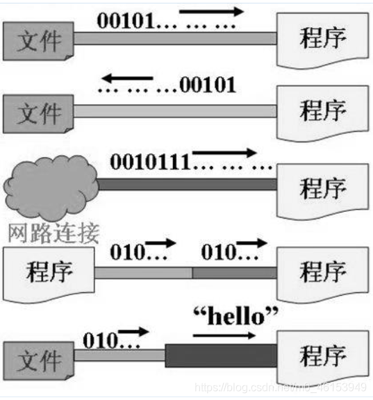
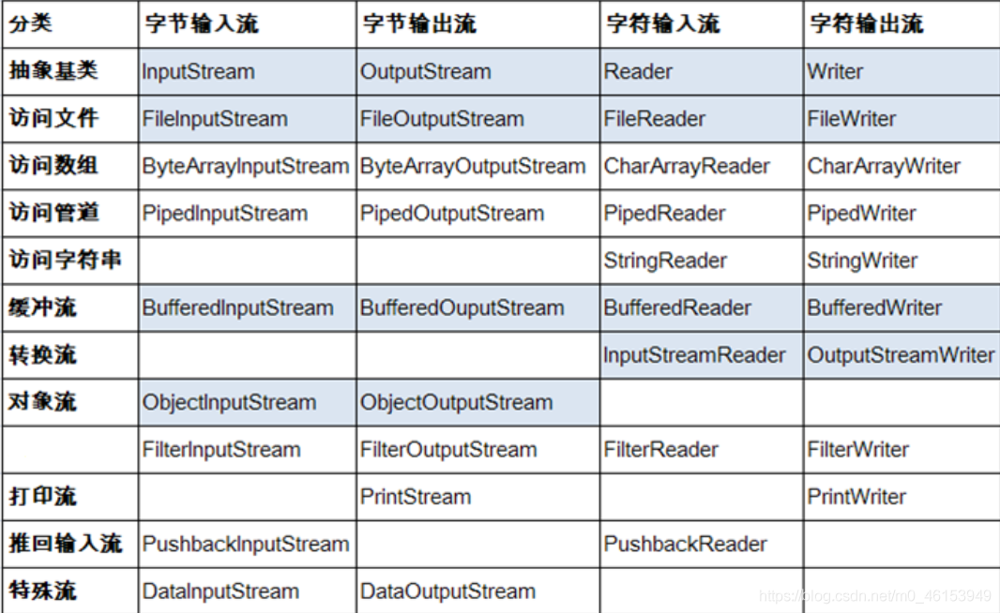
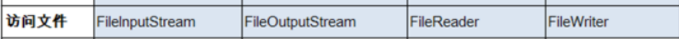

#### 1.IO流原理

* I/O是**Input/Output**的缩写，I/O技术是非常实用的技术，用于**处理设备之间的数据传输**。如读/写文件，网络通讯等。
* Java程序中，对于数据的输入/输出操作以“流(stream)”的方式进行。
* java.io包下提供了各种“流”类和接口，用以获取不同种类的数据，并通过标准的方法输入或输出数据。
* 输入input：读取外部数据（磁盘、光盘等存储设备的数据）到程序（内存）中。
* 输出output：将程序（内存）数据输出到磁盘、光盘等存储设备中。
  



#### 2.流的分类

- 按操作**数据单位**不同分为：字节流(8 bit),如图片视频的处理;字符流(16 bit),如文本的处理【byte=字节,1byte=8bit,1字符=2byte,1byte=8bit,1kb=1000byte,1m=1024kb】
- 按数据流的**流向**不同分为：输入流，输出流
- 按流的**角色**的不同分为：节点流【直接传输文件】，处理流【在节点流的基础上包了层，比如能加快传输速度的工具等】

| 抽象基类 | 字节流       | 字符流 |
| -------- | ------------ | ------ |
| 输入流   | InputStream  | Reader |
| 输出流   | OutputStream | Writer |

1. Java的IO流共涉及40多个类，实际上非常规则，都是从上面4个抽象基类派生的。
2. 由这四个类派生出来的子类名称都是以其父类名作为子类名后缀。

#### 3.IO流体系



访问文件的这四个叫做节点流【文件流】



下面的全是处理流。

注意了，**writer是字符输出流，reader是字符输入流**。读入写出，这样分类的原因是我们站在内存或程序的角度来看的。当从文件里将内容读到内存，这叫读入。当将内存里的内容写到文件这叫写出。

#### 4、节点流(或文件流)

##### 4.1、FileReader读入数据的基本操作

读取文件【四个步骤】

1.建立一个流对象，将已存在的一个文件加载进流。

```java
FileReaderfr= new FileReader(new File(“Test.txt”));
```

2.创建一个临时存放数据的数组。

```java
char[] ch= new char[1024];
```

3.调用流对象的读取方法将流中的数据读入到数组中。

```java
fr.read(ch);
```

4.关闭资源。

```java
fr.close();
```
##### 4.2、FileReader中使用read(char[] cbuf)读入数据

