##### 1.JVM体系概述

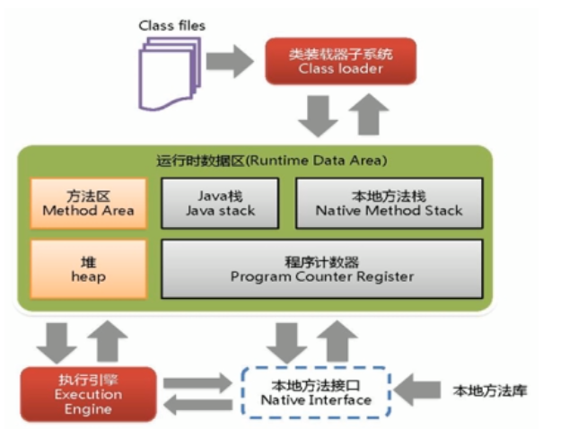

GC作用域是方法区和堆

##### 2.四种常见垃圾回收算法

引用计数法，复制算法，标记清除算法，标记压缩算法

##### 2.HotSpot GC的分类？

针对HotSpot VM的实现，它里面的GC其实准确分类只有两大种：

Partial GC：并不收集整个GC堆的模式，具体如下：

​		Young GC/Minor GC：只收集新生代的GC。

​		Old GC：只收集老年代的GC。只有CMS的concurrent collection是这个模式。

​		Mixed GC：收集整个新生代以及部分老年代的GC，只有G1有这个模式。

Full GC/Major GC：收集整个GC堆的模式，包括新生代、老年代、永久代（如果存在的话）或元空间等所有部分的模式

##### 2.HotSpot GC的触发条件？

这里只说常见的Young GC和Full GC。

Young GC：当新生代中的Eden区没有足够空间进行分配时会触发Young GC。

Full GC：

1.当准备要触发一次Young GC时，如果发现统计数据说之前Young GC的平均晋升大小比目前老年代剩余的空间大，则不会触发Young GC而是转为触发Full GC。（通常情况）

2.如果有永久代的话，在永久代需要分配空间但已经没有足够空间时，也要触发一次Full GC。

3.System.gc()默认也是触发Full GC。

4.heap dump带GC默认也是触发Full GC。

5.CMS GC时出现Concurrent Mode Failure会导致一次Full GC的产生。

##### 3.GCRoots的理解

**什么是垃圾？**

简单的说就是内存中已经不再被使用到的空间就是垃圾

**要进行垃圾回收，如何判断一个对象是否可以被回收?**

* 引用计数法（目前已经不用了，难解决对象之间相互循环引用的问题）
* 枚举根节点做可达性分析(根搜索路径)GC Roots

**GC Roots解释**：基本思路就是通过一系列名为”GC Roots”的对象作为起始点，从这个被称为GC Roots的对象开始向下搜索，如果一个对象到GC Roots没有任何引用链相连时，则说明此对象不可用。也即给定一个集合的引用作为根出发，通过引用关系遍历对象图，能被遍历到的（可到达的）对象就被判定为存活;没有被遍历到的就自然被判定为死亡。

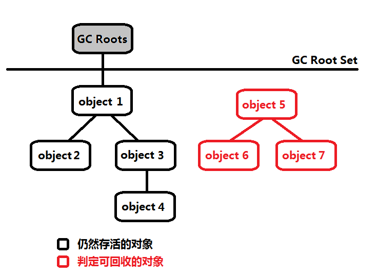

**Java中可以作为GC Roots的对象**：

- 虚拟机栈（栈帧中的局部变量区，也叫做局部变量表）中引用的对象。[方法局部变量]
- 方法区中的类静态属性引用的对象。[类中static修饰的对象]
- 方法区中常量引用的对象。[static final修饰的对象]
- 本地方法栈中JNI(Native方法)引用的对象。[]

##### 4.JVM的参数类型(三类)

* 标配参数
  - java -version
  - java -help
* X参数
  - -Xint：解释执行
  - -Xcomp：第一次使用就编译成本地代码
  - -Xmixed：混合模式
* XX参数【重点】

JVM

-Xms
-Xmx
-Xss
......

**其中Xms和Xmx最好配置成一样，防止频繁GC**

##### 5.XX参数--布尔类型

**公式**：-XX:+ 或者 - 某个属性值（+表示开启，-表示关闭）

如何查看一个正在运行中的java程序，它的某个jvm参数是否开启？具体值是多少？

jps -l 查看一个正在运行中的java程序，得到Java程序号。
命令【jinfo -flag PrintGCDetails  java进程号 】查看它的某个jvm参数（如PrintGCDetails ）是否开启。
jinfo -flags (Java程序号 )查看它的所有jvm参数。

**Case：**
是否打印GC收集细节

* -XX:-PrintGCDetails
* -XX:+PrintGCDetails

是否使用串行垃圾回收器

* -XX:-UseSerialGC
* -XX:+UserSerialGC

##### 6.XX参数--KV键值对类型

公式：`-XX:属性key=属性值value`

Case

- -XX:MetaspaceSize=128m 设置元空间大小
  注意 查看的时候 这里的单位是byte。1M=1024✖1KB = 1024✖1024byte
  
- -XX:MaxTenuringThreshold=15 

##### 7.JVM的XX参数之Xms和Xmx坑题

- -Xms等价于-XX:InitialHeapSize，初始的堆内存大小，默认物理内存1/64

- -Xmx等价于-XX:MaxHeapSize，最大堆分配内存，默认为物理内存1/4

  **Xms和Xmx最好配置成一样，防止频繁GC**

##### 8.JVM盘点家底查看初始默认值

* **查看初始默认参数值**：-XX:+PrintFlagsInitial

  公式：`java -XX:+PrintFlagsInitial`

  这个命令**不需要运行java程序**就能看到jvm的出厂默认参数。

  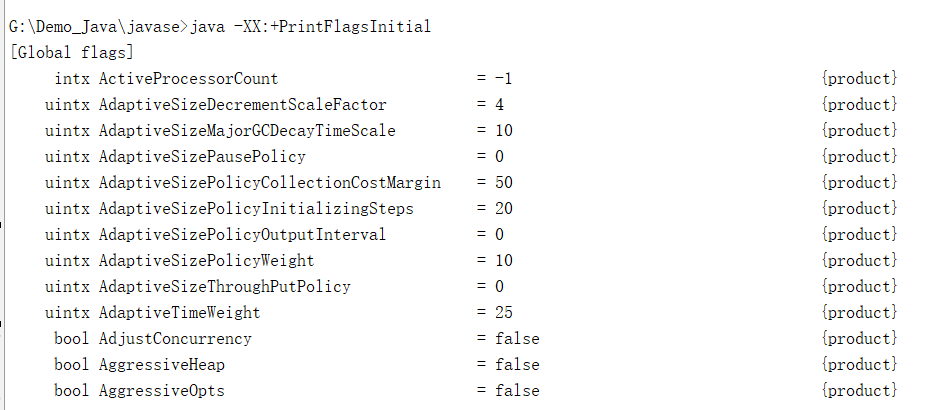

* **查看修改更新的参数**：-XX:+PrintFlagsFinal

  公式：`java -XX:+PrintFlagsFinal`

  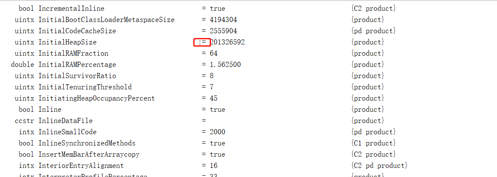

  =表示默认，:=表示修改过的。

  T是一个.java的文件

  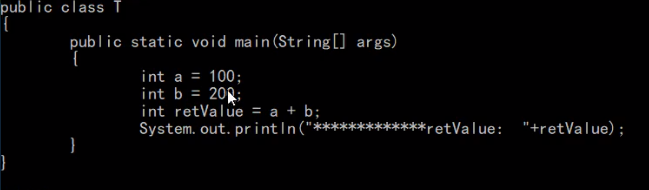

  运行如下命令:
  java -XX:+PrintFlagsFinal -XX:MetaspaceSize=512m T

  可以找到修改后的MetaspaceSize的修改后的值
  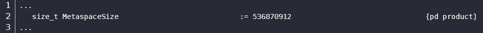

* **打印命令行参数**：-XX:+PrintCommandLineFlags

  运行程序的时候会在(idea是debug窗口)命令行上出来
  公式：java -XX:+PrintCommandLineFlags 

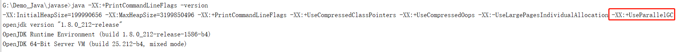

##### 9.JVM常见参数之 堆

-Xmn 是Young Gen的配置(年轻代内存大小)

-Xms 和-Xmx上面有讲过，是JVM Heap的内存大小配置

##### 10.堆内存

在Java8中，永久代已经被移除，被一个称为**元空间**的区域所取代。**元空间的本质和永久代类似**。

元空间(Java8)与永久代(Java7)之间最大的区别在于：永久带使用的JVM的堆内存，但是Java8以后的**元空间并不在虚拟机中而是使用本机物理内存**。

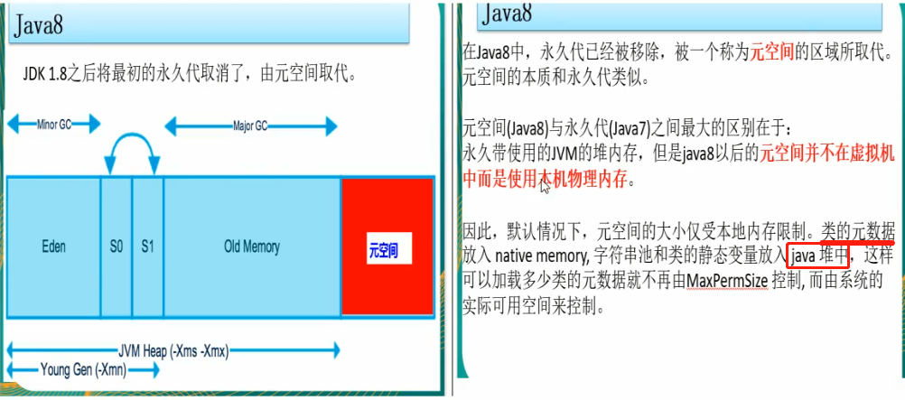

##### 11.元空间(永久代)与方法区

**元空间(永久带)**是方法区的一种实现，其中存储类模板信息，常量以及静态变量。

元空间中一般包含：
	1 类的方法(字节码...)
	2 类名(Sring对象)
	3 .class文件读到的常量信息
	4 class对象相关的对象列表和类型列表 (e.g., 方法对象的array).
	5 JVM创建的内部对象
	6 JIT编译器优化用的信息

**由于元空间是使用的本机物理内存，所以垃圾回收对元空间无作用**

##### 12.Xss参数讲解

-Xss等价于 -XX:ThreadStackSize
设置单个线程栈的大小，一般默认为512k~1024K

##### 13.Xmn参数

设置年轻代大小，一般是用默认就行

##### 14.MetaspaceSize

-XX:MetaspaceSize 设置元空间大小

元空间的本质和永久代类似，都是对JVM规范中方法区的实现。不过元空间与永久代之间最大的区别在于：**元空间并不在虚拟机中，而是使用本地内存**。因此，默认情况下，元空间的大小仅受本地内存限制。

##### 15.参数典型设置案例

-Xms128m -Xmx4096m -Xss1024k -XX:MetaspaceSize=512m -XX:+PrintCommandLineFlags -XX:+PrintGCDetails-XX:+UseSerialGC

##### 16.PrintGCDetails参数调试

-XX:+PrintGCDetails 输出详细GC收集日志信息

设置参数 -Xms10m -Xmx10m -XX:+PrintGCDetails 运行以下程序

```java
import java.util.concurrent.TimeUnit;

public class PrintGCDetailsDemo {

public static void main(String[] args) throws 	 		InterruptedException {
		byte[] byteArray = new byte[10 * 1024 * 1024];
		
		TimeUnit.SECONDS.sleep(Integer.MAX_VALUE);
	}
}
```

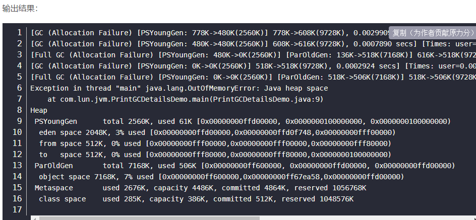

关于普通GC的分析如下图：

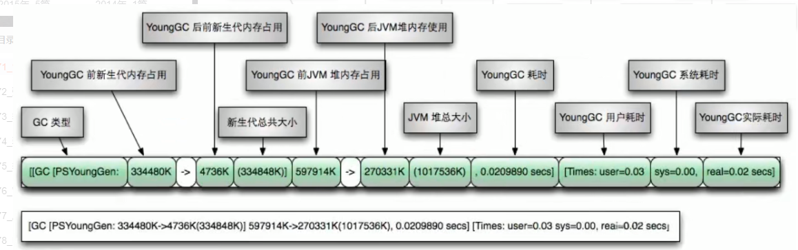

关于Full GC的分析 如下图：

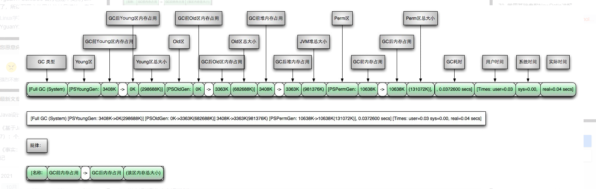

关于垃圾回收器的

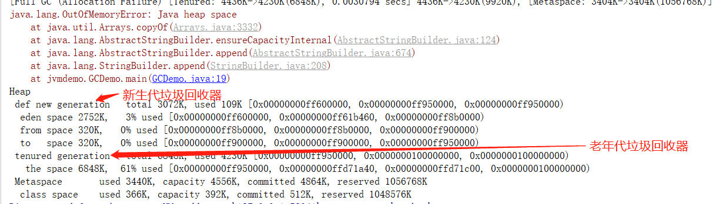

##### 17.SurvivorRatio参数

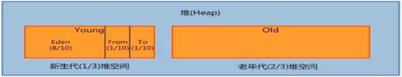

调节**新生代**中 eden 和 S0、S1的空间比例，默认为 -XX:SuriviorRatio=8，Eden:S0:S1 = 8:1:1

假如设置成 -XX:SurvivorRatio=4，则为 Eden:S0:S1 = 4:1:1

SurvivorRatio值就是设置eden区的比例占多少，S0和S1相同.

**from区和to区 谁空谁是to**

##### 18.NewRatio参数

配置年轻代new 和老年代old 在堆结构的占比

默认：-XX:NewRatio=2 新生代占1，老年代2，年轻代占整个堆的1/3

-XX:NewRatio=4：新生代占1，老年代占4，年轻代占整个堆的1/5，

NewRadio值就是设置老年代的占比，剩下的1个新生代。

新生代特别小，会造成频繁的进行GC收集。

##### 19.MaxTenuringThreshold参数

晋升到老年代的对象年龄。

在一次minorGC时，SurvivorTo和SurvivorFrom互换，原SurvivorTo成为下一次GC时的SurvivorFrom区，部分对象会在From和To区域中复制来复制去，如此交换15次[15次minorGC]（由JVM参数MaxTenuringThreshold决定，这个参数默认为15），最终如果还是存活，就存入老年代。

在MinorGC开始的时候，对象只会存在于Eden区和名为“From”的Survivor区，Survivor区“To”是空的。紧接着进行GC，Eden区中所有存活的对象都会被复制到“To”，而在“From”区中，仍存活的对象会根据他们的年龄值来决定去向。年龄达到一定值(年龄阈值，可以通过-XX:MaxTenuringThreshold来设置)的对象会被移动到年老代中，没有达到阈值的对象会被复制到“To”区域。经过这次GC后，Eden区和From区已经被清空。这个时候，**“From”和“To”会交换他们的角色**，也就是新的“To”就是上次GC前的“From”，新的“From”就是上次GC前的“To”。不管怎样，都会保证名为To的Survivor区域是空的。Minor GC会一直重复这样的过程，直到“To”区被填满，“To”区被填满之后，会将所有对象移动到年老代中。

这里就是调整这个次数的，**默认是15**，并且**设置的值一定要在 0~15之间**。

-XX:MaxTenuringThreshold=0：设置垃圾最大年龄。如果设置为0的话，则年轻对象不经过Survivor区，直接进入老年代。对于年老代比较多的应用，可以提高效率。如果将此值设置为一个较大的值，则年轻代对象会在Survivor区进行多次复制，这样可以增加对象再年轻代的存活时间，增加在年轻代即被回收的概念

##### 20.MaxDirectMemorySize参数

公式：-XX:MaxDirectMemorySize=5m

解释：给java虚拟机堆之外的直接内存分配【元空间就是在这块上面】，NIO中的ByteBuffer.allocateDirect(capability)方法也是分配OS本地内存，不属于GC管辖范围，由于不需要内存拷贝所以速度相对较快。


##### 21.垃圾收集器种类

GC算法(引用计数/复制(新生代)/标清(老年代)/标整(老年代))是内存回收的方法论，垃圾收集器就是算法落地实现

因为目前为止还没有完美的收集器出现，更加没有万能的收集器，只是针对具体应用最合适的收集器，进行分代收集

4种**主要**垃圾收集器Serial[串行]，Parallel[并行回收]，CMS[并发标记清楚]，G1

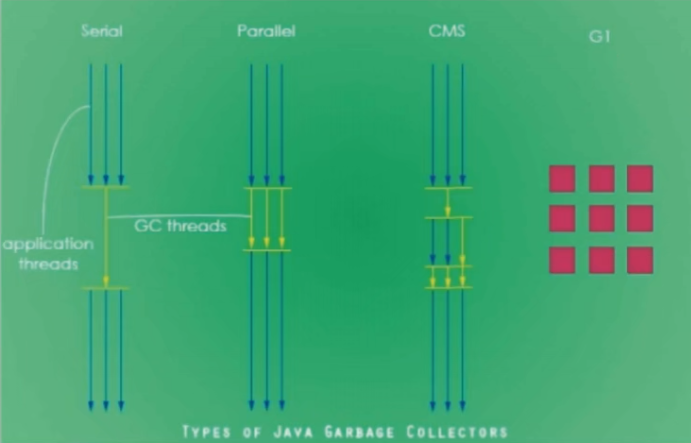

* 串行垃级回收器(Serial) - 它为单线程环境设计且值使用**一个线程**进行垃圾收集，会**暂停所有的用户线程**，**只有当垃圾回收完成时，才会重新唤醒主线程继续执行**。所以**不适合**服务器环境。会产生STW
* 并行垃圾回收器(Parallel) - **多个垃圾收集线程**并行工作，**此时用户线程也是阻塞的**，适用于科学计算 / 大数据处理等弱交互场景，也就是说Serial 和 Parallel其实是类似的，不过是多了几个线程进行垃圾收集，但是主线程都会被暂停，但是**并行垃圾收集器处理时间，肯定比串行的垃圾收集器要更短**。会产生STW
* 并发垃圾回收器(CMS) - **用户线程和垃圾收集线程同时执行**（不一定是并行，可能是交替执行），不需要停顿用户线程，互联网公司都在使用，适用于响应时间有要求的场景。并发标记清楚，会产生内存碎片
* G1垃圾回收器 - G1垃圾回收器将堆内存分割成不同的区域然后并发的对其进行垃圾回收。
* ZGC（Java 11的，了解）
  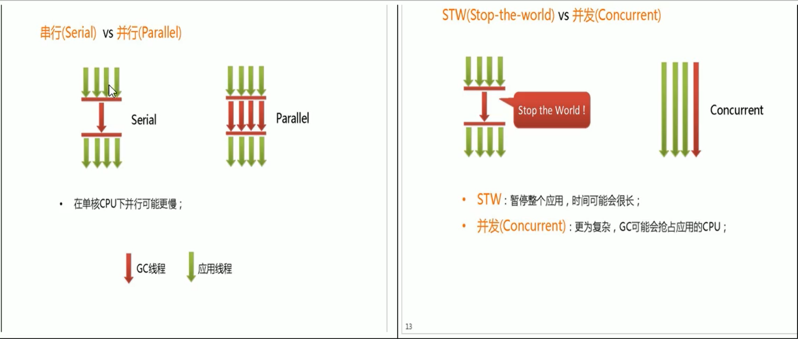


##### 22.如何查看默认的垃圾收集器

java -XX:+PrintCommandLineFlags -version 

输出结果

```
C:\Users\abc>java -XX:+PrintCommandLineFlags -version
-XX:InitialHeapSize=266613056 -XX:MaxHeapSize=4265808896 -XX:+PrintCommandLineFlags -XX:+UseCompressedClassPointers -XX:+UseCompressedOops -XX:-UseLargePagesIndividualAllocation -XX:+UseParallelGC
java version "1.8.0_251"
Java(TM) SE Runtime Environment (build 1.8.0_251-b08)
Java HotSpot(TM) 64-Bit Server VM (build 25.251-b08, mixed mode)
```

从结果看到-XX:+UseParallelGC，也就是说默认的垃圾收集器是并行垃圾回收器。

或者用 jps -l

然后得出Java程序号 

再用这个命令 jinfo -flags (Java程序号)

##### 23.JVM默认的垃圾收集器有哪些

Java中一共有7大垃圾收集器

年轻代GC：

* UserSerialGC：串行垃圾收集器
* UserParallelGC：并行垃圾收集器
* UseParNewGC：年轻代的并行垃圾回收器

老年代GC：

* UserSerialOldGC：串行老年代垃圾收集器（已经被移除）
* UseParallelOldGC：老年代的并行垃圾回收器
* UseConcMarkSweepGC：（CMS）并发标记清除

老嫩通吃：

* UseG1GC：G1垃圾收集器

不同厂商、不同版本的虚拟机实现差别很大，HotSpot中包含的收集器如下图所示：

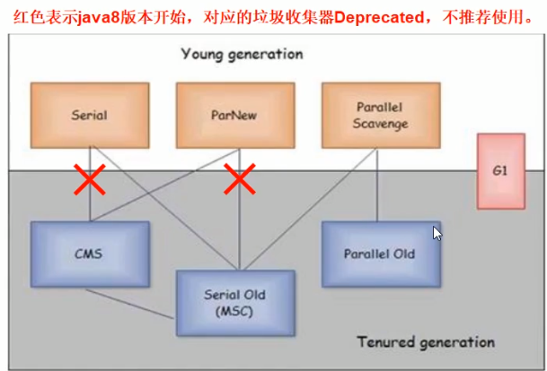

上图中打红×的年轻代和老年代是不推荐使用的组合。

##### 24.GC之约定参数说明 以及 Server/Client模式

- DefNew：Default New Generation  新生代默认GC  也就是 串行GC
- Tenured：Old   (老年代默认GC,也就是Serial Old)
- ParNew：Parallel New Generation
- PSYoungGen：Parallel Scavenge
- ParOldGen：Parallel Old Generation

Server/Client模式分别是什么意思？

Server启动慢，运行快；Client启动快，运行慢

使用范围：一般使用Server模式，Client模式基本不会使用

操作系统：

* 32位的Window操作系统，不论硬件如何都默认使用Client的JVM模式

* 32位的其它操作系统，2G内存同时有2个cpu以上用Server模式，低于该配置还是Client模式

* 64位只有Server模式

```
C:\Users\abc>java -version
java version "1.8.0_251"
Java(TM) SE Runtime Environment (build 1.8.0_251-b08)
Java HotSpot(TM) 64-Bit Server VM (build 25.251-b08, mixed mode)
```

##### 25.GC之Serial收集器

一句话：一个单线程的收集器，在进行垃圾收集时候，必须暂停其他所有的工作线程直到它收集结束。

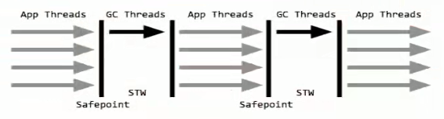

STW: Stop The World

串行收集器是最古老，最稳定以及效率高的收集器，只使用一个线程去回收但其在进行垃圾收集过程中可能会产生较长的停顿（Stop-The-World状态)。虽然在收集垃圾过程中需要暂停所有其他的工作线程，但是它简单高效，对于限定单个CPU环境来说，**没有线程交互的开销可以获得最高的单线程垃圾收集效率**，因此Serial垃圾收集器依然是java虚拟机运行在Client模式下默认的新生代垃圾收集器。

**对应JVM参数是：-XX:+UseSerialGC**

**开启后会使用：Serial(Young区用) + Serial Old(Old区用)的收集器组合**

表示：新生代、老年代都会使用串行回收收集器，新生代使用复制算法，老年代使用标记-整理算法

```java
public class GCDemo {

	public static void main(String[] args) throws InterruptedException {
		
		Random rand = new Random(System.nanoTime());
		
		try {
			String str = "Hello, World";
			while(true) {
				str += str + rand.nextInt(Integer.MAX_VALUE) + rand.nextInt(Integer.MAX_VALUE);
			}
		}catch (Throwable e) {
			e.printStackTrace();
		}
		
	}

}
```

VM参数：（启用UseSerialGC）

-Xms10m -Xmx10m -XX:+PrintGCDetails -XX:+PrintCommandLineFlags -XX:+UseSerialGC

上面程序运行的结果：

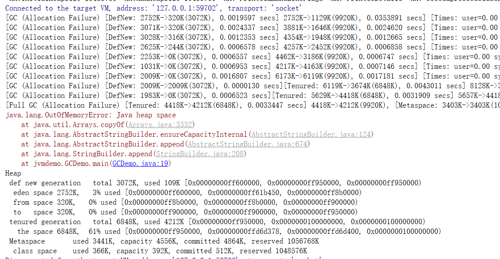

##### 26.GC之ParNew收集器

一句话：使用多线程进行垃圾回收，在垃圾收集时，会Stop-The-World暂停其他所有的工作线程直到它收集结束。

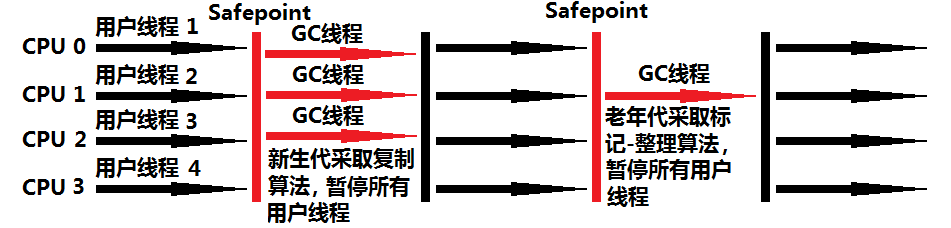

ParNew收集器其实就是Serial收集器**新生代**的并行多线程版本，最常见的应用场景是配合老年代的**CMS** GC工作，其余的行为和Seria收集器完全一样，ParNew垃圾收集器在垃圾收集过程中同样也要**暂停所有其他的工作线程**。它是很多Java虚拟机运行在Server模式下**新生代**的**默认垃圾收集器**。

**常用对应JVM参数**：-XX:+UseParNewGC启用ParNew收集器，只影响新生代的收集，不影响老年代。

**开启上述参数后**，会使用：ParNew(Young区)+ Serial Old的收集器组合，新生代使用复制算法，老年代采用标记-整理算法

但是，ParNew+Tenured这样的搭配，**Java8已经不再被推荐**

备注：-XX:ParallelGCThreads限制开启的GC线程数量，默认开启和CPU数目相同的线程数。

vm参数：-Xms10m -Xmx10m -XX:+PrintGCDetails -XX:+PrintCommandLineFlags -XX:+UseParNewGC 

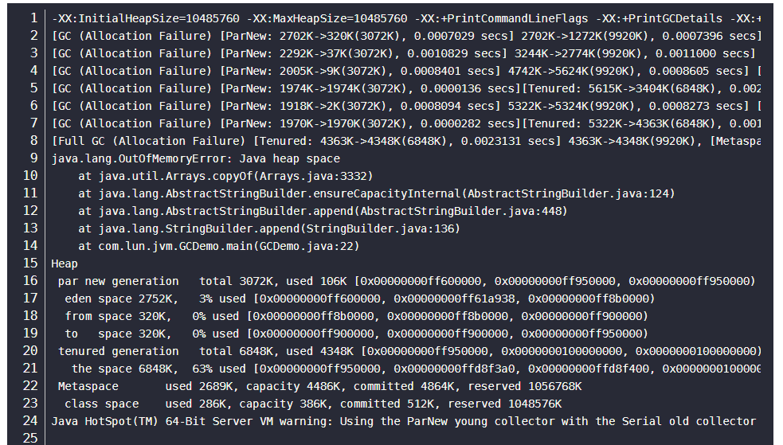


##### 27.GC之Parallel收集器

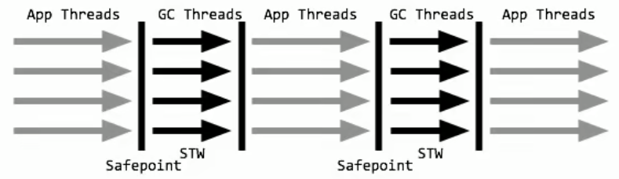

Parallel Scavenge收集器类似ParNew也是一个新生代垃圾收集器，**使用复制算法[新生代]**，也是一个并行的多线程的垃圾收集器，俗称吞吐量优先收集器。一句话：**串行收集器在新生代和老年代的并行化**。

它重点关注的是：可控制的吞吐量(Thoughput=运行用户代码时间(运行用户代码时间+垃圾收集时间),也即比如程序运行100分钟，垃圾收集时间1分钟，吞吐量就是99% )。高吞吐量意味着**高效利用CPU的时间**，它多用于在**后台运算而不需要太多交互的任务**。

自适应调节策略也是ParallelScavenge收集器与ParNew收集器的一个重要区别。(自适应调节策略:虚拟机会根据当前系统的运行情况收集性能监控信息，动态调整这些参数以提供最合适的停顿时间（-XX:MaxGCPauseMillis）或最大的吞吐量。

常用JVM参数：-XX:+UseParallelGC或-XX:+UseParallelOldGC（**可互相激活**）使用Parallel Scanvenge收集器。

开启该参数后：新生代使用复制算法，老年代使用标记-整理算法。

多说一句：-XX:ParallelGCThreads=数字N 表示启动多少个GC线程

* cpu>8 N= 5/8
* cpu<8 N=实际个数

-Xms10m -Xmx10m -XX:+PrintGCDetails -XX:+PrintCommandLineFlags -XX:+UseParallelGC

##### 28.GC之ParallelOld收集器

Parallel Old收集器是Parallel Scavenge的老年代版本，使用多线程的**标记-整理算法**，Parallel Old收集器在JDK1.6才开始提供。

在JDK1.6之前，新生代使用ParallelScavenge收集器只能搭配年老代的Serial Old收集器，只能保证新生代的吞吐量优先，无法保证整体的吞吐量。在JDK1.6之前（Parallel Scavenge + Serial Old )

Parallel Old 正是为了在年老代同样提供吞吐量优先的垃圾收集器，如果系统对吞吐量要求比较高，JDK1.8后可以优先考虑新生代Parallel Scavenge和年老代Parallel Old收集器的搭配策略。在JDK1.8及后〈Parallel Scavenge + Parallel Old )

JVM常用参数：-XX:+UseParallelOldGC 或 -XX:+UseParallelGC （**可互相激活**）使用Parallel Old收集器，设置该参数后，新生代Parallel+老年代Parallel Old。

-Xms10m -Xmx10m -XX:+PrintGCDetails -XX:+PrintCommandLineFlags -XX:+UseParallelOldGC

##### 29.GC之CMS收集器

CMS收集器(Concurrent Mark Sweep：**并发标记清除**）**是一种以获取最短回收停顿时间为目标的收集器**。

适合应用在互联网站或者**B/S**系统的服务器上，这类应用尤其**重视服务器的响应速度，希望系统停顿时间最短**。

CMS非常适合堆内存大、CPU核数多的服务器端应用，也是G1出现之前大型应用的首选收集器。
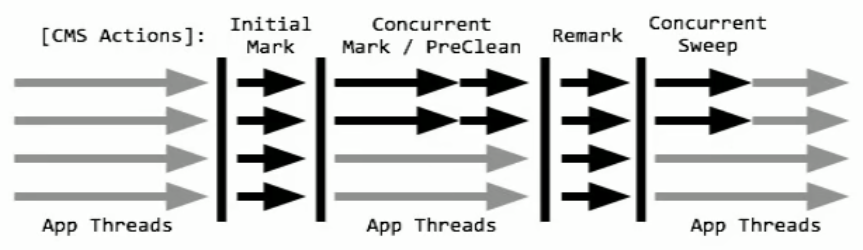

Concurrent Mark Sweep并发标记清除，**并发收集低停顿,**并发指的是与用户线程一起执行
开启该收集器的JVM参数：-XX:+UseConcMarkSweepGC开启该参数后会**自动**将-XX:+UseParNewGC打开。

开启该参数后，使用**ParNew（Young区用）+ CMS（Old区用）+ Serial Old**的收集器组合，**Serial Old将作为CMS出错的后备收集器**。

###### 四步过程：

初始标记（CMS initial mark） - 只是标记一下GC Roots能直接关联的对象，**速度很快**，**仍然需要暂停所有的工作线程**。

并发标记（CMS concurrent mark）和用户线程一起 - 进行GC Roots跟踪的过程，和用户线程一起工作，**不需要暂停工作线程**。主要标记过程，标记全部对象。

重新标记（CMS remark）- **为了修正在并发标记期间，因用户程序继续运行而导致标记产生变动的那一部分对象的标记记录**，仍然**需要暂停所有的工作线程**。由于并发标记时，用户线程依然运行，因此在正式清理前，再做修正。就怕第二个过程中(并发标记)用户线程让初始标记要清楚的对象又用了起来，所以需要重新检查标记下。

并发清除（CMS concurrent sweep） - **清除GCRoots不可达对象，和用户线程一起工作**，**不需要暂停工作线程**。基于标记结果，直接清理对象，由于耗时最长的并发标记和并发清除过程中，**垃圾收集线程可以和用户现在一起并发工作**，所以总体上来看**CMS 收集器的内存回收和用户线程是一起并发地执行**。

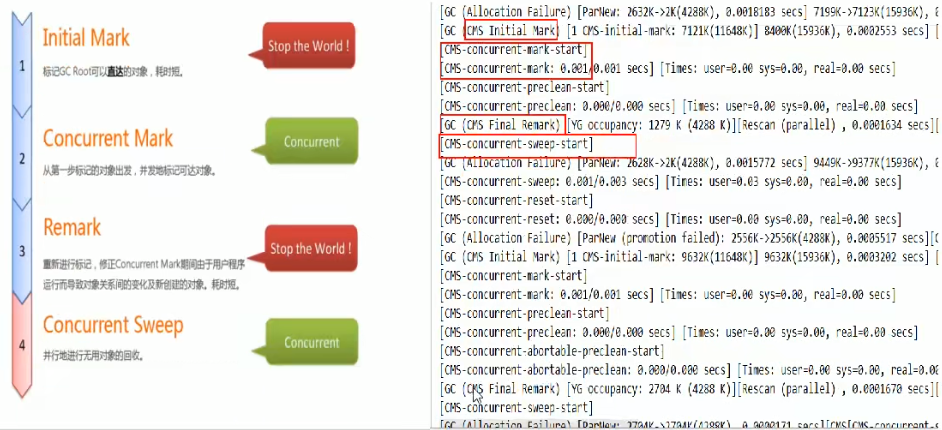

优点：并发收集低停顿。

缺点：并发执行，对CPU资源压力大，采用的标记清除算法会导致大量碎片。

由于并发进行，CMS在收集与应用线程会同时会增加对堆内存的占用，也就是说，CMS必须要在老年代堆内存用尽之前完成垃圾回收，否则CMS回收失败时，将触发担保机制，串行老年代收集器将会以STW的方式进行一次GC，从而造成较大停顿时间。

**标记清除算法无法整理空间碎片**，老年代空间会随着应用时长被逐步耗尽，最后将不得不通过**担保机制(Serial Old垃圾收集器)**对堆内存进行压缩。CMS也提供了参数-XX:CMSFullGCsBeForeCompaction(默认O，即每次都进行内存整理)来指定多少次CMS收集之后，进行一次压缩的Full GC。

复用之前的GCDemo

vm参数启动CMS垃圾收集：-Xms10m -Xmx10m -XX:+PrintGCDetails -XX:+PrintCommandLineFlags -XX:+UseConcMarkSweepGC 

##### 30.GC之SerialOld收集器

Serial Old是Serial垃圾收集器老年代版本，它同样是个单线程的收集器，使用标记-整理算法，这个收集器也主要是运行在 Client默认的java虚拟机默认的年老代垃圾收集器。

在Server模式下，主要有两个用途(了解，版本已经到8及以后):

* 在JDK1.5之前版本中与新生代的Parallel Scavenge 收集器搭配使用。(Parallel Scavenge + Serial Old )
* 作为老年代版中使用CMS收集器的后备垃圾收集方案。

vm参数：-Xms10m -Xmx10m -XX:+PrintGCDetails -XX:+PrintCommandLineFlags -XX:+UseSerialOldGC 

注意：**在Java8中，-XX:+UseSerialOldGC不起作用**

##### 31.GC之如何选择垃圾收集器

组合的选择：

* 单CPU或者小内存，单机程序
  * -XX:+UseSerialGC
* 多CPU，需要最大的吞吐量，如后台计算型应用
  * -XX:+UseParallelGC（这两个相互激活）
  * -XX:+UseParallelOldGC
* 多CPU，追求低停顿时间，需要快速响应如互联网应用
  * -XX:+UseConcMarkSweepGC
  * -XX:+ParNewGC

| **参数**                                 | 新生代垃圾收集器         | 新生代算法                | 老年代垃圾收集器                                             | 老年代算法 |
| ---------------------------------------- | ------------------------ | ------------------------- | ------------------------------------------------------------ | ---------- |
| -XX:+UseSerialGC                         | SerialGC                 | 复制                      | SerialOldGC                                                  | 标记整理   |
| -XX:+UseParNewGC                         | ParNew                   | 复制                      | SerialOldGC                                                  | 标记整理   |
| -XX:+UseParallelGC/-XX:UserParallelOldGC | Parallel Scavenge        | 复制                      | Parallel Old                                                 | 标记整理   |
| -XX:+UseConcMarkSweepGC                  | ParNew                   | 复制                      | CMS + Serial Old的收集器组合，Serial Old作为CMS出错的后备收集器 | 标记清除   |
| -XX:+UseG1GC                             | G1整体上采用标记整理算法 | 局部复制,不会产生内存随便 |                                                              |            |

##### 32.G1垃圾回收器概述

借用之前的CGDemo

将启动参数变更为：-Xms10m -Xmx10m -XX:+PrintGCDetails -XX:+PrintCommandLineFlags -XX:+UseG1GC

注意控制台输出的结果：

只有一个堆信息和元空间 不像之前的垃圾回收器有区分新生代和老年代以及元空间

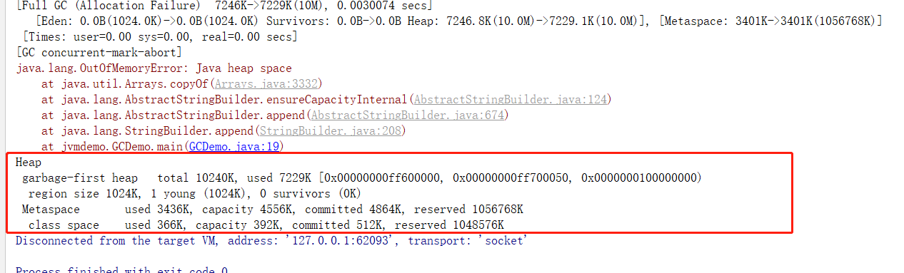

###### 以前收集器特点：

- 年轻代和老年代是各自独立且连续的内存块；
- 年轻代收集使用单eden+s0+s1进行复机算法；
- 老年代收集必须扫描整个老年代区域；
- 都是以尽可能少而快速地执行GC为设计原则。

###### G1是什么

G1 (Garbage-First）收集器，是一款面向服务端应用的收集器：

从官网的描述中，我们知道G1是一种服务器端的垃圾收集器，应用在多处理器和大容量内存环境中，在实现**高吞吐量**的同时，尽可能的**满足垃圾收集暂停时间变短**的要求。另外，它还具有以下特性:

* 像CMS收集器一样，能与应用程序线程并发执行。

* 整理空闲空间更快。

* 需要更多的时间来预测GC停顿时间。

* 不希望牺牲大量的吞吐性能。

* 不需要更大的Java Heap。

**G1收集器的设计目标是取代CMS收集器**，它同CMS相比，在以下方面表现的更出色：

* G1是一个有整理内存过程的垃圾收集器，不会产生很多内存碎片。
* G1的Stop The World(STW)更可控，**G1在停顿时间上添加了预测机制**，**用户可以指定期望停顿时间**。

CMS垃圾收集器虽然减少了暂停应用程序的运行时间，但是它还是存在着内存碎片问题。于是，为了去除内存碎片问题，同时又保留CMS垃圾收集器低暂停时间的优点，JAVA7发布了一个新的垃圾收集器-G1垃圾收集器。

G1是在2012年才在jdk1.7u4中可用。oracle官方计划在JDK9中将G1变成默认的垃圾收集器以替代CMS。它是一款面向服务端应用的收集器，主要应用在多CPU和大内存服务器环境下，极大的减少垃圾收集的停顿时间，全面提升服务器的性能，逐步替换java8以前的CMS收集器。

主要改变是Eden，Survivor和Tenured等内存区域**不再是连续的了**，而是变成了一个个大小一样的region ,每个region从1M到32M不等。**一个region有可能属于Eden，Survivor或者Tenured内存区域**。

**特点：**

* G1能充分利用多CPU、多核环境硬件优势，尽量缩短STW。
* G1整体上采用**标记-整理算法**，**局部是通过复制算法**，**不会产生内存碎片**。
* **宏观上**看G1之中**不再区分年轻代和老年代**。把内存划分成多个独立的子区域(Region)，可以近似理解为一个围棋的棋盘。
* G1收集器里面讲整个的内存区都混合在一起了，**但其本身依然在小范围内要进行年轻代和老年代的区分**，保留了新生代和老年代，**但它们不再是物理隔离的**，而是一部分Region的集合且不需要Region是连续的，**也就是说依然会采用不同的GC方式来处理不同的区域**。
* **G1虽然也是分代收集器，但整个内存分区不存在物理上的年轻代与老年代的区别**，也不需要完全独立的**survivor(to space)**堆做复制准备。**G1只有逻辑上的分代概念**，或者说每**个分区都可能随G1的运行在不同代之间前后切换**。

##### 33.G1的底层原理

Region区域化垃圾收集器 - 最大好处是化整为零，避免全内存扫描，只需要按照区域来进行扫描即可。

区域化内存划片Region，整体编为了一些列不连续的内存区域，**避免了全内存区的GC操作**。

核心思想是**将整个堆内存区域分成大小相同的子区域(Region)**，在JVM启动时会自动设置这些子区域的大小，在堆的使用上，G1并不要求对象的存储一定是物理上连续的只要逻辑上连续即可，每个分区也不会固定地为某个代服务，可以按需在年轻代和老年代之间切换。**启动时可以通过参数-XX:G1HeapRegionSize=n可指定分区大小（1MB~32MB，且必须是2的幂），默认将整堆划分为2048个分区**。

**大小范围在1MB~32MB，最多能设置2048个区域**，也即能够支持的最大内存为：32 M B ∗ 2048 = 65536 M B = 64 G 32MB*2048=65536MB=64G32MB∗2048=65536MB=64G内存

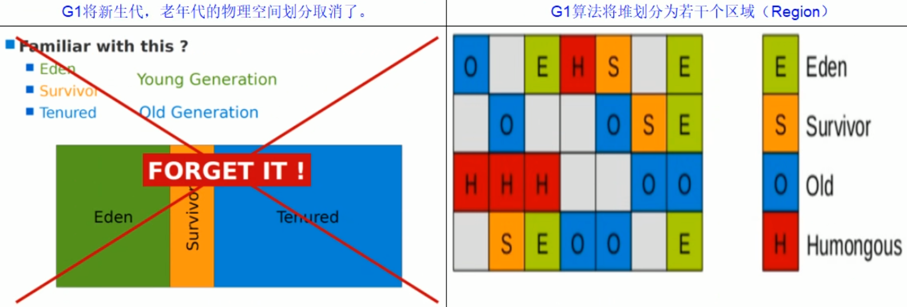

G1算法将堆划分为若干个区域(Region），它仍然属于**分代收集器**。

这些Region的一部分包含新生代，新生代的垃圾收集**依然采用暂停所有应用线程的方式**，**将存活对象拷贝到老年代或者Survivor空间**。

这些Region的一部分包含老年代，G1收集器通过将对象从一个区域复制到另外一个区域，完成了清理工作。这就意味着，在正常的处理过程中，G1完成了堆的压缩（至少是部分堆的压缩），这样也就不会有CMS内存碎片问题的存在了。

在G1中，还有一种特殊的区域，叫**Humongous区域**。

如果一个对象占用的空间超过了**分区容量50%以上**，G1收集器就认为这是一个巨型对象。这些巨型对象默认直接会被分配在年老代，但是如果它是一个短期存在的巨型对象，就会对垃圾收集器造成负面影响。

为了解决这个问题，G1划分了一个**Humongous区**，它用来专门存放**巨型对象**。**如果一个H区装不下一个巨型对象，那么G1会寻找连续的H分区来存储**。为了能找到连续的H区，有时候不得不启动**Full GC**。

###### 回收步骤：

1.G1收集器下的Young GC

针对Eden区进行收集，Eden区耗尽后会被触发，主要是小区域收集＋形成连续的内存块，避免内存碎片

* **Eden区的数据移动到Survivor区，假如出现Survivor区空间不够，Eden区数据会部会晋升到Old区**。
* **Survivor区的数据移动到新的Survivor区，部会数据晋升到Old区。**
* 最后Eden区收拾干净了，GC结束，用户的应用程序继续执行
  

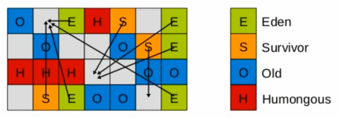

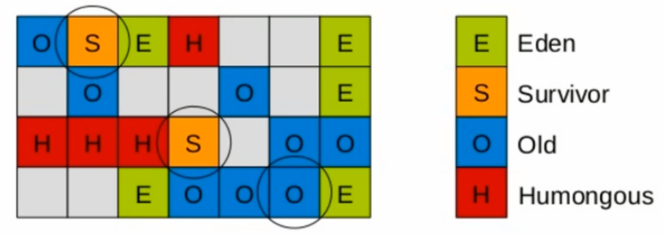

###### 四步过程：

1. 初始标记：只标记GC Roots能直接关联到的对象
2. 并发标记：进行GC Roots Tracing的过程
3. 最终标记：修正并发标记期间，因程序运行导致标记发生变化的那一部分对象
4. 筛选回收：根据时间来进行价值最大化的回收

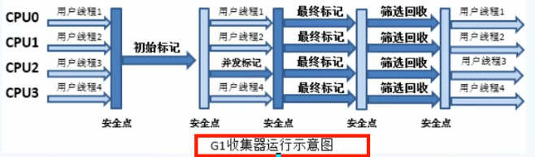


##### 34.G1参数配置及和CMS的比较

* -XX:+UseG1GC
* -XX:G1HeapRegionSize=n：设置的G1区域的大小。值是2的幂，范围是1MB到32MB。目标是根据最小的Java堆大小划分出约2048个区域。
* -XX:MaxGCPauseMillis=n：最大GC停顿时间，这是个软目标，JVM将尽可能（但不保证）停顿小于这个时间。
* -XX:InitiatingHeapOccupancyPercent=n：堆占用了多少的时候就触发GC，默认为45。
* -XX:ConcGCThreads=n：并发GC使用的线程数。
* -XX:G1ReservePercent=n：设置作为空闲空间的预留内存百分比，以降低目标空间溢出的风险，默认值是10%。

开发人员仅仅需要声明以下参数即可：

三步归纳：开始G1+设置最大内存+设置最大停顿时间

* -XX:+UseG1GC
* -Xmx32g
* -XX:MaxGCPauseMillis=100

-XX:MaxGCPauseMillis=n：最大GC停顿时间单位毫秒，这是个软目标，JVM将尽可能（但不保证）停顿小于这个时间

**G1和CMS比较**

* G1不会产生内碎片
* 是可以精准控制停顿。该收集器是把整个堆（新生代、老年代）划分成多个固定大小的区域，每次根据允许停顿的时间去收集垃圾最多的区域。

##### 35.垃圾回收小总结：

**1.垃圾对象的判断**：引用计数器；可达性分析(虚拟机栈-局部变量，方法区类属性和常量所引用的对象，本地方法栈所引用的，都可作为GCroot)

**2.回收策略**：标记清除(效率差，存在内存碎片),复制(没有碎片，但浪费空间),标记整理(没有碎片，需要移动对象),分代().

**3.垃圾回收器**：Serial(单线程GC,会STW), ParNew(多线程的GC,会STW), Parallel-Scavenge(多线程同parNew,不过它关心的是吞吐量，用户代码time/(用户time+GC time)), CMS(三阶段a初始标记,STW，b并行标记，c重新标记并清除，STW-----占用cpu,空间碎片，并发异常),G1(并发和并行，分代，空间整合，可预测停顿),ZGC(jdk11).

##### 36.JVMGC结合SpringBoot微服务优化简介

1. IDEA开发微服务工程。
2. Maven进行clean package。
3. 要求微服务启动的时候，同时配置我们的JVM/GC的调优参数。
4. 公式：`java -server jvm的各种参数 -jar 第1步上面的jar/war包名`。

##### 37.类加载过程

类从被加载到虚拟机内存中开始，到卸载出内存为止，它的整个生命周期包括：加载、验证、准备、解析、初始化、使用和卸载7个阶段。其中验证、准备、解析3个部分统称为连接。

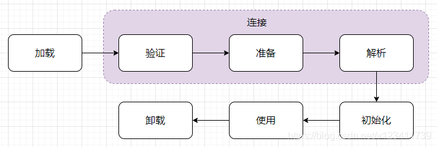

###### 1.加载

“类加载”过程的一个阶段，在加载阶段，虚拟机需要完成以下3件事情：

* 通过一个类的全限定名来**获取定义此类的二进制字节流**。
* 将这个字节流所代表的静态存储结构**转化**为**方法区的运行时数据结构**。
* 在内存中生成一个**代表这个类**的 java.lang.Class 对象，作为**方法区**这个类的各种数据的访问入口。

###### 2.验证

连接阶段的第一步，这一阶段的目的是为了确保 Class 文件的字节流中包含的信息**符合当前虚拟机的要求**，并且**不会危害虚拟机自身的安全**。从整体上看，验证阶段大致上会完成下面4个阶段的检验动作：**文件格式验证**、**元数据验证**、**字节码验证**、**符号引用验证**。

**什么是符号引用？**

###### 3.准备

该阶段是正式为**类变量**（static修饰的变量）**分配内存并设置类变量初始值**的阶段，这些变量所使用的内存都将在方法区中进行分配。这里所说的初始值“通常情况”下是数据类型的零值，下表列出了Java中所有基本数据类型的零值。

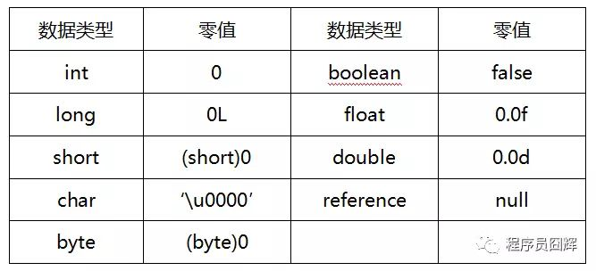

###### 4.解析

该阶段是虚拟机将常量池内的**符号引用**替换为**直接引用**的过程。解析动作主要针对类或**接口、字段、类方法、接口方法、方法类型、方法句柄和调用点限定符**这7类符号引用进行。

###### 5.初始化

到了初始化阶段，才真正开始执行类中定义的Java程序代码。在准备阶段，变量已经赋过一次系统要求的初始零值，而在初始化阶段，则会根据程序员通过程序制定的主观计划去初始化类变量和其他资源。

我们也可以从另外一种更直接的形式来表达：初始化阶段是**执行类构造器**<clinit>()方法的过程。<clinit>() 不是程序员在 Java 代码中直接编写的方法，而是由 **Javac 编译器自动生成的**。

<clinit>() 方法是由**编译器**自动收集类中的所有类变量的赋值动作和静态语句块（static{}块）中的语句合并产生的，编译器收集的顺序是由语句在源文件中出现的顺序所决定的，静态语句块中只能访问到定义在静态语句块之前的变量，定义在它之后的变量，在前面的静态语句块可以赋值，但是不能访问。

##### 38.类加载器种类

从 Java 虚拟机的角度来讲，只存在两种不同的类加载器：

一种是启动类加载器（Bootstrap ClassLoader），这个类加载器使用C++语言实现，是虚拟机自身的一部分；

另一种就是所有其他的类加载器，这些类加载器都由Java语言实现，独立于虚拟机外部，并且全都继承自抽象类java.lang.ClassLoader。

从Java开发人员的角度来看，绝大部分Java程序都会使用到以下3种系统提供的类加载器。

* 启动类加载器（Bootstrap ClassLoader）：

这个类加载器负责将存放在<JAVA_HOME>\lib目录中的，或者被-Xbootclasspath参数所指定的路径中的，并且是虚拟机识别的（仅按照文件名识别，如rt.jar，名字不符合的类库即使放在lib目录中也不会被加载）类库加载到虚拟机内存中。

* 扩展类加载器（Extension ClassLoader）：

这个加载器由sun.misc.Launcher$ExtClassLoader实现，它负责加载<JAVA_HOME>\lib\ext目录中的，或者被java.ext.dirs系统变量所指定的路径中的所有类库，开发者可以直接使用扩展类加载器。

* 应用程序类加载器（Application ClassLoader）：

这个类加载器由sun.misc.Launcher$AppClassLoader实现。由于这个类加载器是ClassLoader中的getSystemClassLoader()方法的返回值，所以一般也称它为系统类加载器。它负责加载用户类路径（ClassPath）上所指定的类库，开发者可以直接使用这个类加载器，如果应用程序中没有自定义过自己的类加载器，一般情况下这个就是程序中默认的类加载器。

我们的应用程序都是由这3种类加载器互相配合进行加载的，如果有必要，还可以加入自己定义的类加载器。这些类加载器之间的关系一般如图所示。

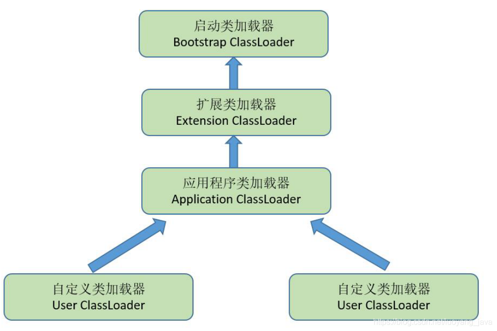

##### 39.什么是双亲委派模型

如果一个类加载器收到了类加载的请求，它首**先不会自己去尝试加载这个类**，而是把这个请求**委派给父加载器**去完成，每一个层次的类加载器都是如此，因此所有的加载请求最终都应该传送到顶层的**启动类加载器**中，只有当**父加载器反馈自己无法完成这个加载请求（它的搜索范围中没有找到所需的类）时，子加载器才会尝试自己去加载**。

类加载的源码java.lang.ClassLoader的loadClass方法：

```java
protected Class<?> loadClass(String name, boolean resolve)
        throws ClassNotFoundException
    {
        synchronized (getClassLoadingLock(name)) {
            // 1、检查请求的类是否已经被加载过了
            Class<?> c = findLoadedClass(name);
            if (c == null) {
                long t0 = System.nanoTime();
                try {
                    // 2、将类加载请求先委托给父类加载器
                    if (parent != null) {
                        // 父类加载器不为空时，委托给父类加载进行加载
                        c = parent.loadClass(name, false);
                    } else {
                        // 父类加载器为空，则代表当前是Bootstrap，从Bootstrap中加载类
                        c = findBootstrapClassOrNull(name);
                    }
                } catch (ClassNotFoundException e) {
                    // 如果父类加载器抛出ClassNotFoundException
                    // 说明父类加载器无法完成加载请求
                }

             if (c == null) {
                 // 3、在父类加载器无法加载的时候，再调用本身的findClass方法来进行类加载
                 long t1 = System.nanoTime();
                 c = findClass(name);

                 // this is the defining class loader; record the stats
                 sun.misc.PerfCounter.getParentDelegationTime().addTime(t1 - t0);
                 sun.misc.PerfCounter.getFindClassTime().addElapsedTimeFrom(t1);
                 sun.misc.PerfCounter.getFindClasses().increment();
             }
         }
         if (resolve) {
             resolveClass(c);
         }
         return c;
     }
}
```


##### 40.为什么使用双亲委派模式

1）使用双亲委派模型来组织类加载器之间的关系，有一个显而易见的好处就是 Java 类随着它的类加载器一起具备了一种带有优先级的层次关系。

2）如果没有使用双亲委派模型，由各个类加载器自行去加载的话，如果用户自己编写了一个java.lang.Object 的类，并放在程序的 ClassPath 中，那系统中将会出现多个不同的 Object 类，Java 类型体系中最基础的行为也就无法保证，应用程序也将会变得一片混乱。

简单的来说：一个是**安全性**，另一个就是**性能**；（**避免重复加载** 和 **避免核心类被篡改**）

用户自定义一个java.lang.String类，该String类具有系统的String类一样的功能，只是在某个函数稍作修改。比如equals函数，这个函数经常使用，如果在这这个函数中，黑客加入一些“病毒代码”。并且通过自定义类加载器加入到JVM中。此时，如果没有双亲委派模型，那么JVM就可能误以为黑客自定义的java.lang.String类是系统的String类，导致“病毒代码”被执行。

而有了双亲委派模型，黑客自定义的java.lang.String类永远都不会被加载进内存。因为首先是最顶端的类加载器加载系统的java.lang.String类，最终自定义的类加载器无法加载java.lang.String类。

##### 41.有哪些场景破坏了双亲委派模型

目前比较常见的场景主要有：

1）线程上下文类加载器，典型的：JDBC 使用**线程上下文类加载器**加载 Driver 实现类

2）Tomcat 的多 Web 应用程序

3）OSGI 实现模块化热部署

##### 42.为什么要破坏双亲委派模型

原因其实很简单，就是使用双亲委派模型**无法满足需求**了，因此只能破坏它，这边以面试常问的 Tomcat 为例。

我们知道 Tomcat 容器可以同时部署多个 Web 应用程序，多个 Web 应用程序很容易存在依赖同一个 jar 包，但是版本不一样的情况。例如应用1和应用2都依赖了 spring ，应用1使用的 3.2.* 版本，而应用2使用的是 4.3.* 版本。

如果遵循双亲委派模型，这个时候使用哪个版本了？

其实使用哪个版本都不行，很容易出现兼容性问题。因此，Tomcat 只能选择破坏双亲委派模型

##### 43.如何破坏双亲委派模型？

破坏双亲委派模型的思路都比较类似，这边以面试中常问到的 Tomcat 为例。

其实原理非常简单，我们可以看到上面的类加载方法源码（loadClass）的方法修饰符是 protected，因此我们只需以下几步就能破坏双亲委派模型。

1）继承 ClassLoader，Tomcat 中的 WebappClassLoader 继承 ClassLoader 的子类 URLClassLoader。

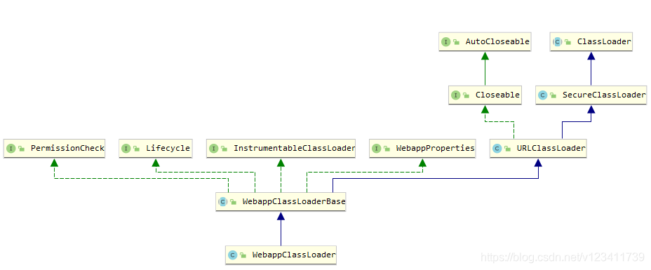

2）重写 loadClass 方法，实现自己的逻辑，不要每次都先委托给父类加载，例如可以先在本地加载，这样就破坏了双亲委派模型了。

##### 44.运行时数据区（Run-Time Data Areas）

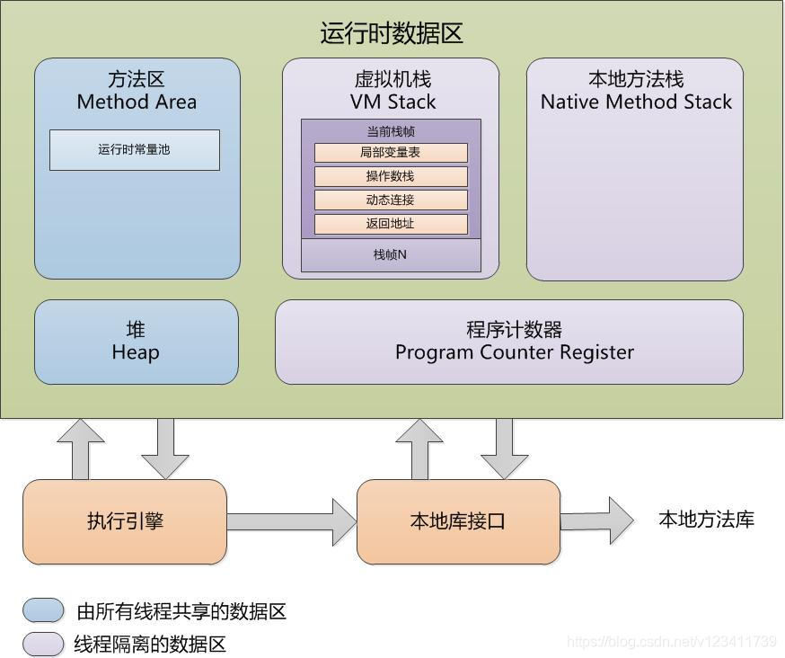

Java 虚拟机定义了若干种在程序执行期间会使用到的运行时数据区域。

其中一些数据区域在 Java 虚拟机启动时被创建，随着虚拟机退出而销毁。也就是线程间共享的区域：堆、方法区、运行时常量池。

另外一些数据区域是按线程划分的，这些数据区域在线程创建时创建，在线程退出时销毁。也就是线程间隔离的区域：程序计数器、Java虚拟机栈、本地方法栈。

1）程序计数器（Program Counter Register）

Java 虚拟机可以支持多个线程同时执行，每个线程都有自己的程序计数器。在任何时刻，每个线程都只会执行一个方法的代码，这个方法称为该线程的当前方法（current method）。

如果线程正在执行的是 Java 方法（不是 native 的），则程序计数器记录的是正在执行的 Java 虚拟机字节码指令的地址。如果正在执行的是本地（native）方法，那么计数器的值是空的（undefined）。

2）Java虚拟机栈（Java Virtual Machine Stacks）

每个 Java 虚拟机线程都有自己私有的 Java 虚拟机栈，它与线程同时创建，用于存储栈帧。

Java 虚拟机栈描述的是 Java 方法执行的内存模型：每个方法在执行的同时都会创建一个栈帧用于存储局部变量表、操作数栈、动态链接、方法出口等信息。

每一个方法从调用直至执行完成的过程，就对应着一个栈帧在虚拟机栈中入栈到出栈的过程。

3）本地方法栈（Native Method Stacks）

本地方法栈与 Java 虚拟机栈所发挥的作用是非常相似的，它们之间的区别不过是 Java 虚拟机栈为虚拟机执行 Java方法（也就是字节码）服务，而本地方法栈则为虚拟机使用到的本地（Native）方法服务。

4）堆（Heap）

堆是被各个线程共享的运行时内存区域，也是供所有类实例和数组对象分配内存的区域。

堆在虚拟机启动时创建，堆存储的对象不会被显示释放，而是由垃圾收集器进行统一管理和回收。

5）方法区（Method Area）

方法区是被各个线程共享的运行时内存区域。**方法区类似于传统语言的编译代码的存储区**。它存储了每一个**类的结构信息**，例如：**运行时常量池**、**字段和方法数据**，**构造函数**和**普通方法**的**字节码内容**，还包括一些用于**类、实例、接口初始化用到的特殊方法**。

6）运行时常量池（Run-Time Constant Pool）

运行时常量池是 class 文件中每一个类或接口的常量池表（constant_pool table）的运行时表示形式。

它包含了若干种常量，从编译时已知的数值字面量到必须在运行时解析后才能获得的方法和字段引用。运行时常量池的功能类似于传统编程语言的符号表（symbol table），不过它包含的数据范围比通常意义上的符号表要更为广泛。


##### 45.Java中常量池种类

现在我们经常提到的常量池主要有三种：class 文件常量池、运行时常量池、字符串常量池

##### 46.class 文件常量池

class 文件常量池（class constant pool）属于 class 文件的其中一项，class 类文件包含：魔数、类的版本、常量池、访问标志、字段表集合、方发表等信息。

常量池用于存放编译期间生成的各种字面量（Literal）和符号引用（Symbolic References）。

**字面量**比较接近于**Java语言层面的常量概念**，如文本字符串、声明为 final 的常量值等。

**符号引用**则属于**编译原理**方面的概念。符号引用是一组符号来描述所引用的目标，符号可以是任何形式的字面量，只要使用时能无歧义地定位到目标即可（**它与直接引用区分**，**直接引用一般是指向方法区的本地指针**，**相对偏移量或是一个能间接定位到目标的句柄**）。符号引用主要包括下面几类常量：

* 被模块导出或开放的包（Package）
* 类和接口的全限定名（Fully Qualified Name）
* 字段的名称和描述符（Descriptor）

常量池中每一项常量都是一个表，截至JDK 13，常量表中分别有17种不同类型的常量。17种常量类型所代表的具体含义如图所示。

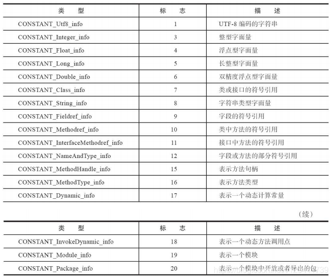


##### 47.运行时常量池

**class 文件常量池**是在**类被编译成 class 文件时**生成的。而当**类被加载到内存中**后，**JVM 就会将 class 文件常量池中的内容存放到运行时常量池中**。

Java 虚拟机规范中对运行时常量池的定义如下：

​	运行时常量池是 **class 文件中每一个类或接口的常量池表**（constant_pool table）的运行时表示形式。

因此，根据规范定义，可以说**运行时常量池是 class 文件常量池的运行时表示**，**每个类在运行时都有自己的一个独立的运行时常量池**。

##### 48.字符串常量池

简单来说，**HotSpot** 虚拟机里的字符串常量池（**StringTable**）是个**哈希表**，**全局只有一份，被所有的类共享**。

StringTable 具体存储的是 **String 对象的引用**，**而不是** String 对象实例自身。**String 对象实例**在 JDK 6 及之前是在永久代里，**从JDK 7 开始放在堆里**。

根据 Java 虚拟机规范的定义，**堆是存储 Java 对象的地方，其他地方是不会有 Java 对象实体的，如果有的话，根据规范定义，这些地方也要算堆的一部分**。

##### 49.字符串常量池是否属于方法区

我认为是不属于的。

在读本文之前，我相信很多同学会有如下观点：因为运行时常量池属于方法区，所以很多同学认为字符串常量池也应该属于方法区。

但是相信看了上面的内容后，会开始意识到，运行时常量池和字符串常量池其实是不同的两个东西，当然它们在字符串解析时会有关联。

Java 虚拟机规范中对方法区的定义如下：

​		在 Java 虚拟机中，方法区是**被各个线程共享的运行时内存区域**。方法区**类似于传统语言的编译代码的存储区**，或者**类似于操作系统进程中的文本段**。**它存储了每一个类的结构信息**，例如：**运行时常量池**、**字段和方法数据**，**构造函数和普通方法的字节码内容**，**还包括一些用于类、实例、接口初始化用到的特殊方法**。

这边的关键在于 “它存储了每一个类的结构信息”，而**字符串常量池并不属于某个类**，**字符串常量是全局共享的**，因此，根据规范定义，我们可以说字符串常量池不属于方法区。

**那字符串常量池（StringTable）究竟存在哪里了？** 

**StringTable 本体是存储在 native memory（本地内存）里，不是在方法区里，当然，更不是在堆里**

##### 50.运行时常量池和字符串常量池的关联

上面说了，运行时常量池和字符串常量池在字符串**解析时**会有关联，具体如下。

类的运行时常量池中有 CONSTANT_String_info（见上面表格）类型的常量，CONSTANT_String_info 类型的常量的解析（resolve）过程如下：

首先到字符串常量池（StringTable）中查找是否已经有了该字符串的引用，如果有，则直接返回字符串常量池的引用；如果没有，则在堆中创建 String 对象，并在字符串常量池驻留其引用，然后返回该引用。

也就说，运行时常量池里的 CONSTANT_String_info 类型的常量，经过解析（resolve）之后，**同样存的是字符串的引用，并且和 StringTable 驻留的引用的是一致的**。

##### 51.String#intern 方法

在 JDK 7 及之后的版本中，该方法的作用如下：**如果字符串常量池中已经有这个字符串，则直接返回常量池中的引用；如果没有，则将这个字符串的引用保存一份到字符串常量池，然后返回这个引用**。

下面的例子可以进行简单的验证：

```java
public static void main(String args[]) {
    // 创建2个对象，str持有的是new创建的对象引用
    // 1）驻留（intern）在字符串常量池中的对象
    // 2）new创建的对象
    String str = new String("joonwhee");
    // 字符串常量池中已经有了，返回字符串常量池中的引用
    String str2 = "joonwhee";
    // false，str为new创建的对象引用，str2为字符创常量池中的引用
    System.out.println(str == str2);
    // str修改为字符串常量池的引用，所以下面为true
    str = str.intern();
    // true
    System.out.println(str == str2);
}
```

##### 52.被移除的永久代（PermGen）

永久代在 Java 8 被移除。根据官方提案的描述，移除的主要动机是：要将 JRockit 和 Hotspot 进行融合，而 JRockit 并没有永久代。

而据我们所了解的，还有另外一个重要原因是永久代本身也存在较多的问题，经常出现OOM，还出过不少bug。

根据官方提案的描述，永久代主要存储了三种数据： 

1）Class metadata（类元数据），也就是方法区中包含的数据，除了编译生成的字节码被放在 native memory（本地内存）。

2）interned Strings，也就是字符串常量池中驻留引用的字符串对象，字符串常量池只驻留引用，而实际对象是在永久代中。

3）class static variables，类静态变量。

移除永久代后，interned Strings 和 class static variables 被移动了堆中，Class metadata 被移动到了后来的元空间。

##### 53.永久代和方法区的关系？

方法区是 Java 虚拟机规范中定义的一种逻辑概念，而**永久代是对方法区的实现**。但是永久代并不等同于方法区，方法区也不等同于永久代。

永久代中的 interned Strings 并不属于方法区，按规范：堆是存储 Java 对象的地方 ，这部分应该属于堆，因此永久代并不是只用于实现方法区。

方法区中 JIT 编译生成的代码并不是存放在永久代，而是在 native memory 中，因此可以说方法区也并不只是由永久代来实现。

##### 54.元空间（metaspace）

元空间在 Java 8 移除永久代后被引入，用来代替永久代，本质和永久代类似，都是**对方法区的实现**。不过元空间与永久代之间最大的区别在于：**元空间并不在虚拟机中，而是使用本地内存**（native memory）。

元空间主要用于存储 Class metadata（类元数据），根据其命名其实也看得出来。

可以通过 -XX:MaxMetaspaceSize 参数来限制元空间的大小，如果没有设置该参数，则元空间默认限制为机器内存。

##### 55.为什么引入元空间？

在 Java 8 之前，Java 虚拟机使用永久代来存放类元信息，通过-XX:PermSize、-XX:MaxPermSize 来控制这块内存的大小，随着动态类加载的情况越来越多，这块内存变得不太可控，到底设置多大合适是每个开发者要考虑的问题。

如果设置小了，容易出现内存溢出；如果设置大了，又有点浪费，尽管不会实质分配这么大的物理内存。

而元空间可以较好的解决内存设置多大的问题：当我们**没有指定** -XX:MaxMetaspaceSize 时，**元空间可以动态的调整使用的内存大小，以容纳不断增加的类**。

##### 56.元空间能彻底解决内存溢出（Out Of Memory）问题吗？

很遗憾，答案是不行的。

元空间无法彻底解决内存溢出的问题，只能说是有所缓解。当内存使用完毕后，元空间一样会出现内存溢出的情况，最典型的场景就是出现了内存泄漏时。
