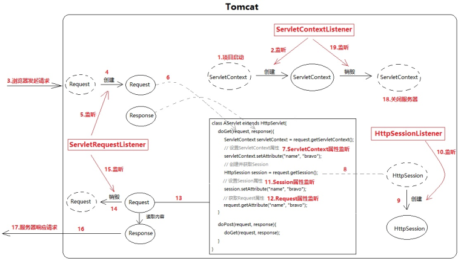
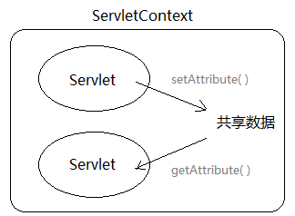
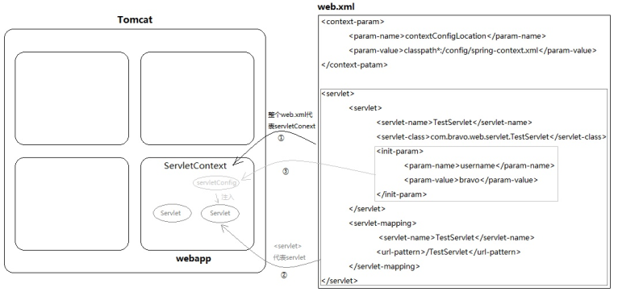

1.JavaWeb是用Java语言开发的，能通过浏览器进行访问的程序的总称。基于请求和响应开发的。
请求：客户端给服务器发送数据
响应：服务器给客户端回传数据。

2.web资源分类：按照实现的方式和呈现的效果不同，分为静态资源和动态资源。
静态资源有：html,css,js,txt,png,mp4......
动态资源有：jsp页面，servlet程序，asp页面......

3.Tomcat：由apache提供的web程序，提供对servlet和jsp的支持，是一种轻量级的javaWeb容器（服务器）。

监听器：6个常规监听器  2个感知监听器

6个常规监听器[**需要**在web.xml中配置]
    |---ServletContext
            |---ServletContextListener（生命周期监听）
            |---ServletContextAttributeListener（属性监听）
    |---HttpSession
            |---HttpSessionListener（生命周期监听）
            |---HttpSessionAttributeListener（属性监听）
    |---ServletRequest
            |---ServletRequestListener（生命周期监听）
            |---ServletRequestAttributeListener（属性监听）
2个感知监听【**不需要**在web.xml中配置】
    |---HttpSessionBindingListener
    |---HttpSessionActivationListener

##### ServletContext的作用

参考：https://www.yuque.com/books/share/2b434c74-ed3a-470e-b148-b4c94ba14535/tmdy9s

ServletContext，直译的话叫做“Servlet上下文”，听着挺别扭，但其实就是个大容器，是一个map。服务器会为每个应用创建一个ServletContext对象：

- ServletContext对象的创建是在服务器启动时完成的

- ServletContext对象的销毁是在服务器关闭时完成的

  

ServletContext对象的作用是在整个Web应用的动态资源（Servlet/JSP）之间共享数据。例如在AServlet中向ServletContext对象保存一个值，然后在BServlet中就可以获取这个值。

这种用来装载共享数据的对象，在JavaWeb中共有4个，而且更习惯被成为“域对象”：

- ServletContext域（Servlet间共享数据）
- Session域（一次会话间共享数据，也可以理解为多次请求间共享数据）

- Request域（同一次请求共享数据）
- Page域（JSP页面内共享数据）

它们都可以看做是map，都有getAttribute()/setAttribute()方法。来看一下物理磁盘中的配置文件与内存对象之间的映射关系：

每一个动态web工程，都应该在WEB-INF下创建一个web.xml，它代表当前整个应用。Tomcat会根据这个配置文件创建ServletContext对象
