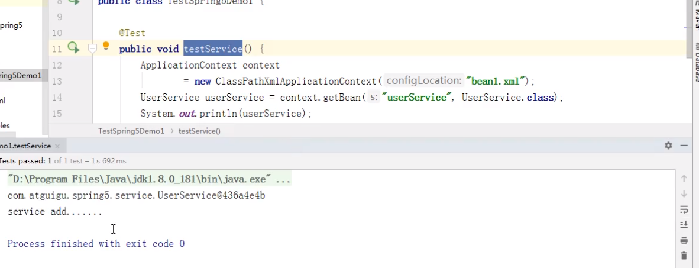
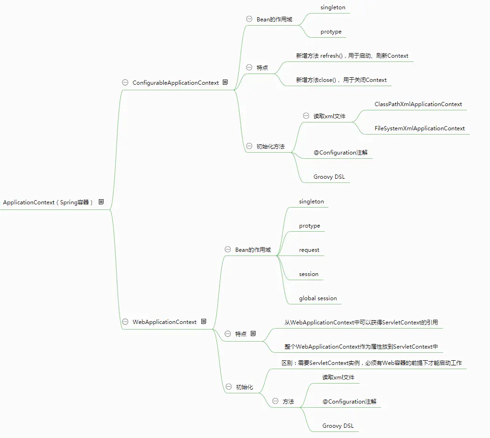
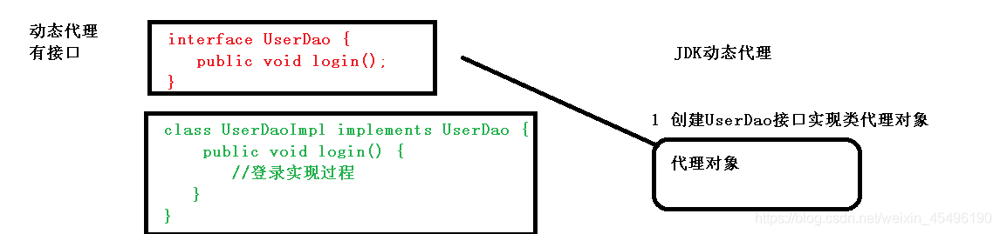
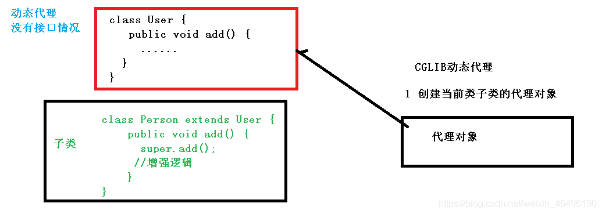
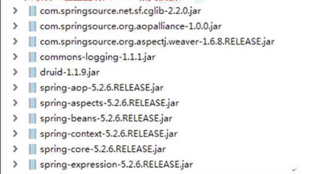

##### 0.控制反转和依赖注入

**硬编码new对象**：在刚学编程的时候，我们知道在一个类A中，需要调用类B的普通public方法，那么需要在类A中将类B new出来，再使用，那么A就完全自主控制B的产生和销毁。但是这样的方式存在着比较麻烦的问题，如果很多个类都需要调用类B的方法，那么类B就需要new很多次。

**控制反转思想**：上面硬编码会出现new 很多次的问题，那么我们将需要new出来的B对象放到一个容器里，由容器控制这个对象的产生和销毁，而不是传统的在你的对象内部直接控制。这个时候的主导者就是容器了。有了IoC容器后，把创建和查找依赖对象的控制权交给了容器，由容器进行注入组合对象，所以对象与对象之间是 松散耦合，这样也方便测试，利于功能复用，更重要的是使得程序的整个体系结构变得非常灵活。

**依赖注入方式**：依赖注入是实现控制反转的方式，当容器里有了，主要依赖注入方式有构造函数注入，set注入[属性注入]，接口注入[*]。


##### 1.理解bean

**由Spring IoC容器所管理的对象称为bean**。bean被实例化，组装，并通过Spring IoC容器所管理的对象。Bean配置信息定义了Bean的实现及依赖关系，Spring容器根据各种形式的Bean配置信息在容器内部建立**Bean定义注册表**，然后**根据注册表加载、实例化Bean**，并建立**Bean和Bean的依赖关系**，最后将这些准备就绪的Bean放到**Bean缓存池**中，以供外层的应用程序进行调用

##### 2.bean作用域

在 Spring 里面，默认情况下，bean 是单实例对象，下面进行作用域设置

（1）在 spring 配置文件 bean 标签里面有属性（scope）用于设置单实例还是多实例

（2）scope 属性值 第一个值 默认值，singleton，表示是单实例对象 第二个值 prototype，表示是多实例对象

（3）singleton 和 prototype 区别

​		a.singleton 单实例，prototype 多实例

​		b.**设置 scope 值是 singleton 时候，加载 spring 配置文件时候就会创建单实例对象 ；设置 scope 值是 prototype 时候，不是在加载 spring 配置文件时候创建对象，在调用 getBean 方法时候创建多实例对象**

```xml
<bean id="book" class="com.atguigu.spring5.collectiontype.Book" scope="prototype"><!--设置为多实例-->
        <property name="list" ref="bookList"></property>
</bean>
```


##### 3.bean生命周期

* **生命周期** ：**从对象创建到对象销毁的过程**

  创建一个类演示生命周期

```java
public class Orders {
    //无参数构造
    public Orders() {
        System.out.println("第一步 执行无参数构造创建 bean 实例");
    }
    private String oname;
    public void setOname(String oname) {
        this.oname = oname;
        System.out.println("第二步 调用 set 方法设置属性值");
    }
    //创建执行的初始化的方法
    public void initMethod() {
        System.out.println("第三步 执行初始化的方法");
    }
    //创建执行的销毁的方法
    public void destroyMethod() {
        System.out.println("第五步 执行销毁的方法");
    }
}
```


* **bean 生命周期（正常版）**

 （1）通过构造器创建 bean 实例（无参数构造）

 （2）为 bean 的属性设置值和对其他 bean 引用（调用 set 方法）

 （3）调用 bean 的初始化的方法（需要进行配置初始化的方法）

 （4）bean 可以使用了（对象获取到了）

 （5）当容器关闭时候，调用 bean 的销毁的方法（需要进行配置销毁的方法）

* **bean 生命周期（配置后置处理器后的版本）**

此方式需要**先创建一个后置处理器的实现类**，**再去在bean.xml中配置一个后置处理器**。

```java
public class MyBeanPost implements BeanPostProcessor {//创建后置处理器实现类
    @Override
    public Object postProcessBeforeInitialization(Object bean, String beanName) throws BeansException {
        System.out.println("在初始化之前执行的方法");
        return bean;
    }
    @Override
    public Object postProcessAfterInitialization(Object bean, String beanName) throws BeansException {
        System.out.println("在初始化之后执行的方法");
        return bean;
    }
}
```

```xml
<!--配置文件的bean参数配置-->
<bean id="orders" class="com.atguigu.spring5.bean.Orders" init-method="initMethod" destroy-method="destroyMethod">	<!--配置初始化方法和销毁方法-->
    <property name="oname" value="手机"></property><!--这里就是通过set方式（注入属性）赋值-->
</bean>

<!--配置后置处理器-->
<bean id="myBeanPost" class="com.atguigu.spring5.bean.MyBeanPost"></bean> 
```

```java
    @Test
    public void testBean3() {
	// ApplicationContext context =
	// new ClassPathXmlApplicationContext("bean4.xml");
        ClassPathXmlApplicationContext context =
                new ClassPathXmlApplicationContext("bean4.xml");
        Orders orders = context.getBean("orders", Orders.class);
        System.out.println("第四步 获取创建 bean 实例对象");
        System.out.println(orders);
        //手动让 bean 实例销毁
        context.close();
    }
```


（1）通过构造器创建 bean 实例（无参数构造）

 （2）为 bean 的属性设置值和对其他 bean 引用（调用 set 方法）

 （3）把 bean 实例传递 bean 后置处理器的方法 postProcessBeforeInitialization【?】

 （4）调用 bean 的初始化的方法（需要进行配置初始化的方法）

 （5）把 bean 实例传递 bean 后置处理器的方法 postProcessAfterInitialization【?】

 （6）bean 可以使用了（对象获取到了）

 （7）当容器关闭时候，调用 bean 的销毁的方法（需要进行配置销毁的方法）


##### 4.Spring注解

######  1、什么是注解 

 （1）注解是代码特殊标记，格式：@注解名称(属性名称=属性值, 属性名称=属性值…)

 （2）使用注解，注解作用在类上面，方法上面，属性上面

 （3）使用注解目的：简化 xml 配置

######  2、Spring 针对 Bean 管理中创建对象提供注解

 下面四个注解功能是一样的，都可以用来创建 bean 实例。但是具体在什么层，还是用对应的注解为好，避免别人看代码理解错误

 （1）@Component

 （2）@Service

 （3）@Controller

 （4）@Repository

###### 3、基于注解方式实现对象创建

注：创建的对象就放入到了Spring的Bean对象容器中

 第一步 引入依赖 （引入**spring-aop jar包**）

 第二步 开启组件扫描（在bean1.xml里开启组件扫描）

```xml
<!--开启组件扫描
 1 如果扫描多个包，多个包使用逗号隔开
 2 扫描包上层目录
-->
<context:component-scan base-package="com.atguigu"></context:component-scan>
```

 第三步 创建类，在类上面添加创建对象注解

```java
//在注解里面 value 属性值可以省略不写，
//默认值是类名称，首字母小写
//UserService -- userService
@Component(value = "userService") //注解等同于XML配置文件：<bean id="userService" class=".."/>
public class UserService {
 public void add() {
 System.out.println("service add.......");
 }
}
```

测试demo


###### 4.开启组件扫描细节配置

```xml
<!--示例 1
 use-default-filters="false" 表示现在不使用默认 filter，自己配置 filter
 context:include-filter ，设置扫描哪些内容
-->
<context:component-scan base-package="com.atguigu" use-defaultfilters="false">
 <context:include-filter type="annotation"

expression="org.springframework.stereotype.Controller"/><!--代表只扫描Controller注解的类-->
</context:component-scan>
<!--示例 2
 下面配置扫描包所有内容
 context:exclude-filter： 设置哪些内容不进行扫描
-->
<context:component-scan base-package="com.atguigu">
 <context:exclude-filter type="annotation"

expression="org.springframework.stereotype.Controller"/><!--表示Controller注解的类之外一切都进行扫描-->
</context:component-scan>
```

###### 5.基于注解方式实现属性注入

1）@Autowired：根据属性类型进行自动装配

 第一步 把 service 和 dao 对象创建，在 service 和 dao 类添加创建对象注解

第二步 在 service 注入 dao 对象，在 service 类添加 dao 类型属性，在属性上面使用注解

```java
@Service
public class UserService {
 //定义 dao 类型属性
 //不需要添加 set 方法
 //添加注入属性注解
 @Autowired
 private UserDao userDao;
 public void add() {
 System.out.println("service add.......");
 userDao.add();
 }
}

//Dao实现类
@Repository
//@Repository(value = "userDaoImpl1")
public class UserDaoImpl implements UserDao {
    @Override
    public void add() {
        System.out.println("dao add.....");
    }
}
```

 （2）@Qualifier：根据名称进行注入，这个@Qualifier 注解的使用，**和上面@Autowired 一起使用**

```java
//定义 dao 类型属性
//不需要添加 set 方法
//添加注入属性注解
@Autowired //根据类型进行注入
//根据名称进行注入（目的在于区别同一接口下有多个实现类，根据类型就无法选择，从而出错！）
@Qualifier(value = "userDaoImpl1") 
private UserDao userDao;
```


 （3）@Resource：可以根据类型注入，也可以根据名称注入（它属于javax包下的注解，不推荐使用！）

```java
//@Resource //根据类型进行注入
@Resource(name = "userDaoImpl1") //根据名称进行注入
private UserDao userDao;
```


 （4）@Value：注入普通类型属性

```java
@Value(value = "abc")
private String name
```

###### 6.完全注解开发

 （1）创建配置类，替代 xml 配置文件

```java
@Configuration //作为配置类，替代 bean.xml 配置文件
@ComponentScan(basePackages = {"com.atguigu"})
public class SpringConfig {

}
```

 （2）编写测试类（注意这里用了 AnnotationConfigApplicationContext实现类）

```java
@Test
public void testService2() {
 //加载配置类
 ApplicationContext context
 = new AnnotationConfigApplicationContext(SpringConfig.class);
 UserService userService = context.getBean("userService",
UserService.class);
 System.out.println(userService);
 userService.add();
}
```


##### 5.Spring容器脑图




##### 6.Spring-AOP

###### 1、AOP 基本概念

 （1）面向切面编程（方面），利用 AOP 可以对业务逻辑的各个部分进行隔离，从而使得 业务逻辑各部分之间的耦合度降低，提高程序的可重用性，同时提高了开发的效率。

 （2）通俗描述：不通过修改源代码方式，在主干功能里面添加新功能

###### 2、AOP（底层原理）-动态代理

第一种 有接口情况，使用 **JDK 动态代理** ；创建**接口实现类代理对象**，增强类的方法



第二种 没有接口情况，使用 **CGLIB 动态代理**；创建**子类的代理对象**，增强类的方法



关于两种动态代理的实现，可以去查看具体文档(网上太多了)

###### 3、AOP基本术语

 a）连接点：类里面哪些方法可以被增强，这些方法称为连接点

 b）切入点：实际被真正增强的方法称为切入点

 c）通知（增强）：实际增强的逻辑部分称为通知，且分为以下五种类型：

​      前置通知[执行方法之前] 、后置通知[执行方法之后] 、环绕通知[执行方法的前和后] 、异常通知[执行方法出现异常] 、最终通知[相当于 try catch finally的finally]

 d）切面：把通知应用到切入点过程（一个动作）


###### 4、AOP操作

 a）Spring 框架一般都是基于 **AspectJ** 实现 AOP 操作，**AspectJ 不是 Spring 组成部分，是独立 AOP 框架，一般把 AspectJ 和 Spirng 框架一起使用，进行 AOP 操作**

 b）基于 AspectJ 实现 AOP 操作：

​       1）基于 xml 配置文件实现 

​       2）基于注解方式实现（使用这种方式）

 c） 引入相关jar包



 d）切入点表达式，如下

```java
（1）切入点表达式作用：知道对哪个类里面的哪个方法进行增强 
（2）语法结构： execution([权限修饰符] [返回类型] [类全路径] [方法名称]([参数列表]) )
（3）例子如下：
    例 1：对 com.atguigu.dao.BookDao 类里面的 add 进行增强
		 @Pointcut(execution(* com.atguigu.dao.BookDao.add(..)))
 	例 2：对 com.atguigu.dao.BookDao 类里面的所有的方法进行增强
		 @Pointcut(execution(* com.atguigu.dao.BookDao.* (..)))
    例 3：对 com.atguigu.dao 包里面所有类，类里面所有方法进行增强
		 @Pointcut(execution(* com.atguigu.dao.*.* (..)))
```

###### 5、AOP 操作（AspectJ 注解）

```java
//1、创建类，在类里面定义方法
public class User {
 public void add() {
 System.out.println("add.......");
 }
}
//2、创建增强类（编写增强逻辑）
//（1）在增强类里面，创建方法，让不同方法代表不同通知类型
//增强的类
public class UserProxy {
 public void before() {//前置通知
 System.out.println("before......");
 }
}
```

```xml
<!--3、进行通知的配置-->
<?xml version="1.0" encoding="UTF-8"?>
<beans xmlns="http://www.springframework.org/schema/beans"
       xmlns:xsi="http://www.w3.org/2001/XMLSchema-instance"
       xmlns:context="http://www.springframework.org/schema/context"
       xmlns:aop="http://www.springframework.org/schema/aop"
       xsi:schemaLocation="http://www.springframework.org/schema/beans http://www.springframework.org/schema/beans/spring-beans.xsd
                        http://www.springframework.org/schema/context http://www.springframework.org/schema/context/spring-context.xsd
                        http://www.springframework.org/schema/aop http://www.springframework.org/schema/aop/spring-aop.xsd">
    <!-- 开启注解扫描 -->
    <context:component-scan base-package="com.atguigu.spring5.aopanno"></context:component-scan>

    <!-- 开启Aspect生成代理对象-->
    <aop:aspectj-autoproxy></aop:aspectj-autoproxy>

</beans>
```

```java
//增强的类
@Component
@Aspect  //生成代理对象
public class UserProxy {}

//被增强的类
@Component
public class User {}
```

```java
//4、配置不同类型的通知
@Component
@Aspect  //生成代理对象
public class UserProxy {
      //相同切入点抽取
    @Pointcut(value = "execution(* com.atguigu.spring5.aopanno.User.add(..))")
    public void pointdemo() {

    }
    
    //前置通知
    //@Before注解表示作为前置通知
    @Before(value = "pointdemo()")//相同切入点抽取使用！
    public void before() {
        System.out.println("before.........");
    }
    
    //后置通知（返回通知，返回结果后执行）
    @AfterReturning(value = "execution(* com.atguigu.spring5.aopanno.User.add(..))")
    public void afterReturning() {
        System.out.println("afterReturning.........");
    }
    
    //最终通知(被增强的方法不管有没有异常都会执行)
    @After(value = "execution(* com.atguigu.spring5.aopanno.User.add(..))")
    public void after() {
        System.out.println("after.........");
    }
    
    //异常通知
    @AfterThrowing(value = "execution(* com.atguigu.spring5.aopanno.User.add(..))")
    public void afterThrowing() {
        System.out.println("afterThrowing.........");
    }
    
    //环绕通知
    @Around(value = "execution(* com.atguigu.spring5.aopanno.User.add(..))")
    public void around(ProceedingJoinPoint proceedingJoinPoint) throws Throwable {
        System.out.println("环绕之前.........");
    
        //被增强的方法执行
        proceedingJoinPoint.proceed();
    
        System.out.println("环绕之后.........");
    }

}
```

###### 6、有多个增强类对同一个方法进行增强，设置增强类优先级

```java
//（1）在增强类上面添加注解 @Order(数字类型值)，数字类型值越小优先级越高
@Component
@Aspect
@Order(1)
public class PersonProxy{ }
```

###### 7、AOP 操作（AspectJ 配置文件）

```xml
<!--1、创建两个类，增强类和被增强类，创建方法（同上一样）-->
<!--2、在 spring 配置文件中创建两个类对象-->
<!--创建对象-->
<bean id="book" class="com.atguigu.spring5.aopxml.Book"></bean>
<bean id="bookProxy" class="com.atguigu.spring5.aopxml.BookProxy"></bean>
<!--3、在 spring 配置文件中配置切入点-->
<!--配置 aop 增强-->
<aop:config>
 <!--切入点-->
 <aop:pointcut id="p" expression="execution(* com.atguigu.spring5.aopxml.Book.buy(..))"/>
 <!--配置切面-->
 <aop:aspect ref="bookProxy">
 <!--增强作用在具体的方法上-->
 <aop:before method="before" pointcut-ref="p"/>
 </aop:aspect>
</aop:config>
```


##### 7.Spring事务

###### 0.事务概述

事务四个特性以及事务四个隔离级别文档：
https://www.cnblogs.com/limuzi1994/p/9684083.html

* 事务是数据库操作最基本单位，要么都成功，要么都失败。

* 典型场景：转账

* 事务四个特性ACID：
  * 原子性：原子性是指事务包含的所有操作要么全部成功，要么全部失败回滚，因此事务的操作如果成功就必须要完全应用到数据库，如果操作失败则不能对数据库有任何影响
  * 一致性：一致性是指事务必须使数据库从一个一致性状态变换到另一个一致性状态，也就是说一个事务执行之前和执行之后都必须处于一致性状态。举例来说，假设用户A和用户B两者的钱加起来一共是1000，那么不管A和B之间如何转账、转几次账，事务结束后两个用户的钱相加起来应该还得是1000，这就是事务的一致性。
  * 隔离性：隔离性是当多个用户并发访问数据库时，比如同时操作同一张表时，数据库为每一个用户开启的事务，不能被其他事务的操作所干扰，多个并发事务之间要相互隔离。关于事务的隔离性数据库提供了多种隔离级别，稍后会介绍到。
  * 持久性：持久性是指一个事务一旦被提交了，那么对数据库中的数据的改变就是永久性的，即便是在数据库系统遇到故障的情况下也不会丢失提交事务的操作。例如我们在使用JDBC操作数据库时，在提交事务方法后，提示用户事务操作完成，当我们程序执行完成直到看到提示后，就可以认定事务已经正确提交，即使这时候数据库出现了问题，也必须要将我们的事务完全执行完成。否则的话就会造成我们虽然看到提示事务处理完毕，但是数据库因为故障而没有执行事务的重大错误。这是不允许的。

* Spring事务管理有两种方式：**编程式事务管理** 和 **声明式事务管理**，一**般使用声明式事务管理，底层使用AOP原理**。编程式太不方便啦，每个事务方法里都要写代码实现事务。

* 声明式事务管理有两种方式：基于**xml**配置方式 和 基于**注解**方式，一般使用注解方式。

* Spring事务管理提供了一个接口，叫做**事务管理器**，这个接口针对不同的框架提供不同的实现类。

  对于使用JdbcTemplate进行数据库交互，则使用DataSourceTransactionManager实现类，如果整合Hibernate框架则使用HibernateTransactionManager实现类，具体情况具体使用。

###### 1.Spring事务操作

a.bean文件中创建事务管理器

b.在Spring配置文件中开启事务注解,需要引入名称空间tx

```xml
<?xml version="1.0" encoding="UTF-8"?>
<beans xmlns="http://www.springframework.org/schema/beans"
       xmlns:xsi="http://www.w3.org/2001/XMLSchema-instance"
       xmlns:context="http://www.springframework.org/schema/context"
       xmlns:aop="http://www.springframework.org/schema/aop"
       xmlns:tx="http://www.springframework.org/schema/tx"
       xsi:schemaLocation="http://www.springframework.org/schema/beans
       http://www.springframework.org/schema/beans/spring-beans.xsd
       http://www.springframework.org/schema/context
       http://www.springframework.org/schema/context/spring-context.xsd
       http://www.springframework.org/schema/aop
       http://www.springframework.org/schema/aop/spring-aop.xsd
       http://www.springframework.org/schema/tx
       http://www.springframework.org/schema/tx/spring-tx.xsd">

    <!-- 开启注解扫描 -->
    <context:component-scan base-package="com.spring"></context:component-scan>

    <bean id="dataSource" class="com.alibaba.druid.pool.DruidDataSource"
          destroy-method="close">
        <property name="url" value="jdbc:mysql://10.0.31.30:6606/rms_base" />
        <property name="username" value="root" />
        <property name="password" value="Ccinn@123456" />
        <property name="driverClassName" value="com.mysql.jdbc.Driver" />
    </bean>

    <!-- JdbcTemplate 对象 -->
    <bean id="jdbcTemplate" class="org.springframework.jdbc.core.JdbcTemplate">
        <!--注入 dataSource-->
        <property name="dataSource" ref="dataSource"></property><!--set方式注入-->
    </bean>

    <!--创建事务管理器-->
    <bean id="transactionManager" class="org.springframework.jdbc.datasource.DataSourceTransactionManager">
        <!--注入数据源-->
        <property name="dataSource" ref="dataSource"/>
    </bean>

      <!--开启事务注解-->
    <tx:annotation-driven transaction-manager="transactionManager"></tx:annotation-driven>

</beans>
```

c.在Service类里面方法上加事务注解 @Transactional.

- 如果把@Transactional添加在类上面，这个类里面所有方法都添加事务。
- 如果只是添加在方法上面，则只为这个方法添加事务。

###### 2.声明式事务管理的参数配置

1. **propagation**：事务传播行为，总共有7种，这一块讲的不是很清楚

2. **isolation**：事务隔离级别

   有三个读问题：脏读，不可重复读，虚读（幻读）。

   设置隔离级别，解决读问题：

| 隔离级别                    | 脏读 | 不可重复读 | 幻读 |
| --------------------------- | ---- | ---------- | ---- |
| READ UNCOMMITED（读未提交） | 有   | 有         | 有   |
| READ COMMITED（读已提交）   | 无   | 有         | 有   |
| REPEATABLE READ（可重复读） | 无   | 无         | 有   |
| SERIALIZABLE（串行化）      | 无   | 无         | 无   |

​	3.**timeout**：超时时间

- 事务需要在一定时间内进行提交，超过时间后回滚。
- 默认值是-1，设置时间以秒为单位

   4.**readOnly**：是否只读

- 默认值为false，表示可以查询，也可以增删改。
- 设置为true，只能查询。

   4.**rollbackFor**：回滚，设置出现哪些异常进行事务回滚。

   5.**noRollbackFor**：不回滚，设置出现哪些异常不进行事务回滚。

```java
@Service
@Transactional(propagation = Propagation.REQUIRED,isolation = Isolation.READ_COMMITTED)
public class AccountService {
```

