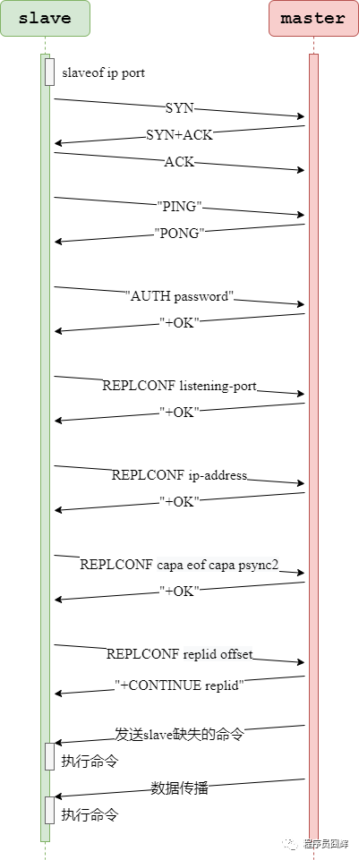

#### Redis 是单线程还是多线程？

这个问题应该已经看到过无数次了，最近 redis 6 出来之后又被翻出来了。

**redis 4.0 之前**，redis 是**完全单线程**的。

**redis 4.0 时**，redis 引入了多线程，但是**额外的线程只是用于后台处理**，例如：删除对象。**核心流程还是完全单线程的**。这也是为什么有些人说 4.0 是单线程的，因为他们指的是核心流程是单线程的。

这边的**核心流程**指的是 redis 正常处理客户端请求的流程，通常包括：**接收命令、解析命令、执行命令、返回结果**等。

而在最近，redis 6.0 版本又一次引入了多线程概念，与 4.0 不同的是，这次的多线程会涉及到上述的核心流程。

**Redis 6.0** 中，**多线程主要用于网络 I/O 阶段**，也就是**接收命令**和**写回结果**阶段，而在**执行命令**阶段，还是由**单线程**串行执行。由于执行时还是串行，因此无需考虑并发安全问题。

值得注意的时，redis 中的多线程组不会同时存在“读”和“写”，这个多线程组只会同时“读”或者同时“写”。

------

#### redis 6.0 加入多线程 I/O 之后，处理命令的核心流程

暂时

------

#### 为什么 Redis 是单线程？

在 redis 6.0 之前，redis 的核心操作是单线程的。

因为 redis 是完全基于内存操作的，通常情况下CPU不会是redis的瓶颈，redis 的**瓶颈**最有可能是**机器内存的大小**和**网络带宽**。

既然CPU不会成为瓶颈，那就顺理成章地采用单线程的方案了，因为如果使用多线程的话会更复杂，同时需要引入上下文切换、加锁等等，会带来额外的性能消耗。

而随着近些年互联网的不断发展，大家对于缓存的性能要求也越来越高了，因此 redis 也开始在逐渐往多线程方向发展。

最近的 **6.0 版本就对核心流程引入了多线程**，主要用于**解决 redis 在网络 I/O 上的性能瓶颈**。而对于核心的命令执行阶段，目前还是单线程的。

------

#### 为什么Redis使用单线程速度确很快

主要有以下几点：

1、基于内存的操作

2、使用了**I/O多路复用模型**，select、epoll 等，基于reactor 模式开发了自己的网络事件处理器

3、单线程可以避免不必要的上下文切换和竞争条件，减少了这方面的性能消耗。

4、以上这三点是 redis 性能高的主要原因，其他的还有一些小优化，例如：对数据结构进行了优化，简单动态字符串、压缩列表等。

------

#### Redis 常见的数据结构

基础的5种：

String：字符串，最基础的数据类型。

List：列表。

Hash：哈希对象。

Set：集合。

Sorted Set：有序集合，Set 的基础上加了个分值。

高级的4种：

HyperLogLog：通常用于基数统计。使用少量固定大小的内存，来统计集合中唯一元素的数量。统计结果不是精确值，而是一个带有0.81%标准差（standard error）的近似值。所以，HyperLogLog适用于一些对于统计结果精确度要求不是特别高的场景，例如网站的UV统计。

Geo：redis 3.2 版本的新特性。可以将用户给定的地理位置信息储存起来， 并对这些信息进行操作：获取2个位置的距离、根据给定地理位置坐标获取指定范围内的地理位置集合。

Bitmap：位图。

Stream：主要用于消息队列，类似于 kafka，可以认为是 pub/sub 的改进版。提供了消息的持久化和主备复制功能，可以让任何客户端访问任何时刻的数据，并且能记住每一个客户端的访问位置，还能保证消息不丢失。

------

#### redis数据结构---(Sorted Set)有序集合的实现

Sorted Set在数据少的时候，底层会使用ziplist【压缩表】数据结构存储数据。当一个Sorted Set的数据超过设置的阈值的时候，底层会改为zset数据结构，zset是由dict【字典】和skiplist【跳跃表存储数据】。

使用压缩列表实现，当保存的元素长度都小于64字节，同时数量小于128时，使用该编码方式，否则会使用 skiplist。这两个参数可以通过 zset-max-ziplist-entries、zset-max-ziplist-value 来自定义修改。

##### ziplist简介

参考https://blog.csdn.net/zgaoq/article/details/89710600

###### ziplist内存布局


ziplist是由**一系列特殊编码的连续内存块组成的顺序存储结构**，类似于数组，ziplist在内存中是**连续存储**的，但是不同于数组，为了**节省内存** ziplist的每个元素所占的内存大小可以不同（数组中叫元素，ziplist叫节点entry），每个节点可以用来存储一个整数或者一个字符串。
下图是ziplist在内存中的布局


zlbytes: ziplist的长度（单位: 字节)，是一个32位无符号整数
zltail: ziplist最后一个节点的偏移量，反向遍历ziplist或者pop尾部节点的时候有用。
zllen: ziplist的节点（entry）个数
entry: 节点
zlend: 值为0xFF，用于标记ziplist的结尾。

接下来我们看看节点的布局

节点的布局(entry)

每个节点由三部分组成：prevlength、encoding、data

prevlengh: 记录上一个节点的长度，为了方便反向遍历ziplist
encoding: 当前节点的编码规则，下文会详细说
data: 当前节点的值，可以是数字或字符串

* **节点的布局(entry)**

  每个节点由三部分组成：prevlength、encoding、data

  prevlengh: 记录上一个节点的长度，为了方便反向遍历ziplist

  encoding: 当前节点的编码规则，下文会详细说

  data: 当前节点的值，可以是数字或字符串 

  为了节省内存，**根据上一个节点的长度prevlength 可以将ziplist节点分为两类：**

  

  entry的前8位小于254，则这8位就表示上一个节点的长度
  entry的前8位等于254，则意味着上一个节点的长度无法用8位表示，后面32位才是真实的prevlength。用254 不用255(11111111)作为分界是因为255是zlend的值，它用于判断ziplist是否到达尾部。

##### zset相关

zset结构体由**字典**和**跳跃表**组成，其中跳跃表按**分值**(score)**从小到大**保存所有集合元素，所以会是按照分值**有序**。而字典则保存着从**元素**到**分值**的映射，这样就可以用**O(1)**的复杂度来查找**元素**对应的**分值**。

字典主要由多个hashtable组成，后面在介绍hash结构的时候会说hashtable，这里的hash扩容和后面也是一样的


先说说skipList，是参考以下链接来的

https://juejin.cn/post/6844903446475177998#heading-7
https://xie.infoq.cn/article/b1a46bb4a55303c9d8d8a5dcc

###### skiplist查找的流程

当查找元素时，会从最顶层链表的头节点开始遍历。以升序跳表为例，如果当前节点的下一个节点包含的值比目标元素值小，则继续向右查找。如果下一个节点的值比目标值大，就转到当前层的下一层去查找。重复向右和向下的操作，直到找到与目标值相等的元素为止。下图中的蓝色箭头标记出了查找元素 21 的步骤


###### skiplist与平衡树、哈希表的比较

平衡树的定义：任意节点的子树的**高度差**都小于等于1

- skiplist和各种平衡树（如AVL、红黑树等）的元素是有序排列的，而哈希表不是有序的。因此，在哈希表上只能做单个key的查找，不适宜做范围查找。所谓范围查找，指的是查找那些大小在指定的两个值之间的所有节点。
- 在做范围查找的时候，平衡树比skiplist操作要复杂。在平衡树上，我们找到指定范围的小值之后，还需要以中序遍历的顺序继续寻找其它不超过大值的节点。如果不对平衡树进行一定的改造，这里的中序遍历并不容易实现。而在skiplist上进行范围查找就非常简单，只需要在找到小值之后，对第1层链表进行若干步的遍历就可以实现。
- 平衡树的插入和删除操作可能引发子树的调整，逻辑复杂，而skiplist的插入和删除只需要修改相邻节点的指针，操作简单又快速。
- 从内存占用上来说，skiplist比平衡树更灵活一些。一般来说，平衡树每个节点包含2个指针（分别指向左右子树），而skiplist每个节点包含的指针数目平均为1/(1-p)，具体取决于参数p的大小。如果像Redis里的实现一样，取p=1/4，那么平均每个节点包含1.33个指针，比平衡树更有优势。
- 查找单个key，skiplist和平衡树的时间复杂度都为O(log n)，大体相当；而哈希表在保持较低的哈希值冲突概率的前提下，查找时间复杂度接近O(1)，性能更高一些。所以我们平常使用的各种Map或dictionary结构，大都是基于哈希表实现的。
- 从算法实现难度上来比较，skiplist比平衡树要简单得多。

###### Sorted Set 为什么使用跳跃表，而不是红黑树？

主要有以下几个原因：

* 跳表的性能和红黑树差不多。
* 跳表更容易实现和调试。
* skiplist占用内存更小
* 平衡树的插入和删除操作可能引发子树的调整，逻辑复杂。而skiplist的插入和删除只需要修改相邻节点的指针，操作简单又快速。

###### 为啥redis的zset用跳表而不用b+树？

| 数据结构 | 实现原理           | key查询方式      | 查找效率 | 存储大小                                                     | 插入、删除效率                           |
| -------- | ------------------ | ---------------- | -------- | ------------------------------------------------------------ | ---------------------------------------- |
| Hash     | 哈希表             | 支持单key        | 接近O(1) | 小，除了数据没有额外的存储                                   | O(1)                                     |
| B+树     | 平衡二叉树扩展而来 | 单key,范围，分页 | O(Log(n) | 除了数据，还多了左右指针，以及叶子节点指针                   | O(Log(n)，需要调整树的结构，算法比较复杂 |
| 跳表     | 有序链表扩展而来   | 单key，分页      | O(Log(n) | 除了数据，还多了指针，但是每个节点的指针小于<2,所以比B+树占用空间小 | O(Log(n)，只用处理链表，算法比较简单     |

从上面表格可以看出跳表和b+树的查找，插入，删除效率都一样。但是，**很明显b+树占用的空间的更大**，显然不适合redis这种针对于内存的读取。由于是针对内存，**不涉及磁盘IO**，因此使用了跳表； 

###### 为啥mysql的索引不用跳表而用b+树？

因为B+树的原理是 叶子节点存储数据，非叶子节点存储索引，B+树的每个节点可以存储多个关键字，**它将节点大小设置为磁盘页[16k]的大小**，充分利用了磁盘预读的功能。每次读取磁盘页时就会读取一整个节点,每个叶子节点还有指向前后节点的指针，为的是最大限度的**降低磁盘的IO**;因为数据在内存中读取耗费的时间是从磁盘的IO读取的百万分之一。

#### redis数据结构---Hash的实现

Hash 对象当前有两种编码：**ziplist**、**hashtable**

**ziplist**：使用压缩列表实现，每当有新的键值对要加入到哈希对象时，程序会先将保存了键的节点推入到压缩列表的表尾，然后再将保存了值的节点推入到压缩列表表尾。

因此：

1）保存了同一键值对的两个节点总是紧挨在一起，保存键的节点在前，保存值的节点在后；

2）先添加到哈希对象中的键值对会被放在压缩列表的表头方向，而后来添加的会被放在表尾方向。


**hashtable**：使用字典作为底层实现，哈希对象中的每个键值对都使用一个字典键值来保存，跟 java 中的 HashMap 类似。


##### Hash 对象的扩容流程

参考：http://redisbook.com/preview/dict/rehashing.html

随着操作的不断执行， 哈希表保存的键值对会逐渐地增多或者减少， 为了让哈希表的负载因子（load factor）维持在一个合理的范围之内， 当哈希表保存的键值对数量太多或者太少时， 程序需要对哈希表的大小进行相应的扩展或者收缩。

1. 为字典的ht[1]哈希表分配空间， 这个哈希表的空间大小取决于要执行的操作， 以及ht[0]当前包含的键值对数量 （也即是ht[0].used属性的值）：

   * 如果执行的是扩展操作，那么 `ht[1]` 的大小为第一个**大于等于** `ht[0].used * 2` 的 2^n （`2` 的 `n` 次方幂）；

   - 如果执行的是收缩操作， 那么 `ht[1]` 的大小为第一个**大于等于** `ht[0].used` 的 2^n

2. 将保存在 `ht[0]` 中的所有键值对 rehash 到 `ht[1]` 上面： rehash 指的是重新计算键的哈希值和索引值， 然后将键值对放置到 `ht[1]` 哈希表的指定位置上。

3. 当 `ht[0]` 包含的所有键值对都迁移到了 `ht[1]` 之后 （`ht[0]` 变为空表）， 释放 `ht[0]` ， 将 `ht[1]` 设置为 `ht[0]` ， 并在 `ht[1]` 新创建一个空白哈希表， 为下一次 rehash 做准备。

举个例子， 假设程序要对下图4-8所示字典的 `ht[0]` 进行扩展操作， 那么程序将执行以下步骤：

1. `ht[0].used` 当前的值为 `4` ， `4 * 2 = 8` ， 而 `8` （2^3）恰好是第一个大于等于 `4` 的 `2` 的 `n` 次方， 所以程序会将 `ht[1]` 哈希表的大小设置为 `8` 。 图 4-9 展示了 `ht[1]` 在分配空间之后， 字典的样子。
2. 将 `ht[0]` 包含的四个键值对都 rehash 到 `ht[1]` ， 如图 4-10 所示。
3. 释放 `ht[0]` ，并将 `ht[1]` 设置为 `ht[0]` ，然后为 `ht[1]` 分配一个空白哈希表，如图 4-11 所示。

至此， 对哈希表的扩展操作执行完毕， 程序成功将哈希表的大小从原来的 `4` 改为了现在的 `8` 。


**由于只关注扩容的过程，所以上面的图没有对rehashidx值进行修改**，这里具体的步骤会由对这个值修改的操作。“**渐进式 rehash[重新散列]**”的具体方式，步骤如下：

1.计算新表 size、掩码，为新表 ht[1] 分配空间，让字典同时持有 ht[0] 和 ht[1] 两个哈希表。

2.将 rehash 索引计数器变量 **rehashidx 的值设置为0**，表示 rehash 正式开始。

3.在 rehash 进行期间，每次对字典执行添加、删除、査找、更新操作时，程序除了执行指定的操作以外，还会触发额外的 rehash 操作，在源码中的 _dictRehashStep 方法。

_dictRehashStep：从名字也可以看出来，大意是 rehash 一步，也就是 rehash 一个索引位置。

该方法会从 ht[0] 表的 rehashidx 索引位置上开始向后查找，找到第一个不为空的索引位置，将该索引位置的所有节点 rehash 到 ht[1]，当本次 rehash 工作完成之后，将 ht[0] 索引位置为 rehashidx 的节点**清空**，同时将 rehashidx 属性的值加一。

4.将 rehash 分摊到每个操作上确实是非常妙的方式，但是万一此时服务器比较空闲，一直没有什么操作，难道 redis 要一直持有两个哈希表吗？

答案当然不是的。我们知道，redis 除了文件事件外，还有**时间事件**，redis 会**定期**触发时间事件，这些时间事件用于执行一些后台操作，其中就**包含 rehash 操作**：当 redis 发现有字典正在进行 rehash 操作时，会花费1毫秒的时间，一起帮忙进行 rehash。

5.随着操作的不断执行，最终在某个时间点上，**ht[0] 的所有键值对都会被 rehash 至 ht[1]**，此时 rehash 流程完成，会执行最后的清理工作：**释放 ht[0] 的空间**、**将 ht[0] 指向 ht[1]**、**重置 ht[1]**、**重置 rehashidx 的值为 -1**。

##### 渐进式 rehash 的优点

渐进式 rehash 的好处在于它采取**分而治之**的方式，将 rehash 键值对所需的计算工作**均摊到对字典**的每个添加、删除、查找和更新操作上，从而避免了集中式 rehash 而带来的庞大计算量。

在进行渐进式 rehash 的过程中，字典会同时使用 ht[0] 和 ht[1] 两个哈希表， 所以**在渐进式 rehash 进行期间，字典的删除、査找、更新等操作会在两个哈希表上进行**。例如，要在字典里面査找一个键的话，程序会先在 ht[0] 里面进行査找，如果没找到的话，就会继续到 ht[1] 里面进行査找，诸如此类。

另外，在渐进式 rehash 执行期间，**新增的键值对会被直接保存到 ht[1], ht[0] 不再进行任何添加操作**，这样就保证了 **ht[0]** 包含的键值对数量会**只减不增**，**并随着 rehash 操作的执行而最终变成空表**。

##### 在什么情况下会对hash进行扩展或压缩？

当以下条件中的任意一个被满足时， 程序会自动开始对哈希表执行**扩展**操作：

1. 服务器目前没有在执行 BGSAVE 命令或者 BGREWRITEAOF 命令， 并且哈希表的负载因子大于等于 `1` ；
2. 服务器目前正在执行 BGSAVE 命令或者 BGREWRITEAOF 命令， 并且哈希表的负载因子大于等于 `5` ；

其中哈希表的负载因子可以通过公式：

```
# 负载因子 = 哈希表已保存节点数量 / 哈希表大小
load_factor = ht[0].used / ht[0].size
```

计算得出。

比如说， 对于一个大小为 `4` ， 包含 `4` 个键值对的哈希表来说， 这个哈希表的负载因子为：

```
load_factor = 4 / 4 = 1
```

又比如说， 对于一个大小为 `512` ， 包含 `256` 个键值对的哈希表来说， 这个哈希表的负载因子为：

```
load_factor = 256 / 512 = 0.5
```

根据 BGSAVE 命令或 BGREWRITEAOF 命令是否正在执行， 服务器执行扩展操作所需的负载因子并不相同， 这是因为在执行 BGSAVE 命令或 BGREWRITEAOF 命令的过程中， Redis 需要创建当前服务器进程的子进程， 而大多数操作系统都采用写时复制（[copy-on-write](http://en.wikipedia.org/wiki/Copy-on-write)）技术来优化子进程的使用效率， 所以在子进程存在期间， 服务器会提高执行扩展操作所需的负载因子， 从而尽可能地避免在子进程存在期间进行哈希表扩展操作， 这可以避免不必要的内存写入操作， 最大限度地节约内存。

另一方面， 当哈希表的**负载因子小于 `0.1` 时**， 程序自动开始对哈希表执行**收缩操作**。

##### rehash 流程在数据量大的时候会有什么问题？

Hash 对象的扩容流程在数据量大的时候会有什么问题吗

1）扩容期开始时，会先给 ht[1] 申请空间，所以在整个扩容期间，会同时存在 ht[0] 和 ht[1]，会**占用额外的空间**。

2）扩容期间同时存在 ht[0] 和 ht[1]，查找、删除、更新等操作有概率需要**操作两张表**，耗时会增加。

3）redis 在内存使用接近 **maxmemory** 并且有设置**驱逐策略**的情况下，出现 rehash 会使得内存占用超过 maxmemory，触发**驱逐淘汰操作**，**导致 master/slave 均有有大量的 key 被驱逐淘汰，从而出现 master/slave 主从不一致**。

#### Redis 的网络事件处理器（Reactor 模式-相应模式）


套接字：socket 连接，也就是客户端连接。当一个套接字准备好执行连接、写入、读取、关闭等操作时， 就会产生一个相应的文件事件。因为一个服务器通常会连接多个套接字， 所以多个文件事件有可能会并发地出现。

I/O 多路复用程序：提供 select、epoll、evport、kqueue 的实现，会根据当前系统自动选择最佳的方式。负责监听多个套接字，当套接字产生事件时，会向文件事件分派器传送那些产生了事件的套接字。当多个文件事件并发出现时， I/O 多路复用程序会将所有产生事件的套接字都放到一个队列里面，然后通过这个队列，以有序、同步、每次一个套接字的方式向文件事件分派器传送套接字：当上一个套接字产生的事件被处理完毕之后，才会继续传送下一个套接字。**这里在nio和netty里会着重说**

文件事件分派器：接收 I/O 多路复用程序传来的套接字， 并根据套接字产生的事件的类型， 调用相应的事件处理器。

事件处理器：事件处理器就是一个个函数， 定义了某个事件发生时， 服务器应该执行的动作。例如：建立连接、命令查询、命令写入、连接关闭等等。

#### Redis过期策略和内存淘汰策略

##### 缓存过期策略

定时删除：在设置键的过期时间的同时，创建一个定时器，让定时器在键的过期时间来临时，立即执行对键的删除操作。对内存最友好，对 CPU 时间最不友好。

惰性删除：放任键过期不管，但是每次获取键时，都检査键是否过期，如果过期的话，就删除该键；如果没有过期，就返回该键。对 CPU 时间最优化，对内存最不友好。

定期删除：每隔一段时间，默认100ms，程序就对数据库进行一次检査，删除里面的过期键。至 于要删除多少过期键，以及要检査多少个数据库，则由算法决定。前两种策略的折中，对 CPU 时间和内存的友好程度较平衡。

Redis 使用惰性删除和定期删除。

##### 内存淘汰（驱逐）策略

当 redis 的内存空间（**maxmemory** 参数配置）已经用满时，redis 将根据配置的驱逐策略（maxmemory-policy 参数配置），进行相应的动作。

网上很多资料都是写 6 种，但是其实当前 redis 的淘汰策略已经有 8 种了，多余的两种是 Redis 4.0 新增的，基于 LFU（Least Frequently Used）算法实现的。

noeviction：默认策略，不淘汰任何 key，直接返回错误
allkeys-lru：在所有的 key 中，使用 LRU 算法淘汰部分 key
allkeys-lfu：在所有的 key 中，使用 LFU 算法淘汰部分 key，该算法于 Redis 4.0 新增
allkeys-random：在所有的 key 中，随机淘汰部分 key
volatile-lru：在设置了过期时间的 key 中，使用 LRU 算法淘汰部分 key
volatile-lfu：在设置了过期时间的 key 中，使用 LFU 算法淘汰部分 key，该算法于 Redis 4.0 新增
volatile-random：在设置了过期时间的 key 中，随机淘汰部分 key
volatile-ttl：在设置了过期时间的 key 中，挑选 TTL（time to live，剩余时间）短的 key 淘汰

LRU是**最近最少使用键**置换算法(Least Recently Used),也就是首先淘汰**最长时间未被使用**的键

LFU是**最近最不常用键**置换算法(Least Frequently Used),也就是淘汰**一定时期内被访问次数最少**的键

##### LRU算法实现

Redis 3.0 对 LRU 算法进行改进，引入了缓冲池（pool，默认16）的概念。

当每一轮移除 key 时，拿到了 N（默认5）个 key 的 idle time，遍历处理这 N 个 key，如果 key 的 idle time 比 pool 里面的 key 的 idle time 还要大，就把它添加到 pool 里面去。

当 pool 放满之后，每次如果有新的 key 需要放入，需要将 pool 中 idle time 最小的一个 key 移除。这样相当于 pool 里面始终维护着还未被淘汰的 idle time 最大的 16 个 key。

当我们每轮要淘汰的时候，直接从 pool 里面取出 idle time 最大的 key（只取1个），将之淘汰掉。

整个流程相当于随机取 5 个 key 放入 pool，然后淘汰 pool 中空闲时间最大的 key，然后再随机取 5 个 key放入 pool，继续淘汰 pool 中空闲时间最大的 key，一直持续下去。

在进入淘汰前会计算出需要释放的内存大小，然后就一直循环上述流程，直至释放足够的内存。

Redis 在 redisObject 结构体中定义了一个长度 24 bit 的 unsigned 类型的字段（unsigned lru:LRU_BITS），在 LRU 算法中用来存储对象最后一次被命令程序访问的时间。其中在redis代码中，pool是用一个双向链表实现的，具体步骤如下：

- 新数据插入到链表头部

- 每当缓存命中（即缓存数据被访问），则将数据移到链表头部

- 当链表满的时候，将链表尾部的数据丢弃

  

LRU Cache具备的操作：

- set(key,value)：如果key在hashmap中存在，则先重置对应的value值，然后获取对应的节点cur，将cur节点从链表删除，并移动到链表的头部；若果key在hashmap不存在，则新建一个节点，并将节点放到链表的头部。当Cache存满的时候，将链表最后一个节点删除即可。
- get(key)：如果key在hashmap中存在，则把对应的节点放到链表头部，并返回对应的value值；如果不存在，则返回-1。

#### Redis持久化

Redis 的持久化机制有：RDB、AOF、混合持久化（RDB+AOF，Redis 4.0引入）

##### RDB

**描述**：类似于快照。在某个时间点，将 Redis 在内存中的数据库状态（数据库的键值对等信息）保存到磁盘里面。RDB 持久化功能生成的 RDB 文件是经过压缩的二进制文件。

**命令**：有两个 Redis 命令可以用于生成 RDB 文件，一个是 SAVE，另一个是 BGSAVE。

**开启**：使用 save point 配置，满足 save point 条件后会触发 BGSAVE 来存储一次快照，这边的 save point 检查就是在上文提到的 serverCron 中进行。

**save point 格式**：save <seconds> <changes>，含义是 Redis 如果在 seconds 秒内数据发生了 changes 次改变，就保存快照文件。例如 Redis 默认就配置了以下3个：

```lua
save 900 1 #900秒内有1个key发生了变化，则触发保存RDB文件
save 300 10 #300秒内有10个key发生了变化，则触发保存RDB文件
save 60 10000 #60秒内有10000个key发生了变化，则触发保存RDB文件
```

**关闭**：1）注释掉所有save point 配置可以关闭 RDB 持久化。2）在所有 save point 配置后增加：save ""，该配置可以删除所有之前配置的 save point。

```lua
save ""
```

**SAVE**：生成 RDB 快照文件，但是会阻塞主进程，服务器将无法处理客户端发来的命令请求，所以通常不会直接使用该命令。

**linux的fork函数**： 一个进程，包括代码、数据和分配给进程的资源。fork()函数通过**系统调用**创建一个与原来进程**几乎完全相同的进程**，也就是两个进程可以做**完全相同的事**，**但如果初始参数或者传入的变量不同，两个进程也可以做不同的事**。 一个进程调用fork()函数后，系统先给新的进程分配资源，例如存储数据和代码的空间。然后把原来的进程的所有值都复制到新的新进程中，只有少数值与原来的进程的值不同。相当于克隆了一个自己。
https://www.jianshu.com/p/1327c51a4a99

**BGSAVE**：fork 子进程来生成 RDB 快照文件，阻塞只会发生在 fork 子进程的时候，之后主进程可以正常处理请求，详细过程如下图：


**RDB 的优点**

1）RDB 文件是是经过压缩的二进制文件，占用空间很小，它保存了 Redis 某个时间点的数据集，很适合用于做备份。 比如说，你可以在最近的 24 小时内，每小时备份一次 RDB 文件，并且在每个月的每一天，也备份一个 RDB 文件。这样的话，即使遇上问题，也可以随时将数据集还原到不同的版本。

2）RDB 非常适用于灾难恢复（disaster recovery）：它只有一个文件，并且内容都非常紧凑，可以（在加密后）将它传送到别的数据中心。

3）RDB 可以最大化 redis 的性能。父进程在保存 RDB 文件时唯一要做的就是 fork 出一个子进程，然后这个子进程就会处理接下来的所有保存工作，父进程无须执行任何磁盘 I/O 操作。

4）RDB 在恢复大数据集时的速度比 AOF 的恢复速度要快。

**RDB 的缺点**

1）RDB 在服务器故障时容易造成数据的丢失。RDB 允许我们通过修改 save point 配置来控制持久化的频率。但是，因为 RDB 文件需要保存整个数据集的状态， 所以它是一个比较重的操作，如果频率太频繁，可能会对 Redis 性能产生影响。所以通常可能设置至少5分钟才保存一次快照，这时如果 Redis 出现宕机等情况，则意味着最多可能丢失5分钟数据。

2）RDB 保存时使用 fork 子进程进行数据的持久化，如果数据比较大的话，fork 可能会非常耗时，造成 Redis 停止处理服务N毫秒。如果数据集很大且 CPU 比较繁忙的时候，停止服务的时间甚至会到一秒。

3）Linux fork 子进程采用的是 copy-on-write 的方式。在 Redis 执行 RDB 持久化期间，如果 client 写入数据很频繁，那么将增加 Redis 占用的内存，最坏情况下，内存的占用将达到原先的2倍。刚 fork 时，主进程和子进程共享内存，但是随着主进程需要处理写操作，主进程需要将修改的页面拷贝一份出来，然后进行修改。极端情况下，如果所有的页面都被修改，则此时的内存占用是原先的2倍。

##### AOF

**描述**：保存 Redis 服务器所执行的所有写操作命令来记录数据库状态，并在服务器启动时，通过重新执行这些命令来还原数据集。

**开启**：AOF 持久化默认是关闭的，可以通过配置：appendonly yes 开启。

**关闭**：使用配置 appendonly no 可以关闭 AOF 持久化。

AOF 持久化功能的实现可以分为三个步骤：命令追加、文件写入、文件同步。

**命令追加**：当 AOF 持久化功能打开时，服务器在执行完一个写命令之后，会将被执行的写命令追加到服务器状态的 aof 缓冲区（aof_buf）的末尾。

**文件写入与文件同步**：可能有人不明白为什么将 aof_buf 的内容写到磁盘上需要两步操作，这边简单解释一下。

Linux 操作系统中为了提升性能，使用了**页缓存**（page cache）。当我们将 aof_buf 的内容写到磁盘上时，此时数据并没有真正的落盘，而是在 page cache 中，为了将 page cache 中的数据真正落盘，需要执行 fsync / fdatasync 命令来强制刷盘。这边的文件同步做的就是刷盘操作，或者叫文件刷盘可能更容易理解一些。

在文章开头，我们提过 serverCron 时间事件中会触发 flushAppendOnlyFile 函数，该函数会根据服务器配置的 appendfsync 参数值，来决定是否将 aof_buf 缓冲区的内容写入和保存到 AOF 文件。

**appendfsync 参数有三个选项**：

* always：每处理一个命令都将 aof_buf 缓冲区中的所有内容写入并同步到AOF 文件，即每个命令都刷盘
* everysec：将 aof_buf 缓冲区中的所有内容写入到 AOF 文件，如果上次同步 AOF 文件的时间距离现在超过一秒钟， 那么再次对 AOF 文件进行同步， 并且这个同步操作是异步的，由一个后台线程专门负责执行，即每秒刷盘1次。
* no：将 aof_buf 缓冲区中的所有内容写入到 AOF 文件， 但并不对 AOF 文件进行同步， 何时同步由操作系统来决定。即不执行刷盘，让操作系统自己执行刷盘。

###### AOF 的优点

AOF 比 RDB可靠。你可以设置不同的 fsync 策略：no、everysec 和 always。默认是 everysec，在这种配置下，redis 仍然可以保持良好的性能，并且就算发生故障停机，也最多只会丢失一秒钟的数据。

AOF文件是一个纯追加的日志文件。即使日志因为某些原因而包含了未写入完整的命令（比如写入时磁盘已满，写入中途停机等等）， 我们也可以使用 redis-check-aof 工具也可以轻易地修复这种问题。

当 AOF文件太大时，Redis 会自动在后台进行重写：重写后的新 AOF 文件包含了恢复当前数据集所需的最小命令集合。整个重写是绝对安全，因为重写是在一个新的文件上进行，同时 Redis 会继续往旧的文件追加数据。当新文件重写完毕，Redis 会把新旧文件进行切换，然后开始把数据写到新文件上。

AOF 文件有序地保存了对数据库执行的所有写入操作以 Redis 协议的格式保存， 因此 AOF 文件的内容非常容易被人读懂， 对文件进行分析（parse）也很轻松。如果你不小心执行了 FLUSHALL 命令把所有数据刷掉了，但只要 AOF 文件没有被重写，那么只要停止服务器， 移除 AOF 文件末尾的 FLUSHALL 命令， 并重启 Redis ， 就可以将数据集恢复到 FLUSHALL 执行之前的状态。

###### AOF 的缺点

对于相同的数据集，AOF 文件的大小一般会比 RDB 文件大。
根据所使用的 fsync 策略，AOF 的速度可能会比 RDB 慢。通常 fsync 设置为每秒一次就能获得比较高的性能，而关闭 fsync 可以让 AOF 的速度和 RDB 一样快。
AOF 在过去曾经发生过这样的 bug ：因为个别命令的原因，导致 AOF 文件在重新载入时，无法将数据集恢复成保存时的原样。（举个例子，阻塞命令 BRPOPLPUSH 就曾经引起过这样的 bug ） 。虽然这种 bug 在 AOF 文件中并不常见， 但是相较而言， RDB 几乎是不可能出现这种 bug 的。

##### 混合持久化

描述：混合持久化并不是一种全新的持久化方式，而是对已有方式的优化。混合持久化只发生于 **AOF 重写过程**。使用了混合持久化，重写后的新 AOF 文件前半段是 RDB 格式的全量数据，后半段是 AOF 格式的增量数据。

整体格式为：[RDB file] [AOF tail]

开启：混合持久化的配置参数为 aof-use-rdb-preamble，配置为 yes 时开启混合持久化，在 redis 4 刚引入时，默认是关闭混合持久化的，但是在 redis 5 中默认已经打开了。

关闭：使用 aof-use-rdb-preamble no 配置即可关闭混合持久化。

混合持久化本质是通过 **AOF 后台重写**（bgrewriteaof 命令）完成的，不同的是当开启混合持久化时，fork 出的子进程先将当前全量数据以 RDB 方式写入新的 AOF 文件，然后再将 AOF 重写缓冲区（aof_rewrite_buf_blocks）的增量命令以 AOF 方式写入到文件，写入完成后通知主进程将新的含有 RDB 格式和 AOF 格式的 AOF 文件替换旧的的 AOF 文件。

优点：结合 RDB 和 AOF 的优点, 更快的重写和恢复。

缺点：AOF 文件里面的 RDB 部分不再是 AOF 格式，可读性差。

##### AOF重写

###### 为什么需要AOF重写

AOF 持久化是通过保存被执行的**写命令**来记录数据库状态的，随着写入命令的不断增加，AOF 文件中的内容会越来越多，**文件的体积也会越来越大**。

如果不加以控制，体积过大的 AOF 文件可能会对 Redis 服务器、甚至整个宿主机造成影响，**并且 AOF 文件的体积越大，使用 AOF 文件来进行数据还原所需的时间就越多**。

举个例子， **如果你对一个计数器调用了 100 次 INCR** ， 那么仅仅是为了保存这个计数器的当前值， AOF 文件就需要使用 100 条记录。

然而在实际上， 只使用一条 SET 命令已经足以保存计数器的当前值了， 其余 99 条记录实际上都是多余的。

为了处理这种情况， Redis 引入了 **AOF 重写**：**可以在不打断服务端处理请求的情况下， 对 AOF 文件进行重建（rebuild）**。

###### AOF 重写的过程

**描述**：Redis 生成新的 AOF 文件来代替旧 AOF 文件，这个新的 AOF 文件包含重建当前数据集所需的最少命令。具体过程是遍历所有数据库的所有键，从数据库读取键现在的值，然后用一条命令去记录键值对，代替之前记录这个键值对的多条命令。

**命令**：有两个 Redis 命令可以用于触发 AOF 重写，一个是 BGREWRITEAOF 、另一个是  REWRITEAOF 命令；

**开启**：AOF 重写由两个参数共同控制，auto-aof-rewrite-percentage 和 auto-aof-rewrite-min-size，同时满足这两个条件，则触发 AOF 后台重写 BGREWRITEAOF。

```lua
// 当前AOF文件比上次重写后的AOF文件大小的增长比例超过100
auto-aof-rewrite-percentage 100 
// 当前AOF文件的文件大小大于64MB
auto-aof-rewrite-min-size 64mb
```

**关闭**：auto-aof-rewrite-percentage 0，指定0的百分比，以禁用自动AOF重写功能。

```lua
auto-aof-rewrite-percentage 0
```

REWRITEAOF：进行 AOF 重写，但是会阻塞主进程，服务器将无法处理客户端发来的命令请求，通常不会直接使用该命令。

BGREWRITEAOF：fork 子进程来进行 AOF 重写，阻塞只会发生在 fork 子进程的时候，之后主进程可以正常处理请求。

REWRITEAOF 和 BGREWRITEAOF 的关系与 SAVE 和 BGSAVE 的关系类似。

###### AOF 后台重写存在的问题

AOF 后台重写使用子进程进行从写，解决了主进程阻塞的问题，但是仍然存在另一个问题：子进程在进行 AOF 重写期间，服务器主进程还需要继续处理命令请求，新的命令可能会对现有的数据库状态进行修改，从而使得当前的数据库状态和重写后的 AOF 文件保存的数据库状态不一致。

###### 如何解决 AOF 后台重写存在的数据不一致问题

为了解决上述问题，Redis 引入了 AOF **重写缓冲区**（aof_rewrite_buf_blocks），这个缓冲区在**服务器创建子进程之后开始使用**，当 Redis 服务器执行完一个写命令之后，它会同时将这个写命令追加到 **AOF 缓冲区**和 **AOF 重写缓冲区**。

这样一来可以保证：

1、现有 AOF 文件的处理工作会如常进行。这样即使在重写的中途发生停机，现有的 AOF 文件也还是安全的。

2、从创建子进程开始，也就是 AOF 重写开始，服务器执行的所有写命令会被记录到 AOF 重写缓冲区里面。

这样，当子进程完成 AOF 重写工作后，父进程会在 serverCron 中检测到子进程已经重写结束，则会执行以下工作：

1、将 AOF 重写缓冲区中的所有内容写入到新 AOF 文件中，这时新 AOF 文件所保存的数据库状态将和服务器当前的数据库状态一致。

2、对新的 AOF 文件进行改名，原子的覆盖现有的 AOF 文件，完成新旧两个 AOF 文件的替换。

之后，父进程就可以继续像往常一样接受命令请求了。

##### 持久化方式的选择

一般来说， 如果想尽量保证数据安全性， 你应该同时使用 RDB 和 AOF 持久化功能，同时可以开启混合持久化。

如果你非常关心你的数据， 但仍然可以承受数分钟以内的数据丢失， 那么你可以只使用 RDB 持久化。

如果你的数据是可以丢失的，则可以关闭持久化功能，在这种情况下，Redis 的性能是最高的。

使用 Redis 通常都是为了提升性能，而如果为了不丢失数据而将 appendfsync  设置为 always 级别时，对 Redis 的性能影响是很大的，在这种不能接受数据丢失的场景，其实可以考虑直接选择 MySQL 等类似的数据库。

##### 同时开启RDB和AOF，服务重启时如何加载

简单来说，如果同时启用了 AOF 和 RDB，Redis 重新启动时，会使用 AOF 文件来重建数据集，因为通常来说， AOF 的数据会更完整。

而在引入了混合持久化之后，使用 AOF 重建数据集时，会通过文件开头是否为“REDIS”来判断是否为混合持久化。

完整流程如下图所示：


#### Redis集群模式

##### 主从复制

在当前最新的 Redis 6.0 中，主从复制的完整过程如下：

1）开启主从复制

通常有以下三种方式：

在 slave 直接执行命令：slaveof <masterip> <masterport>
在 slave 配置文件中加入：slaveof <masterip> <masterport>
使用启动命令：--slaveof <masterip> <masterport>
注：在 Redis 5.0 之后，slaveof 相关命令和配置已经被替换成 replicaof，例如 replicaof <masterip> <masterport>。为了兼容旧版本，通过配置的方式仍然支持 slaveof，但是通过命令的方式则不行了。

2）建立套接字（socket）连接

slave 将根据指定的 IP 地址和端口，向 master 发起套接字（socket）连接，master 在接受（accept） slave 的套接字连接之后，为该套接字创建相应的客户端状态，此时连接建立完成。

3）发送PING命令

slave 向 master 发送一个 PING 命令，以检査套接字的读写状态是否正常、 master 能否正常处理命令请求。

4）身份验证

slave 向 master 发送 AUTH password 命令来进行身份验证。

5）发送端口信息

在身份验证通过后后， slave 将向 master 发送自己的监听端口号， master 收到后记录在 slave 所对应的客户端状态的 slave_listening_port 属性中。

6）发送IP地址

如果配置了 slave_announce_ip，则 slave 向 master 发送 slave_announce_ip 配置的 IP 地址， master 收到后记录在 slave 所对应的客户端状态的 slave_ip 属性。

该配置是用于解决服务器返回内网 IP 时，其他服务器无法访问的情况。可以通过该配置直接指定公网 IP。

7）发送CAPA

CAPA 全称是 capabilities，这边表示的是同步复制的能力。slave 会在这一阶段发送 capa 告诉 master 自己具备的（同步）复制能力， master 收到后记录在 slave 所对应的客户端状态的 slave_capa 属性。

8）数据同步

slave 将向 master 发送 PSYNC 命令， master 收到该命令后判断是进行部分重同步还是完整重同步，然后根据策略进行数据的同步。

9）命令传播

当完成了同步之后，就会进入命令传播阶段，这时 master 只要一直将自己执行的写命令发送给 slave ，而 slave 只要一直接收并执行 master 发来的写命令，就可以保证 master 和 slave 一直保持一致了。

主从复制的核心步骤流程图如下



##### 哨兵模式

哨兵（Sentinel） 是 Redis 的高可用性解决方案：由一个或多个 Sentinel 实例组成的 Sentinel 系统可以监视任意多个主服务器，以及这些主服务器属下的所有从服务器。

Sentinel 可以在被监视的**主服务器进入下线状态**时，自动将下线**主服务器的某个从服务器升级为新的主服务器**，然后由**新的主服务器代替已下线的主服务器**继续处理命令请求。

**1）哨兵故障检测**

**检查主观下线状态**

在**默认情况**下，Sentinel 会以**每秒一次的频率**向**所有与它创建了命令连接**的实例（包括主服务器、从服务器、其他 Sentinel 在内）发送 PING 命令，并通过实例返回的 PING 命令回复来判断实例是否在线。

如果一个实例在 down-after-miliseconds 毫秒内，连续向 Sentinel 返回无效回复，那么 Sentinel 会修改这个实例所对应的实例结构，在结构的 flags 属性中设置 SRI_S_DOWN 标识，以此来表示这个实例已经进入**主观下线状态**。

**检查客观下线状态**

当 Sentinel 将一个主服务器判断为主观下线之后，为了确定这个主服务器是否真的下线了，它会向同样监视这一服务器的其他 Sentinel 进行询问，看它们是否也认为主服务器已经进入了下线状态（可以是主观下线或者客观下线）。

当 Sentinel 从其他 Sentinel 那里接收到足够数量（quorum，可配置）的已下线判断之后，Sentinel 就会将服务器置为**客观下线**，在 flags 上打上 SRI_O_DOWN 标识，并对主服务器执行故障转移操作。

**2）哨兵故障转移流程**

当哨兵监测到某个主节点客观下线之后，就会开始故障转移流程。核心流程如下：

1.发起一次选举，选举出领头 Sentinel
2.领头 Sentinel 在已下线主服务器的所有从服务器里面，**挑选出一个**从服务器，并将其升级为**新的主服务器**。
3.领头 Sentinel 将剩余的所有从服务器改为**复制新的主服务器**。
4.领头 Sentinel 更新相关配置信息，当这个**旧的主服务器重新上线**时，将其设置为新的主服务器的**从服务器**。

##### 集群模式

哨兵模式最大的缺点就是所有的数据都放在**一台服务器**上，无法较好的进行水平扩展。

为了解决哨兵模式存在的问题，集群模式应运而生。在高可用上，集群基本是**直接复用的哨兵模式**的逻辑，并且针对水平扩展进行了优化。

集群模式具备的特点如下：

采取去中心化的集群模式，将数据按**槽存储分布在多个 Redis 节点上**分布在**多个** Redis 节点上。集群共有 16384 个槽，每个节点负责处理部分槽。
使用 **CRC16 算法**来计算 key 所属的槽：crc16(key,keylen) & 16383。
所有的 Redis 节点**彼此互联**，通过 **PING-PONG 机制**来进行节点间的心跳检测。
分片内采用**一主多从**保证高可用，并提供**复制和故障恢复**功能。在实际使用中，通常**会将主从分布在不同机房**，避免机房出现故障导致整个分片出问题，下面的架构图就是这样设计的。
**客户端与 Redis 节点直连**，**不需要中间代理层**（proxy）。客户端**不需要连接集群所有节点**，**连接集群中任何一个可用节点即可**。

集群的架构图如下所示：


###### 集群选举

故障转移的第一步就是选举出新的主节点，以下是集群选举新的主节点的方法：

**1）**当从节点发现自己正在复制的主节点进入已下线状态时，会发起一次选举：将 currentEpoch（配置纪元）加1，然后向集群广播一条 CLUSTERMSG_TYPE_FAILOVER_AUTH_REQUEST 消息，要求所有收到这条消息、并且具有投票权的主节点向这个从节点投票。

**2）**其他节点收到消息后，会判断是否要给发送消息的节点投票，判断流程如下todo:【**流程还需好好看下 重新总结**】：

1.当前节点是 slave，或者当前节点是 master，但是不负责处理槽，则当前节点没有投票权，直接返回。
2.请求节点的 currentEpoch 小于当前节点的 currentEpoch，校验失败返回。因为发送者的状态与当前集群状态不一致，可能是长时间下线的节点刚刚上线，这种情况下，直接返回即可。
3.当前节点在该 currentEpoch 已经投过票，校验失败返回。
4.请求节点是 master，校验失败返回。
5.请求节点的 master 为空，校验失败返回。
6.请求节点的 master 没有故障，并且不是手动故障转移，校验失败返回。因为手动故障转移是可以在 master 正常的情况下直接发起的。
7.上一次为该master的投票时间，在cluster_node_timeout的2倍范围内，校验失败返回。这个用于使获胜从节点有时间将其成为新主节点的消息通知给其他从节点，从而避免另一个从节点发起新一轮选举又进行一次没必要的故障转移
8.请求节点宣称要负责的槽位，是否比之前负责这些槽位的节点，具有相等或更大的 configEpoch，如果不是，校验失败返回。

如果通过以上所有校验，那么主节点将向要求投票的从节点返回一条 CLUSTERMSG_TYPE_FAILOVER_AUTH_ACK 消息，表示这个主节点支持从节点成为新的主节点。

**3）**每个参与选举的从节点都会接收 CLUSTERMSG_TYPE_FAILOVER_AUTH_ACK 消息，并根据自己收到了多少条这种消息来统计自己获得了多少个主节点的支持。

**4）**如果集群里有N个具有投票权的主节点，那么当一个从节点收集到大于等于N/2+1 张支持票时，这个从节点就会当选为新的主节点。因为在每一个配置纪元里面，每个具有投票权的主节点只能投一次票，所以如果有 N个主节点进行投票，那么具有大于等于 N/2+1 张支持票的从节点只会有一个，这确保了新的主节点只会有一个。

**5）**如果在一个配置纪元里面没有从节点能收集到足够多的支持票，那么集群进入一个新的配置纪元，并再次进行选举，直到选出新的主节点为止。

这个选举新主节点的方法和选举领头 Sentinel 的方法非常相似，因为两者都是基于 **Raft 算法的领头选举**（leader election）方法来实现的。

###### Redis 集群要增加分片，槽的迁移怎么保证无损

例如：集群已经对外提供服务，原来有3分片，准备新增2个分片，怎么在不下线的情况下，无损的从原有的3个分片指派若干个槽给这2个分片？

Redis 使用了 **ASK 错误**来保证**在线扩容的安全性**。

在槽的迁移过程中若有客户端访问，依旧**先访问源节点**，源节点会先在自己的数据库里面査找指定的键，如果找到的话，就直接执行客户端发送的命令。

**如果没找到**，说明该键可能已经被**迁移到目标节点了**，源节点将向客户端**返回一个 ASK 错误**，**该错误会指引客户端转向正在导入槽的目标节点**，并再次发送之前想要执行的命令，从而获取到结果。

**ASK错误**

在进行重新分片期间，源节点向目标节点迁移一个槽的过程中，可能会出现这样一种情况：属于被迁移槽的一部分键值对保存在源节点里面，而另一部分键值对则保存在目标节点里面。

当客户端向源节点发送一个与数据库键有关的命令，并且命令要处理的数据库键恰好就属于正在被迁移的槽时。源节点会先在自己的数据库里面査找指定的键，如果找到的话，就直接执行客户端发送的命令。

否则，这个键有可能已经被迁移到了目标节点，源节点将向客户端返回一个 ASK 错误，**指引客户端转向正在导入槽的目标节点，并再次发送之前想要执行的命令，从而获取到结果**。

#### Redis 里面有1亿个 key，其中有 10 个 key 是包含 java，如何将它们全部找出来？

1）keys *java * 命令，该命令性能很好，但是在数据量特别大的时候会有性能问题

2）scan 0 MATCH * java * 命令，基于游标的迭代器，更好的选择

SCAN 命令是一个基于游标的迭代器（cursor based iterator）： SCAN 命令每次被调用之后， 都会向用户返回一个新的游标， 用户在下次迭代时需要使用这个新游标作为 SCAN 命令的游标参数， 以此来延续之前的迭代过程。

当 SCAN 命令的游标参数被设置为 0 时， 服务器将开始一次新的迭代， 而当服务器向用户返回值为 0 的游标时， 表示迭代已结束，这时候会返回所有的符合查询条件的key

关于**scan**命令 ：https://www.cnblogs.com/wy123/p/10955153.html

#### Redis 事务的实现

一个事务从开始到结束通常会经历以下3个阶段：

1）事务开始：multi 命令将执行该命令的客户端从非事务状态切换至事务状态，底层通过 flags 属性标识。

2）命令入队：当客户端处于事务状态时，服务器会根据客户端发来的命令执行不同的操作：

exec、discard、watch、multi 命令会被立即执行
其他命令不会立即执行，而是将命令放入到一个事务队列，然后向客户端返回 QUEUED 回复。

3）事务执行：当一个处于事务状态的客户端向服务器发送 exec 命令时，服务器会遍历事务队列，执行队列中的所有命令，最后将结果全部返回给客户端。

不过 redis 的事务并**不推荐**在实际中使用，如果要使用事务，**推荐**使用 **Lua 脚本**，**redis 会保证一个 Lua 脚本里的所有命令的原子性**

#### Redis实现分布式锁

##### 加锁

加锁通常使用 set 命令来实现，伪代码如下：

```lua
set key value PX milliseconds NX
```

```lua
如：设置10秒的
set LOCK_FLAG LOCKVALUE PX 10000 NX
这个value要好好设计 机器名+线程id  保证分布式情况下value不重复
```

几个参数的意义如下：

**key、value**：键值对

PX milliseconds：设置键的过期时间为 milliseconds 毫秒。

**NX**：只在键不存在时，才对键进行设置操作。SET key value NX 效果等同于 SETNX key value。

**PX、expireTime** 参数则是用于解决没有解锁导致的死锁问题。因为如果没有过期时间，万一程序员写的代码有 bug 导致没有解锁操作，则就出现了死锁，因此该参数起到了一个“兜底”的作用。

**NX 参数用于保证在多个线程并发 set 下，只会有1个线程成功，起到了锁的“唯一”性。**

当一个线程设置成功后， 那么其他线程在未解锁的情况下就会设置失败[执行上面的set命令].

##### 解锁

解锁需要两步操作：

1）查询当前“锁”是否还是我们持有，因为存在过期时间，所以可能等你想解锁的时候，“锁”已经到期，然后被其他线程获取了，所以我们在解锁前需要先判断自己是否还持有“锁”

2）如果“锁”还是我们持有，则执行解锁操作，也就是删除该键值对，并返回成功；否则，直接返回失败。

由于当前 Redis 还没有原子命令直接支持这两步操作，所以当前通常是使用 Lua 脚本来执行解锁操作，Redis 会保证脚本里的内容执行是一个原子操作。

脚本代码如下，逻辑比较简单：

```lua
if redis.call("get",KEYS[1]) == ARGV[1]
then
    return redis.call("del",KEYS[1])
else
    return 0
end
```

两个参数的意义如下：

KEYS[1]：我们要解锁的 key

**ARGV[1]：我们加锁时的 value，用于判断当“锁”是否还是我们持有，如果被其他线程持有了，value 就会发生变化。**

上述方法是 Redis 当前实现分布式锁的主流方法，可能会有一些小优区别，但是核心都是这个思路。

##### Redis 分布式锁过期了，还没处理完怎么办

为了防止死锁，我们会给分布式锁加一个过期时间，但是万一这个时间到了，我们业务逻辑还没处理完，怎么办？

首先，我们在设置过期时间时要结合业务场景去考虑，尽量**设置一个比较合理的值**，就是理论上正常处理的话，在这个过期时间内是一定能处理完毕的。

之后，我们再来考虑对这个问题进行兜底设计。

关于这个问题，目前常见的解决方法有两种：

**守护线程**“续命”：额外起一个线程，定期检查线程是否还持有锁，如果有则延长过期时间。**Redisson** 里面就实现了这个方案，使用“**看门狗**”定期检查（**每1/3的锁时间检查1次**），**如果线程还持有锁，则刷新过期时间**。

**超时回滚**：当我们解锁时发现锁已经被其他线程获取了，说明此时我们执行的操作已经是“不安全”的了，此时需要进行回滚，并返回失败。同时，需要进行告警，人为介入验证数据的正确性，然后找出超时原因，是否需要对超时时间进行优化等等。

##### 守护线程续命的方案有什么问题吗

Redisson 使用看门狗（守护线程）“续命”的方案在大多数场景下是挺不错的，也被广泛应用于生产环境，但是在极端情况下还是会存在问题。

问题例子如下：

1.线程1首先获取锁成功，将键值对写入 redis 的 master 节点
2.在 redis 将该键值对同步到 slave 节点之前，master 发生了故障
3.redis 触发故障转移，其中一个 slave 升级为新的 master
4.此时新的 master 并不包含线程1写入的键值对，因此线程2尝试获取锁也可以成功拿到锁
5.此时相当于有两个线程获取到了锁，可能会导致各种预期之外的情况发生，例如最常见的脏数据

解决方法：上述问题的根本原因主要是由于 redis **异步复制**带来的数据不一致问题导致的，因此**解决的方向就是保证数据的一致**。

当前比较主流的解法和思路有两种：

1）Redis 作者提出的 **RedLock**；2）**Zookeeper** 实现的分布式锁。

##### RedLock

首先，该方案也是基于文章开头的那个方案（**set加锁、lua脚本解锁**）进行改良的，所以 antirez 只描述了差异的地方，大致方案如下。

假设我们有 N 个 Redis 主节点，例如 N = 5，这些节点是完全独立的，我们不使用复制或任何其他隐式协调系统，为了取到锁，客户端应该执行以下操作:

​	1.获取当前时间，以毫秒为单位。
​	2.依次尝试从5个实例，使用相同的 key 和随机值（例如UUID）获取锁。当向Redis 请求获取锁时，客户端应该设置一个超时时间，这个超时时间应该小于锁的失效时间。例如你的锁自动失效时间为10秒，则超时时间应该在 5-50 毫秒之间。这样可以防止客户端在试图与一个宕机的 Redis 节点对话时长时间处于阻塞状态。如果一个实例不可用，客户端应该尽快尝试去另外一个Redis实例请求获取锁。
​	3.客户端通过当前时间减去步骤1记录的时间来计算获取锁使用的时间。当且仅当从大多数（N/2+1，这里是3个节点）的Redis节点都取到锁，并且获取锁使用的时间小于锁失效时间时，锁才算获取成功。
​	4.如果取到了锁，其真正有效时间等于初始有效时间减去获取锁所使用的时间（步骤3计算的结果）。
​	5.如果由于某些原因未能获得锁（无法在至少N/2+1个Redis实例获取锁、或获取锁的时间超过了有效时间），客户端应该在所有的Redis实例上进行解锁（即便某些Redis实例根本就没有加锁成功，防止某些节点获取到锁但是客户端没有得到响应而导致接下来的一段时间不能被重新获取锁）。

可以看出，该方案为了解决数据不一致的问题，直接舍弃了异步复制，只使用 master 节点，同时由于舍弃了 slave，为了保证可用性，引入了 N 个节点，官方建议是 5。

该方案看着挺美好的，但是实际上我所了解到的在实际生产上应用的不多，主要有两个原因：

1）该方案的成本似乎有点高，需要使用5个实例；

2）该方案一样存在问题。

该方案主要存以下问题：

​	1.严重依赖系统时钟。如果线程1从3个实例获取到了锁，但是这3个实例中的某个实例的系统时间走的稍微快一点，则它持有的锁会提前过期被释放，当他释放后，此时又有3个实例是空闲的，则线程2也可以获取到锁，则可能出现两个线程同时持有锁了。
​	2.如果线程1从3个实例获取到了锁，但是万一其中有1台重启了，则此时又有3个实例是空闲的，则线程2也可以获取到锁，此时又出现两个线程同时持有锁了。

针对以上问题其实后续也有人给出一些相应的解法，但是整体上来看还是不够完美，所以目前实际应用得不是那么多。

#### 缓存和数据库之间应用的问题

##### 使用缓存时，先操作数据库 or 先操作缓存

###### 1.先操作数据库

案例如下，有两个并发的请求，一个写请求，一个读请求，流程如下：


可能存在的脏数据时间范围：更新数据库后，失效缓存前。这个时间范围很小，通常不会超过几毫秒。

###### 2.先操作缓存

案例如下，有两个并发的请求，一个写请求，一个读请求，流程如下：


可能存在的脏数据时间范围：更新数据库后，下一次对该数据的更新前。这个时间范围不确定性很大，情况如下：

* 如果下一次对该数据的更新马上就到来，那么会失效缓存，脏数据的时间就很短。
* 如果下一次对该数据的更新要很久才到来，那这期间缓存保存的一直是脏数据，时间范围很长。

###### 3.结论：

通过上述案例可以看出，先操作数据库和先操作缓存都会存在脏数据的情况。但是相比之下，先操作数据库，再操作缓存是更优的方式，即使在并发极端情况下，也只会出现很小量的脏数据。


##### 为什么是让缓存失效，而不是更新缓存

###### 1.更新缓存

案例如下，有两个并发的写请求，流程如下：


分析：数据库中的数据是请求B的，缓存中的数据是请求A的，数据库和缓存存在数据不一致。

###### 2.缓存失效

案例如下，有两个并发的写请求，流程如下：


分析：由于是删除缓存，所以不存在数据不一致的情况。

###### 3.结论

通过上述案例，可以很明显的看出，失效缓存是更优的方式。

##### 如何保证缓存和数据库的数据一致性

在上文的案例中，无论是先操作数据库，还是先操作缓存，都会存在脏数据的情况，有办法避免吗？

答案是有的，由于数据库和缓存是两个不同的数据源，要保证其数据一致性，其实就是典型的分布式事务场景，可以**引入分布式事务**来解决，常见的有：**2PC、TCC、MQ事务消息**等。

但是引入分布式事务必然会带来性能上的影响，这与我们当初引入缓存来提升性能的目的是相违背的。

所以在**实际使用中，通常不会去保证缓存和数据库的强一致性，而是做出一定的牺牲，保证两者数据的最终一致性**。

如果是实在无法接受脏数据的场景，则比较合理的方式是放弃使用缓存，直接走数据库。

保证数据库和缓存数据最终一致性的常用方案如下：

1）更新数据库，数据库产生 binlog。

2）监听和消费 binlog，执行失效缓存操作。

3）如果步骤2失效缓存失败，则引入重试机制，将失败的数据通过MQ方式进行重试，同时考虑是否需要引入幂等机制。

兜底：当出现未知的问题时，及时告警通知，人为介入处理。


#### 缓存穿透

描述：访问一个缓存和数据库都**不存在的 key**，此时会直接打到数据库上，并且查不到数据，没法写缓存，所以下一次同样会打到数据库上。

此时，缓存起不到作用，请求每次都会走到数据库，流量大时数据库可能会被打挂。此时缓存就好像被“穿透”了一样，起不到任何作用。

解决方案：

1）接口校验。在正常业务流程中可能会存在少量访问不存在 key 的情况，但是一般不会出现大量的情况，所以这种场景最大的可能性是遭受了非法攻击。可以在最外层先做一层校验：用户鉴权、数据合法性校验等，例如商品查询中，商品的ID是正整数，则可以直接对非正整数直接过滤等等。

2）**缓存空值**。当访问缓存和DB都没有查询到值时，可以将空值写进缓存，但是设置较短的过期时间，该时间需要根据产品业务特性来设置。

3）**布隆过滤器**。使用布隆过滤器存储所有可能访问的 key，不存在的 key 直接被过滤，存在的 key 则再进一步查询缓存和数据库。

#### 布隆过滤器

布隆过滤器的特点是判断不存在的，则一定不存在；判断存在的，大概率存在，但也有小概率不存在。并且这个概率是可控的，我们可以让这个概率变小或者变高，取决于用户本身的需求。

布隆过滤器由**一个 bitSet** 和 **一组 Hash 函数（算法）**组成，是一种空间效率极高的概率型算法和数据结构，主要用来判断一个元素是否在集合中存在。

在初始化时，bitSet 的每一位被初始化为0，同时会定义 Hash 函数，例如有3组 Hash 函数：hash1、hash2、hash3。

**写入流程**

当我们要写入一个值时，过程如下，以“jionghui”为例：

1）首先将“jionghui”跟3组 Hash 函数分别计算，得到 bitSet 的下标为：1、7、10。

2）将 bitSet 的这3个下标标记为1。

假设我们还有另外两个值：java 和 diaosi，按上面的流程跟 3组 Hash 函数分别计算，结果如下：

java：Hash 函数计算 bitSet 下标为：1、7、11

diaosi：Hash 函数计算  bitSet 下标为：4、10、11


**查询流程**

当我们要查询一个值时，过程如下，同样以“jionghui”为例：：

1）首先将“jionghui”跟3组 Hash 函数分别计算，得到 bitSet 的下标为：1、7、10。

2）查看 bitSet 的这3个下标是否都为1，如果这3个下标**不都为1**，则说明该值**必然不存在**，如果这3个下标**都为1**，则只能说明**可能存在**，并不能说明一定存在。

其实上图的例子已经说明了这个问题了，当我们只有值“jionghui”和“diaosi”时，bitSet 下标为1的有：1、4、7、10、11。

当我们又加入值“java”时，bitSet 下标为1的还是这5个，所以当 bitSet 下标为1的为：1、4、7、10、11 时，我们无法判断值“java”存不存在。

其根本原因是，不同的值在跟 Hash 函数计算后，可能会得到相同的下标，所以某个值的标记位，可能会被其他值给标上了。

这也是为啥布隆过滤器只能判断某个值可能存在，无法判断必然存在的原因。但是反过来，如果该值根据 Hash 函数计算的标记位没有全部都为1，那么则说明必然不存在，这个是肯定的。

降低这种误判率的思路也比较简单：

一个是**加大 bitSet 的长度**，这样不同的值出现“冲突”的概率就降低了，从而误判率也降低。
**提升 Hash 函数的个数**，Hash 函数越多，每个值对应的 bit 越多，从而误判率也降低。
布隆过滤器的误判率还有专门的推导公式，有兴趣的可以去搜相关的文章和论文查看。

#### 缓存击穿

描述：某一个热点 key，在缓存**过期的一瞬间**，同时有**大量的请求**打进来，由于此时缓存过期了，所以请求最终都会**走到数据库**，造成瞬时数据库请求量大、压力骤增，甚至可能打垮数据库。

解决方案：

**1）加互斥锁**。

在并发的多个请求中，只有第一个请求线程能拿到锁并执行数据库查询操作，**其他的线程拿不到锁就阻塞等着**，**等到第一个线程将数据写入缓存后，直接走缓存**。

关于互斥锁的选择，网上看到的大部分文章都是选择 **Redis 分布式锁**（可以参考我之前的文章：面试必问的分布式锁，你懂了吗？），因为这个可以保证只有一个请求会走到数据库，这是一种思路。

但是其实仔细想想的话，这边其实没有必要保证只有一个请求走到数据库，**只要保证走到数据库的请求能大大降低即可**，所以还有另一个思路是 **JVM 锁**。

**JVM 锁**保证了**在单台服务器上只有一个请求走到数据库**，通常来说**已经足够保证数据库的压力大大降低，同时在性能上比分布式锁更好**。

需要注意的是，无论是使用“分布式锁”，还是“JVM 锁”，加锁时要按 key 维度去加锁。如查询订单，那么key可以缓存订单id.

我看网上很多文章都是使用一个“固定的 key”加锁，这样会导致不同的 key 之间也会互相阻塞，造成性能严重损耗。

使用 redis 分布式锁的伪代码，仅供参考：

```java
public Object getData(String key) throws InterruptedException {
    Object value = redis.get(key);
    // 缓存值过期
    if (value == null) {
        // lockRedis：专门用于加锁的redis；
        // "empty"：加锁的值随便设置都可以
        if (lockRedis.set(key, "empty", "PX", lockExpire, "NX")) {
            try {
                // 查询数据库，并写到缓存，让其他线程可以直接走缓存
                value = getDataFromDb(key);
                redis.set(key, value, "PX", expire);
            } catch (Exception e) {
                // 异常处理
            } finally {
                // 释放锁
                lockRedis.delete(key);
            }
        } else {
            // sleep50ms后，进行重试
            Thread.sleep(50);
            return getData(key);
        }
    }
    return value;
}
```

**2）热点数据不过期**

直接将缓存设置为不过期，然后由定时任务去异步加载数据，更新缓存。

这种方式适用于比较极端的场景，例如流量特别特别大的场景，使用时需要考虑业务能接受数据不一致的时间，还有就是异常情况的处理，不要到时候缓存刷新不上，一直是脏数据，那就凉了。

#### 缓存雪崩

描述：大量的热点 key 设置了相同的过期时间，导在缓存在同一时刻全部失效，造成瞬时数据库请求量大、压力骤增，引起雪崩，甚至导致数据库被打挂。

缓存雪崩其实有点像“升级版的缓存击穿”，缓存击穿是一个热点 key，缓存雪崩是一组热点 key。

解决方案：

1）过期时间打散。既然是大量缓存集中失效，那最容易想到就是让他们不集中生效。可以给缓存的过期时间时加上一个随机值时间，使得每个 key 的过期时间分布开来，不会集中在同一时刻失效。

2）热点数据不过期。该方式和缓存击穿一样，也是要着重考虑刷新的时间间隔和数据异常如何处理的情况。

3）加互斥锁。该方式和缓存击穿一样，按 key 维度加锁，对于同一个 key，只允许一个线程去计算，其他线程原地阻塞等待第一个线程的计算结果，然后直接走缓存即可。

#### 应用场景

##### 1.单节点redis内存不够用怎么办？

方案1：

【参考集群模式】增加redis节点，用切片的形式将数据分配到不同的redis节点上，缓解内存不够的情况。

缺点：需要增加服务器资源，用钱换空间。节点越多，管理成本越高，而且会有多节点查询问题。

方案2：

在不增加节点的情况下，从redis的配置和写代码的层面去解决这个问题。

a.根据业务需要对redis的**压缩列表**配置进行修改，压缩列表是redis列表健和哈希健**[set,sortSet,hashTable]**底层实现之一。默认情况下，redis会自动开启压缩列表存储。这个默认的阈值是当保存的元素长度都小于64字节，同时数量小于512时，使用压缩列表。这个时候我们可以将压缩列表配置的阈值调大如【64和2048】，则能在更大的数据量的情况下使用压缩列表，节省内存【set sortSet 哈希在不开启压缩列表的时候，会有其他空间占用如指针等】。但是这个压缩列表的调整不能将阈值调的过大，如几万几十万。因为压缩列表在插入和查询的时候会进行编码和解码，一旦压缩列表数据过多，会造成很大的性能损耗。

b.但是如果在某个业务场景下不可避免有长列表的存储，那么这种情况我们应该在代码层面去进行优化，比如在保证key的唯一性和可读性的情况下对于大列表进行拆分，比如如果是1万条数据的大列表，那么拆分成5个列表进行存储。

c.用lua脚本进行大列表的拆分【不从代码层面去做】

d.索引思想。将某类业务数据，如用户位置信息的存储。将所有位置信息存到redis里 key[简单数据代码如01]-value[具体位置信息如北京朝阳]。那么用户和用户在redis里的保存为 key[小明]-value[01].这样就让value保存的长度变小了。用户数据越多，这样的存储方式越节省空间。

当我们把内存优化完毕后，那么redis就会减少快照创建次数和创建时间的消耗【内存占用越小，rdb快照创建越快】。在aof给文件写入命令也会更快，然后aof重写也会更快。快照和aof的性能优化会直接体现在主从服务器数据同步上。内存变小，那么主从同步占用的网络带宽和传输时间都会降低，同步速度也会更快。从服务器收到rdb和aof文件时，同步的速度也会快[内存占用小了]。整体的效率是提升的。当然，增加压缩列表的长度是会影响性能，但是如果在测试的时候发现这块影响没有想象中这么大，那么使用这些方案肯定是优大于劣。

##### 2.redis实现限流方案

###### a.分布式锁方式(redis+lua)

详情看上面的**分布式锁**内容的实现，主要是看加锁和解锁

这种方式对接口进行限流是保证一个时间内只有一个线程能走到接口的主要业务逻辑部分。这种限流的方法适用于对于数据有强一致性的场景，如库存增减、秒杀等。这种就需要考虑到key的设计

###### b.令牌桶

**1、漏桶算法**
漏桶(Leaky Bucket)算法思路很简单,水(请求)先进入到漏桶里,漏桶以一定的速度出水(接口有响应速率),当水流入速度过大会直接溢出(访问频率超过接口响应速率),然后就拒绝请求,可以看出漏桶算法能强行限制数据的传输速率.示意图如下:


可见这里有两个变量,一个是**桶的大小**,支持流量突发增多时可以存多少的水(burst),另一个是**水桶漏洞的大小**(rate)。
因为漏桶的漏出速率是**固定的参数**,所以,即使网络中不存在资源冲突(没有发生拥塞),漏桶算法也不能使流突发(burst)到端口速率.因此,**漏桶算法对于存在突发特性的流量来说缺乏效率**.

**2、令牌桶算法**

令牌桶算法(Token Bucket)和 Leaky Bucket 效果一样但方向相反的算法,更加容易理解.随着时间流逝,系统会按恒定1/QPS时间间隔(如果QPS=100,则间隔是10ms)往桶里加入Token(想象和漏洞漏水相反,有个水龙头在不断的加水),如果桶已经满了就不再加了.新请求来临时,会各自拿走一个Token,如果**没有Token可拿**了就**阻塞或者拒绝服务**.


令牌桶的另外一个好处是**可以方便的改变速度**. 一旦需要**提高速率**,则按需**提高放入桶中的令牌的速率**. 一般会定时(比如100毫秒)往桶中增加一定数量的令牌, 有些变种算法则实时的计算应该增加的令牌的数量.

为了处理短时间的突发流量而做了优化,令牌桶算法主要由三部分组成`令牌流`、`数据流`、`令牌桶`.

名词释义:

- 令牌流:流通令牌的管道,用于生成的令牌的流通,放入令牌桶中.
- 数据流:进入系统的数据流量
- 令牌桶:保存令牌的区域,可以理解为一个缓存区.令牌保存在这里用于使用.

算法原理 令牌桶算法会按照一定的**速率生成令牌放入令牌桶**,访问要进入系统时,需要从**令牌桶获取令牌**,有令牌的可以进入,没有的被抛弃.由于令牌桶的令牌是源源不断生成的,当访问量小时,可以留存令牌达到令牌桶的上限,这样当短时间的突发访问量来时,积累的令牌数可以处理这个问题.当访问量持续大量流入时,由于生成令牌的速率是固定的,最后也就变成了类似漏斗算法的固定流量处理.

实现方式和漏斗也比较类似,**可以使用一个队列保存令牌**,**一个定时任务用等速率生成令牌放入队列**,**访问量进入系统时,从队列获取令牌再进入系统**.

