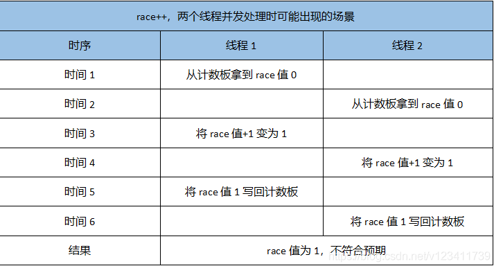
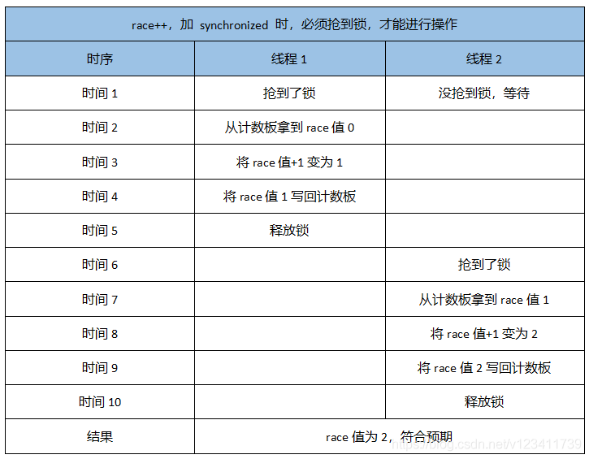
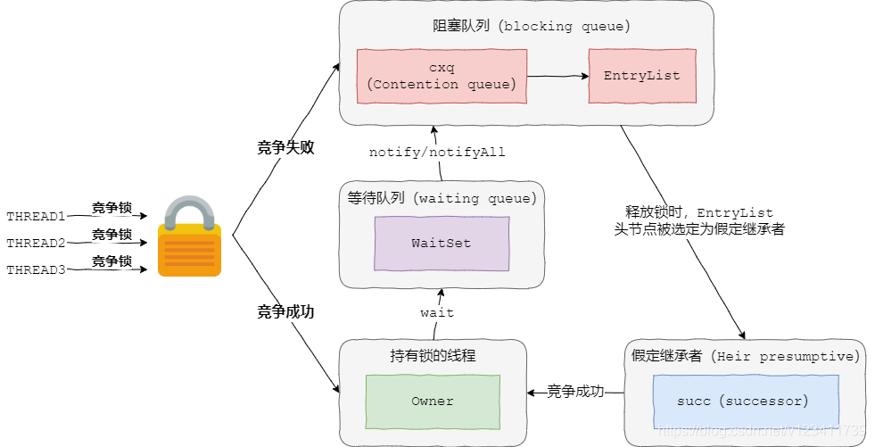
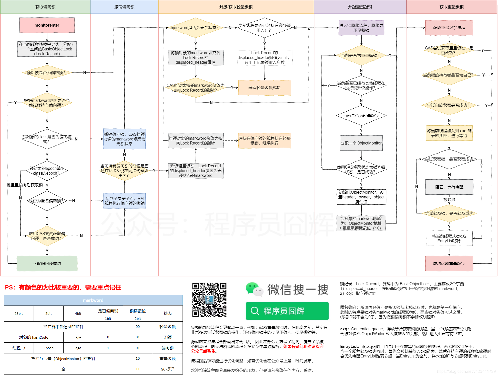
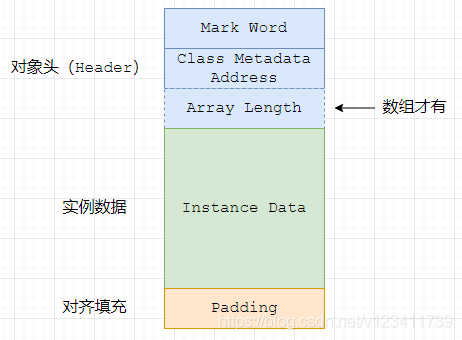
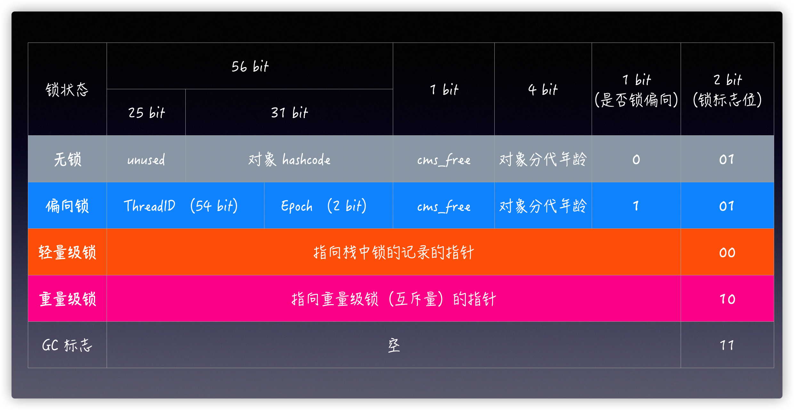
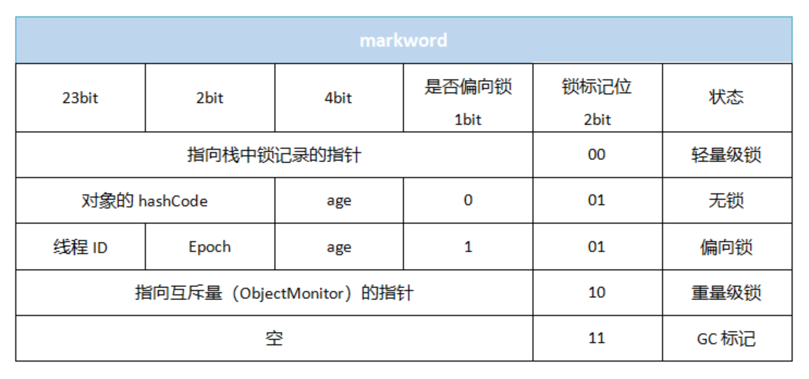
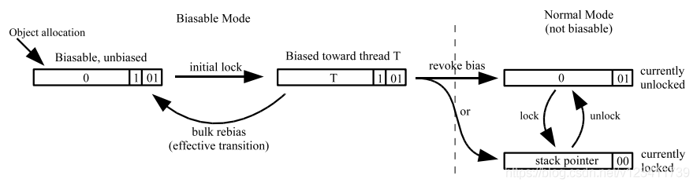
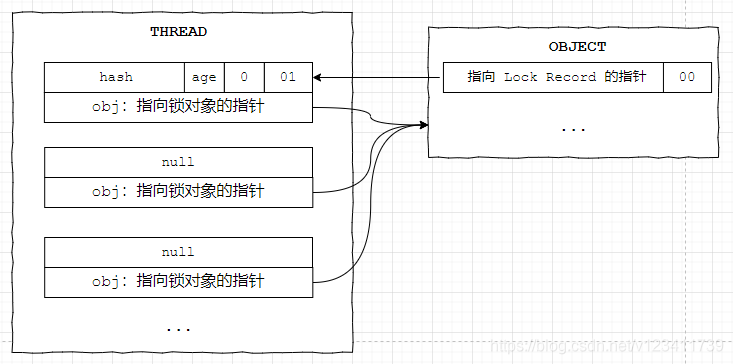
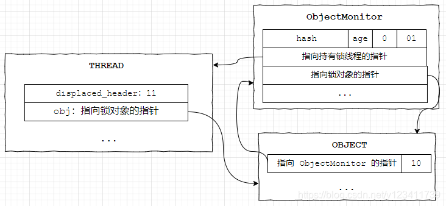

##### 1、synchronized 的使用小例子?

```java
public class SynchronizedTest {
 
    public static volatile int race = 0;
 
    private static CountDownLatch countDownLatch = new CountDownLatch(2);
 
    public static void main(String[] args) throws InterruptedException {
        // 循环开启2个线程来计数
        for (int i = 0; i < 2; i++) {
            new Thread(() -> {
                // 每个线程累加1万次
                for (int j = 0; j < 10000; j++) {
                    race++;
                }
                countDownLatch.countDown();
            }).start();
        }
        // 等待 ，直到所有线程处理结束才放行【直到计数器变为0的时候】
        countDownLatch.await();
        // 期望输出 2万（2*1万）
        System.out.println(race);
    }
}
```

熟悉的2个线程计数的例子，每个线程自增1万次，预期的结果是2万，但是实际运行结果总是一个小于等于2万的数字，为什么会这样了？

race++在我们看来可能只是1个操作，但是在底层其实是由多个操作组成的，所以在并发下会有如下的场景：



为了得到正确的结果，此时我们可以将 race++ 使用 synchronized 来修饰，如下：

```java
synchronized (SynchronizedTest.class) {
    race++;
}
```

加了 synchronized 后，只有抢占到锁才能对 race 进行操作，此时的流程会变成如下：



##### 2.synchronized 各种加锁场景？

* 作用于非静态方法，锁住的是对象实例（this），每一个**对象实例**有一个锁

```java
public synchronized void method() {}
```

* 作用于静态方法，锁住的是类的 Class 对象，Class 对象全局只有一份，因此静态方法锁相当于类的一个全局锁，会锁所有调用该方法的线程

```java
public static synchronized void method() {}
```

* 作用于 Lock.class，锁住的是 Lock 的 Class 对象，也是全局只有一个。这个Lock也可以是其他的类

```java
synchronized (Lock.class) {}
```

* 作用于 this，锁住的是对象实例，每一个对象实例有一个锁。

```java
synchronized (this) {}
```

* 作用于静态成员变量，锁住的是该静态成员变量对象，由于是静态变量，因此全局只有一个。

```java
public static Object monitor = new Object(); 
synchronized (monitor) {}
```

有些同学可能会搞混，但是其实很容易记，记住以下两点:

1.必须有“对象”来充当“锁”的角色

2.对于同一个类来说，通常只有两种对象来充当锁：实例对象、Class 对象（一个类全局只有一份）。

Class 对象：静态相关的都是属于 Class 对象，还有一种直接指定 Lock.class。

实例对象：非静态相关的都是属于实例对象。

##### 3.为什么调用 Object 的 wait/notify/notifyAll 方法，需要加 synchronized 锁？

这个问题说难也难，说简单也简单。说简单是因为，大家应该都记得有道题目：“sleep 和 wait 的区别”，答案中非常重要的一项是：“**wait会释放对象锁，sleep不会**”，既然要释放锁，那必然要先获取锁。

说难是因为如果没有联想到这个题目并且没有了解的底层原理，可能就完全没头绪了。

究其原因，因为这3个方法都会操作锁对象，所以需要先获取锁对象，而加 synchronized 锁可以让我们获取到锁对象。

来看一个例子：

```java
public class SynchronizedTest {
    private static final Object lock = new Object();
     
    public static void testWait() throws InterruptedException {
        lock.wait();
    }
     
    public static void testNotify() throws InterruptedException {
        lock.notify();
    }
}
```

在这个例子中，wait 会释放 lock 锁对象，notify/notifyAll 会唤醒其他正在等待获取 lock 锁对象的线程来抢占 lock 锁对象。

既然你想要操作 lock 锁对象，那必然你就得先获取 lock 锁对象。就像你想把苹果让给其他同学，那你必须先拿到苹果。

再来看一个反例：

```java
public class SynchronizedTest {
    private static final Object lock = new Object();
    
    public static synchronized void getLock() throws InterruptedException {
        lock.wait();
    }
}
```

该方法运行后会抛出 IllegalMonitorStateException，为什么了，我们明明加了 synchronized 来获取锁对象了？

因为在 getLock 静态方法中加 synchronized 方法获取到的是 SynchronizedTest.class 的锁对象，而我们的 wait() 方法是要释放 lock 的锁对象。

这就相当于你想让给其他同学一个苹果（lock），但是你只有一个梨子（SynchronizedTest.class）。

##### 4.synchronize 底层维护了几个列表存放被阻塞的线程？

这题是紧接着上一题的，很明显面试官想看看我是不是真的对 synchronize 底层原理有所了解。

synchronized 底层对应的 JVM 模型为 objectMonitor，使用了3个双向链表来存放被阻塞的线程：_cxq（Contention queue 竞争队列）、_EntryList（EntryList）、_WaitSet（WaitSet）。

当线程**获取锁失败**进入阻塞后，**首先**会被加入到 _**cxq 链表**，_**cxq 链表**的节点会在**某个时刻被进一步转移到 _EntryList 链表**。

具体转移的时刻？见题目29。

当持有锁的线程释放锁后，**_EntryList 链表头结点**的线程会**被唤醒**，该线程称为 successor（**假定继承者**），然后该线程**会尝试抢占锁**。

当我们调用 **wait()** 时，线程会被放入 **_WaitSet**，直到调用了 **notify()/notifyAll()** 后，线程**才被重新放入 _cxq 或 _EntryList**，**默认放入 _cxq 链表头部**。

objectMonitor 的整体流程如下图：


##### 5、为什么释放锁时被唤醒的线程会称为“假定继承者”？被唤醒的线程一定能获取到锁吗？

因为被唤醒的线程并不是就一定获取到锁了，该线程仍然需要去**竞争锁**，而且可能会失败，所以该线程并不是就**一定会**成为锁的“继承者”，而**只是有机会成为**，所以我们称它为**假定**的。

这也是 synchronized 为什么是**非公平锁**的一个原因。

##### 6.synchronized 为什么是非公平锁？非公平体现在哪些地方？

synchronized 的非公平其实在源码中应该有不少地方，因为设计者就没按公平锁来设计，核心有以下几个点：

1.当持有锁的线程释放锁时，该线程会执行以下两个重要操作：

* 先将锁的**持有者 owner 属性赋值为 null**
* **唤醒**等待链表中的一个线程（**假定继承者**）

在上面两点之间，**如果有其他线程刚好在尝试获取锁（例如自旋），则可以马上获取到锁**。

2.当线程尝试获取锁失败，**进入阻塞时，放入链表的顺序，和最终被唤醒的顺序是不一致的**，也就是说你先进入链表，不代表你就会先被唤醒。

##### 7.既然加了 synchronized 锁，那当某个线程调用了 wait 的时候明明还在 synchronized 块里，其他线程怎么进入到 synchronized 里去执行 notify 的？

如下例子：调用 lock.wait() 时，线程就阻塞在这边了，此时代码执行应该还在 synchronized 块里，其他线程为什么就能进入 synchronized 块去执行 notify() ？

```java
public class SynchronizedTest {

    private static final Object lock = new Object();
     
    public static void testWait() throws InterruptedException {
        synchronized (lock) {
            // 阻塞住，被唤醒之前不会输出aa，也就是还没离开synchronized
            lock.wait();
            System.out.println("aa");
        }
    }
     
    public static void testNotify() throws InterruptedException {
        synchronized (lock) {
            lock.notify();
            System.out.println("bb");
        }
    }
}
```

只看代码确实会给人题目中的这种错觉，这也是 Object 的 wait() 和 notify() 方法很多人用不好的原因，包括我也是用的不太好。

这个题需要从底层去看，当线程进入 synchronized 时，需要获取 lock 锁，但是在调用 lock.wait() 的时候，此时虽然线程还在 synchronized 块里，但是其实已经释放掉了 lock 锁。

所以，其他线程此时可以获取 lock 锁进入到 synchronized 块，从而去执行 lock.notify()。

##### 8.如果有多个线程都进入 wait 状态，那某个线程调用 notify 唤醒线程时是否按照进入 wait 的顺序去唤醒？

答案是否定的。上面在介绍 synchronized 为什么是非公平锁时也介绍了**不会按照顺序去唤醒**。

调用 wait 时，节点进入**_WaitSet** 链表的尾部。

调用 notify 时，根据不同的策略，节点可能被移动到 cxq 头部、cxq 尾部、EntryList 头部、EntryList 尾部等多种情况。

所以，**唤醒的顺序并不一定是进入 wait 时的顺序**。

##### 9.notifyAll 是怎么实现全唤起的？

**nofity** 是获取 **WaitSet 的头结点，执行唤起操作**。

**nofityAll** 的流程，**可以简单的理解为就是循环遍历 WaitSet 的所有节点，对每个节点执行 notify 操作**。

##### 10.JVM 做了哪些锁优化？

偏向锁、轻量级锁、自旋锁、自适应自旋、锁消除、锁粗化

##### 11.为什么要引入偏向锁和轻量级锁？为什么重量级锁开销大？

重量级锁底层依赖于**系统的同步函数来实现**，在 linux 中使用 pthread_mutex_t（**互斥锁**）来实现。

这些**底层的同步函数**操作会涉及到：操作系统**用户态**和**内核态**的切换、**进程的上下文切换**，而这些操作都是比较耗时的，因此**重量级锁操作的开销比较大**。

而在很多情况下，**可能获取锁时只有一个线程**，**或者是多个线程交替获取锁**，在这种情况下，使用重量级锁就不划算了，因此**引入了偏向锁和轻量级锁**来**降低没有并发竞争时的锁开销**。

##### 12.偏向锁有撤销、膨胀，性能损耗这么大为什么要用呢？

偏向锁的好处是在只有一个线程获取锁的情况下，只需要通过**一次 CAS** 操作修改 **markword** ，之后每次进行简单的判断即可，**避免了轻量级锁每次获取释放锁时的 CAS 操作**。

如果确定同步代码块**会被多个线程访问或者竞争较大**，可以通过 -XX:-UseBiasedLocking 参数关闭偏向锁。

##### 13.偏向锁、轻量级锁、重量级锁分别对应了什么使用场景？todo？

1）偏向锁

适用于只有一个线程获取锁。当第二个线程尝试获取锁时，即使此时第一个线程已经释放了锁，此时还是会升级为轻量级锁。

但是有一种特例，如果出现**偏向锁的重偏向**，则此时第二个线程可以尝试获取偏向锁。

2）轻量级锁

适用于**多个线程交替获取锁**。跟偏向锁的区别在于可以**有多个线程**来获取锁，但是**必须没有竞争**，如果**有则会升级会重量级锁**。有同学可能会说，不是有自旋，请继续往下看。

3）重量级锁

适用于多个线程**同时**获取锁。

##### 14.自旋发生在哪个阶段？

网上99.99%的说法，自旋都是发生在轻量级锁阶段，但是实际看了源码（JDK8）之后，并不是这样的。

**轻量级锁阶段并没有自旋操作**，在轻量级锁阶段，**只要发生竞争**，**就是直接膨胀成重量级锁**。

而在重量级锁阶段，如果获取锁失败，则会尝试**自旋去获取锁**。

##### 15.为什么要设计自旋操作？

因为**重量级锁的挂起开销太大**。todo

一般来说，同步代码块内的代码应该很快就执行结束，这时候竞争锁的线程自旋一段时间是很容易拿到锁的，这样就可以节省了重量级锁挂起的开销。

##### 16.自适应自旋是如何体现自适应的？

自适应自旋锁有自旋次数限制，范围在：1000~5000。

如果当次自旋获取锁成功，则会奖励自旋次数100次，如果当次自旋获取锁失败，则会惩罚扣掉次数200次。

所以如果自旋一直成功，则JVM认为自旋的成功率很高，值得多自旋几次，因此增加了自旋的尝试次数。

相反的，如果自旋一直失败，则JVM认为自旋只是在浪费时间，则尽量减少自旋。

##### 17.synchronized 锁能降级吗？

答案是可以的。

具体的触发时机：在全局安全点（safepoint）中，**执行清理任务的时候**会触发尝试降级锁。

当锁降级时，主要进行了以下操作：

1）**恢复锁对象的 markword 对象头**；

2）**重置 ObjectMonitor**，然后将该 ObjectMonitor 放入全局空闲列表，等待后续使用。

##### 18.synchronized 和 ReentrantLock 的区别

1）底层实现：synchronized 是 Java 中的关键字，是 JVM 层面的锁；ReentrantLock 是 JDK 层次的锁实现。

2）是否需要手动释放：synchronized 不需要手动获取锁和释放锁，在发生异常时，会自动释放锁，因此不会导致死锁现象发生；ReentrantLock 在发生异常时，如果没有主动通过 unLock() 去释放锁，很可能会造成死锁现象，因此使用 ReentrantLock 时需要在 finally 块中释放锁。

3）锁的公平性：synchronized 是非公平锁；ReentrantLock 默认是非公平锁，但是可以通过参数选择公平锁。

4）是否可中断：synchronized 是不可被中断的；ReentrantLock 则可以被中断。

5）灵活性：使用 synchronized 时，等待的线程会一直等待下去，直到获取到锁；ReentrantLock 的使用更加灵活，有立即返回是否成功的，有响应中断、有超时时间等。

6）性能上：随着近些年 synchronized 的不断优化，ReentrantLock 和 synchronized 在性能上已经没有很明显的差距了，所以性能不应该成为我们选择两者的主要原因。官方推荐尽量使用 synchronized，除非 synchronized 无法满足需求时，则可以使用 Lock。

##### 19.synchronized 锁升级流程？

核心流程如下图所示，请保存后放大查看，有一些概念看不懂很正常，会在文章后面陆续介绍，请继续往下看。



##### 20.synchronized 的底层实现

synchronized 的底层实现主要区分：方法和代码块，如下图例子。

```java
public class SynchronizedDemo {
 
    private static final Object lock = new Object();
 
    public static void main(String[] args) {
        // 锁作用于代码块
        synchronized (lock) {
            System.out.println("hello word");
        }
    }
 
    // 锁作用于方法
    public synchronized void test() {
        System.out.println("test");
    }
}
```

将该代码进行编译后，查看其字节码，核心代码如下：

```cpp
{
  public com.joonwhee.SynchronizedDemo();
    descriptor: ()V
    flags: ACC_PUBLIC
    Code:
      stack=1, locals=1, args_size=1
         0: aload_0
         1: invokespecial #1                  // Method java/lang/Object."<init>":()V
         4: return
      LineNumberTable:
        line 9: 0
 
  public static void main(java.lang.String[]);
    descriptor: ([Ljava/lang/String;)V
    flags: ACC_PUBLIC, ACC_STATIC
    Code:
      stack=2, locals=3, args_size=1
         0: getstatic     #2                  // Field lock:Ljava/lang/Object;
         3: dup
         4: astore_1
         5: monitorenter   // 进入同步块  
         6: getstatic     #3                  // Field java/lang/System.out:Ljava/io/PrintStream;
         9: ldc           #4                  // String hello word
        11: invokevirtual #5                  // Method java/io/PrintStream.println:(Ljava/lang/String;)V
        14: aload_1
        15: monitorexit   // 退出同步块  
        16: goto          24
        19: astore_2
        20: aload_1
        21: monitorexit  // 退出同步块  
        22: aload_2
        23: athrow
        24: return
      Exception table:
         from    to  target type
             6    16    19   any
            19    22    19   any
 
 
  public synchronized void test();
    descriptor: ()V
    flags: ACC_PUBLIC, ACC_SYNCHRONIZED  // ACC_SYNCHRONIZED 标记
    Code:
      stack=2, locals=1, args_size=1
         0: getstatic     #3                  // Field java/lang/System.out:Ljava/io/PrintStream;
         3: ldc           #6                  // String test
         5: invokevirtual #5                  // Method java/io/PrintStream.println:(Ljava/lang/String;)V
         8: return
      LineNumberTable:
        line 20: 0
        line 21: 8
}
```

synchronized 修饰**代码块**时，编译后会生成  **monitorenter** 和 **monitorexit** 指令，分别对应进入同步块和退出同步块。可以看到**有两个 monitorexit**，这是因为编译时 **JVM 为代码块添加了隐式的 try-finally**，**在 finally 中进行了锁释放**，这也是为什么 **synchronized 不需要手动释放锁**的原因。

synchronized 修饰方法时，编译后会生成 **ACC_SYNCHRONIZED** 标记，当方法调用时，调用指令将会检**查方法的 ACC_SYNCHRONIZED 访问标志是否被设置**，如果设置了则会**先尝试获得锁**。 

两种实现其实本质上没有区别，只是**方法的同步**是一种**隐式**的方式来实现，**无需通过字节码**来完成.

##### 21.对象的内存布局和对象头

在介绍 Mark Word 之前，需要先了解对象的内存布局。 HotSpot 中，对象在堆内存中的存储布局可以分为三部分：对象头（Header）、实例数据（Instance Data）、对齐填充（Padding）。



###### 1.对象头(Header)

主要包含两类信息：Mark Word 和 类型指针。

Mark Word 记录了对象的运行时数据，例如：HashCode、GC分代年龄、偏向标记、锁标记、偏向的线程ID、偏向纪元（epoch）等，32 位的 markword 如下图所示。

Java 对象头最多由三部分构成：

1. `MarkWord`
2. ClassMetadata Address  [类型指针，对象的Class信息，存储对象的class地址【元空间中】]
3. Array Length （**如果对象是数组才会有这部分**）

其中 `Markword` 是保存锁状态的关键，对象锁状态可以从偏向锁升级到轻量级锁，再升级到重量级锁，加上初始的无锁状态，可以理解为有 4 种状态。想在一个对象中表示这么多信息自然就要用`位`存储，在 64 位操作系统中，是这样存储的（**注意颜色标记**）,下面是对象头的结构



32 位的 markword 如下图所示



类型指针【ClassMetadata Address】，指向它的**类型元数据的指针**，**Java 虚拟机通过这个指针来确定该对象时哪个类的实例**。如果对象是数组，则需要有一个用于记录数组长度的数据。

###### 2.实例数据（Instance Data）

对象存储的真正有效信息，即我们在代码里定义的各种类型的字段内容。

###### 3.对齐填充（Padding）

Hotspot 要求对象的大小必须是8字节的整数倍，因此，如果实例数据不是8字节的整数倍时，需要通过该字段进行填充。

##### 22.介绍下 Lock Record？

锁记录，这个大家应该都听过，用于**偏向锁优化和轻量级锁优化**时**暂存锁对象的 markword**。

Lock Record 在源码中为 BasicObjectLock，源码如下：

```cpp
class BasicObjectLock VALUE_OBJ_CLASS_SPEC {
 private:
  BasicLock _lock;
  oop       _obj;
};
class BasicLock VALUE_OBJ_CLASS_SPEC {
 private:
  volatile markOop _displaced_header; 
};
```

其实就两个属性：

1）_displaced_header：用于轻量级锁中**暂存锁对象的 markword**，也称为 displaced mark word。

2）_obj：**指向锁对象**。

Lock Record 除了用于暂存 markword 之外，还有一个重要的功能是用于**实现锁重入的计数器**，当每次锁重入时，会用一个 Lock Record 来记录，但是此时 _displaced_header 为 null。

这样在解锁的时候，每解锁1次，就移除1个 Lock Record。移除时，判断 _displaced_header 是否为 null。如果是，则代表是锁重入，则不会执行真正的解锁；否则，代表这是最后一个 Lock Record，此时会真正执行解锁操作。 

##### 23.什么是匿名偏向？

所谓的匿名偏向是指该**锁从未被获取过**，也就是**第一次偏向**，此时的特点是锁对象 **markword 的线程 ID 为0**。

当第一个线程获取偏向锁后，**线程ID会从0修改为该线程的 ID**，之后该线程 ID 就不会为0了，**因为释放偏向锁不会修改线程 ID**。

这也是为什么说**偏向锁适用于**：**只有一个线程获取锁的场景**。

##### 24.偏向锁模式下 hashCode 存放在哪里？

偏向锁状态下是**没有地方存放 hashCode** 的。

因此，当**一个对象已经计算过 hashCode 之后**，**就再也无法进入偏向锁状态了**。

如果**一个对象当前正处于偏向锁状态**，**收到需要计算其 hashCode 的请求**时（Object::hashCode()或者System::identityHashCode（Object）方法的调用），**它的偏向锁状态就会立即被撤销**。

##### 25.偏向锁加锁解锁流程

首先，在开启偏向锁的时候，对象创建后，其偏向锁标记位为1。如果没开启偏向锁，对象创建后，其偏向锁标记位为0。

加锁流程：

1）从当前线程的**栈帧**中寻找一个空闲的 **Lock Record**，**将 obj 属性指向当前锁对象**。

2）获取偏向锁时，会先进行各种判断，如加锁流程图所示，最终只有两种场景能尝试获取锁：**匿名偏向、批量重偏向**。

3）使用 **CAS** 尝试将**自己的线程 ID 填充到锁对象 markword 里**，**修改成功则获取到锁**。

4）如果不是步骤2的两种场景，**或者 CAS 修改失败，则会撤销偏向锁，并升级为轻量级锁**。

5）如果线程成功获取偏向锁，之后每次进入该同步块时，**只需要简单的判断锁对象 markword 里的线程ID是否是自己**，如果是则直接进入，几乎没有额外开销。

解锁流程：

偏向锁的解锁很简单，**就是将Lock Record的 obj 属性赋值为 null**，这边很重要的点是**不会将锁对象 markword 的线程ID还原回0**。

偏向锁流程中，markword 的状态变化如下图所示：


##### 26.批量重偏向、批量撤销？启发式算法？

上面我们提到了**批量重偏向**，与批量重偏向同时被引入的还有**批量撤销**，官方统称两者为 **“启发式算法**”。

###### **为什么引入启发式算法？**

从上面的介绍我们知道，当只有一个线程获取锁时，偏向锁只需在第一次进入同步块时执行一次 CAS 操作，之后每次进入只需要简单的判断即可，此时的开销基本可以忽略。**因此在只有一个线程获取锁的场景中，偏向锁的性能提升是非常可观的**。

但是如果有**其他线程尝试获得锁时**，此时需要将**偏向锁撤销为无锁状态**或者**升级为轻量级锁**。偏向锁的撤销是有一定成本的（撤销后会升级），如果我们的使用场景存在多线程竞争导致大量偏向锁撤销，那偏向锁反而会导致性能下降。

JVM 开发人员通过分析得出以下两个观点：

场景1：**对于某些对象，偏向锁显然是无益的**。例如**涉及两个或更多线程的生产者-消费者队列**。这样的**对象必然有锁竞争**，而且在程序执行过程中可能会分配许多这样的对象。

该观点描述的是**锁竞争比较多**的场景，对这种场景，**一种简单粗暴的方法是直接禁用偏向锁**，但是这种方式并不是最优的。

因为在整个服务中，可能只有一小部分是这种场景，因为这一小部分场景而直接放弃偏向锁的优化，显然是不划算的。最理想的情况下是能够识别这样的对象，并只为它们禁用偏向锁。

**批量撤销就是对该场景的优化。**

场景2：在某些情况下，将一组对象重新偏向另一个线程是有好处的。特别是当一个线程分配了许多对象并对每个对象执行了初始同步操作，但另一个线程对它们执行了后续工作。

我们知道**偏向锁的设计初衷是用于只有一个线程获取锁的场景**。该观点中后半部分其实是符合这场场景的，但是由于前半部分而导致不能享受偏向锁带来的好处，因此 JVM 开发人员要做的就是识别出这种场景，并进行优化。

对于这种场景，官方引入了批量重偏向来进行优化。

###### **批量重偏向**

JVM 选择以 class 为粒度，为**每一个 class 维护了一个偏向锁撤销计数器**。每当**该 class的对象** 发生偏向锁撤销的时候，计数器值+1。

当计数器的值**超过批量重偏向的阈值**（默认20）的时候，JVM 认为此时命中了上述的场景2，就会对**整个 class的对象** 进行批量重偏向。

每个 class 都会有 markword，当处于偏向锁状态时，markword 会有 epoch 属性，当**创建**该 class 的**实例对象**时，**实例对象的 epoch 值会赋值为 class 的 epoch 值**，也就是说正常情况下，**实例对象的 epoch 和 class 的 epoch 是相等的**。

而当发生批量重偏向时，epoch 就派上用场了。

当发生批量重偏向时，首先会将 **class 的 epoch 值+1**，接着**遍历所有当前存活的线程的栈**，找到该 **class 所有正处于偏向锁状态**的**锁实例对象**， **将其epoch 值修改为新值**。

而那些当前没有**被任何线程持有的锁实例对象**，其 **epoch 值**则**没有**得到**更新**，此时会比 class 的 epoch 值小1。在下一次其他线程准备获取该锁对象的时候，**不会因为该锁对象的线程ID不为0**（也就是曾经被其他线程获取过），而**直接升级为轻量级锁**，而是**使用 CAS 来尝试获取偏向锁**，**从而达到批量重偏向的优化效果**。

PS：对应了加锁流程图中的 “**锁对象的epoch等于class的epoch**” 的选择框。

###### **批量撤销**

批量撤销是**批量重偏向**的**后续流程**，同样是以 class 为粒度，同样使用偏向撤销计数器。

当批量重偏向后，每次进行**偏向撤销**时，会计算**本次撤销时间**和**上一次撤销时间**的**间隔**，如果两次撤销时间的间隔**超过指定时间**（25秒），则此时 JVM 会认为**批量重偏向是有效果的**，**因为此时偏向撤销的频率很低**，所以会将**偏向撤销计数器重置为0**。

而当批量重偏向后，偏向计数器的值**继续快速增加**，**当计数器的值超过批量撤销的阈值**（默认40）时，**JVM 认为该 class 的实例对象**存在明显的**锁竞争**，**不适合使用偏向锁**，**则会触发批量撤销操作**。

批量撤销：将 class 的 markword 修改为**不可偏向无锁状态**，也就是偏向标记位为0，锁标记位为01。接着**遍历所有当前存活的线程的栈**，找到该**class 所有正处于偏向锁状态的锁实例对象**，**执行偏向锁的撤销操作**。

这样当线程后续尝试获取该 class 的锁实例对象时，会发现锁对象的 **class 的 markword 不是偏向锁状态**，知道该 **class 已经被禁用偏向锁**，从而直接进入**轻量级锁流程**。

PS：对应了加锁流程图中的 “**锁对象的class是否为偏向模式？**” 的选择框。

##### 27.轻量级锁流程

###### 加锁：

如果**关闭偏向锁**，或者**偏向锁升级**，则会进入轻量级锁加锁流程。

1）从当前线程的栈帧中寻找一个空闲的 **Lock Record**，obj 属性指向锁对象。

2）将锁对象的 markword 修改为**无锁状态**，填充到 Lock Rrcord 的 displaced_header 属性。

3）使用 CAS 将**对象头**的 **markword** 修改为指向 **Lock Record 的指针**

此时的线程栈和锁对象的关系如下图所示，可以看到2次锁重入的 displaced_header 填充的是 null。


###### 解锁：

1）将 Lock Record 的 obj 属性赋值为 null。

2）使用 CAS 将 displaced_header 属性暂存的 displaced mark word 还原回锁对象的 markword。

##### 28.重量级锁流程

###### 加锁：

当**轻量级锁出现竞争时**，**会膨胀成重量级锁**。

1）分配一个 **ObjectMonitor**，并填充相关属性。

2）将锁对象的 markword 修改为：该 ObjctMonitor 地址 + 重量级锁标记位（10）

3）尝试获取锁，如果失败了则尝试**自旋获取锁**

4）如果多次尝试后还是失败，则将该线程封装成 **ObjectWaiter**，插入到 **cxq** 链表中，当前线程进入**阻塞状态**

5）当其他锁释放时，会唤醒链表中的节点，被唤醒的节点会再次尝试获取锁，获取成功后，将自己从 cxq（EntryList）链表中移除

此时的线程栈、锁对象、ObjectMonitor 之间的关系如下图所示：


ObjectMonitor 的核心属性如下：

```cpp
ObjectMonitor() {
    _header       = NULL; // 锁对象的原始对象头
    _count        = 0;    // 抢占该锁的线程数，_count大约等于 _WaitSet线程数 + _EntryList线程数
    _waiters      = 0,    // 调用wait方法后的等待线程数
    _recursions   = 0;    // 锁的重入数
    _object       = NULL; // 指向锁对象指针
    _owner        = NULL; // 当前持有锁的线程
    _WaitSet      = NULL; // 存放调用wait()方法的线程
    _WaitSetLock  = 0 ;   // 操作_WaitSet链表的锁
    _Responsible  = NULL ;
    _succ         = NULL ;  // 假定继承人
    _cxq          = NULL ;  // 等待获取锁的线程链表，竞争锁失败后会被先放到cxq链表，之后再进入_EntryList链接
    FreeNext      = NULL ;  // 指向下一个空闲的ObjectMonitor
    _EntryList    = NULL ;  // 等待获取锁的线程链表，该链表的头结点是获取锁的第一候选者
    _SpinFreq     = 0 ;
    _SpinClock    = 0 ;
    OwnerIsThread = 0 ; // 标记_owner是指向占用当前锁的线程的指针还是BasicLock，1为线程，0为BasicLock，发生在轻锁升级重锁的时候
    _previous_owner_tid = 0;  // 监视器上一个所有者的线程id
  }
```

###### 解锁：

1）将重入计数器-1，ObjectMonitor 里的 _recursions 属性。

2）先释放锁，将锁的持有者 owner 属性赋值为 null，此时其他线程已经可以获取到锁，例如自旋的线程。

3）从 EntryList 或 cxq 链表中唤醒下一个线程节点。

##### 29._cxq 链表和 _EntryList 链表的排队策略？

上文说道，“_cxq 链表的节点会在某个时刻被进一步转移到 _EntryList 链表”，那到底是什么时刻了？

通常来说，可以认为是**在持有锁的线程释放锁时**，该线程需要去唤醒链表中的下一个线程节点，此时如果检查到 _EntryList 为空，并且 _cxq 不为空时，会将 _cxq 链表的节点转移到 _EntryList 中。

不过也不全是这样，_cxq 链表和 _EntryList 链表的排队策略（QMode）和执行顺序如下：

1）当 QMode = 2 时，此时 _cxq 比 EntryList 优先级更高，如果此时 _cxq 不为空，则会首先唤醒 _cxq 链表的头结点。**除了 QMode = 2 之外**，其他模式都是唤醒 _EntryList 的头结点。 

2）当 QMode = 3 时，无论 _EntryList 是否为空，都会直接将 _cxq 链表中的节点转移到 _EntryList 链表的**末尾**。

3）当 QMode = 4 时，无论 _EntryList 是否为空，都会直接将 _cxq 链表中的节点转移到 _EntryList 链表的**头部**。

4）执行到这边，如果 _EntryList 不为空，则直接唤醒 _EntryList 的头结点并返回，如果此时 _EntryList 为空，则继续执行。

5）执行到这边，代表此时 _EntryList 为空。

6）当 QMode = 1 时，将 _cxq 链表的节点转移到 _EntryList 中，并且调换顺序，也就是原来在_cxq 头部，会变到 _EntryList 尾部。

7）剩余情况，将 _cxq 链表的节点转移到 _EntryList 中，并且节点顺序一致。

8）如果此时 _EntryList 不为空，则唤醒 _EntryList 的头结点。
