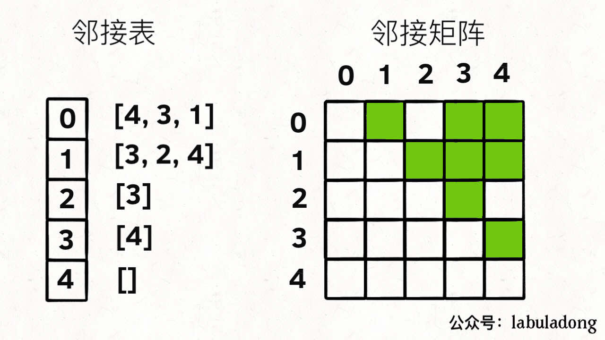
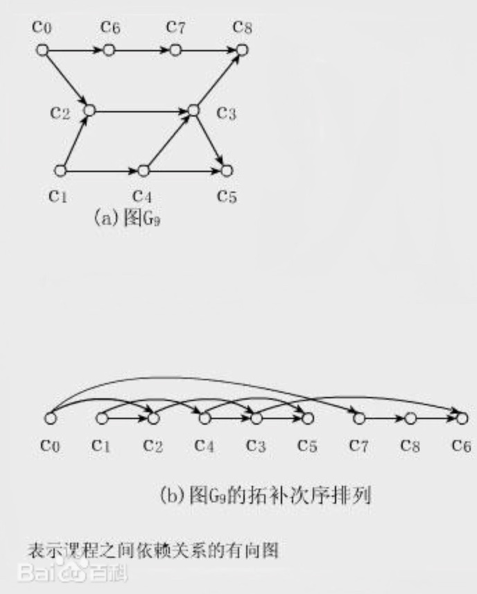

#### 1.图的逻辑结构和具体实现

一幅图是由**节点**和**边**构成的，逻辑结构如下：


```java
/* 图节点的逻辑结构 */
class Vertex {
    int id;
    //相邻节点
    Vertex[] neighbors;
}
```

##### 1.邻接表和邻接矩阵

实际上我们很少用这个 `Vertex` 类实现图，都是用**邻接表和邻接矩阵**来实现图。

用邻接表和邻接矩阵的存储方式如下：



邻接表很直观，我把每个节点 `x` 的邻居都存到一个列表里，然后把 `x` 和这个列表关联起来，这样就可以通过一个节点 `x` 找到它的所有相邻节点。

邻接矩阵则是一个二维布尔数组，我们权且称为 `matrix`，如果节点 `x` 和 `y` 是相连的，那么就把 `matrix[x][y]` 设为 `true`（上图中绿色的方格代表 `true`）。如果想找节点 `x` 的邻居，去扫一圈 `matrix[x][..]` 就行了。

如果用代码的形式来表现，邻接表和邻接矩阵大概长这样：

```java
//有向无权图的表示

// 邻接表
// graph[x] 存储 x 的所有邻居节点
List<Integer>[] graph;

// 邻接矩阵
// matrix[x][y] 记录 x 是否有一条指向 y 的边
boolean[][] matrix;
```

**那么，为什么有这两种存储图的方式呢？肯定是因为他们各有优劣**。

对于邻接表，好处是占用的空间少。

你看邻接矩阵里面空着那么多位置，肯定需要更多的存储空间。

但是，邻接表无法快速判断两个节点是否相邻。

比如说我想判断节点 `1` 是否和节点 `3` 相邻，我要去邻接表里 `1` 对应的邻居列表里查找 `3` 是否存在。但对于邻接矩阵就简单了，只要看看 `matrix[1][3]` 就知道了，效率高。

所以说，使用哪一种方式实现图，要看具体情况。

好了，对于「图」这种数据结构，能看懂上面这些就绰绰够用了。

那你可能会问，我们这个图的模型仅仅是「**有向无权图**」，不是还有什么加权图，无向图，等等……

**其实，这些更复杂的模型都是基于这个最简单的图衍生出来的**。

**有向加权图怎么实现**？很简单呀：

如果是邻接表，我们不仅仅存储某个节点 `x` 的所有邻居节点，还存储 `x` 到每个邻居的权重，不就实现加权有向图了吗？

如果是邻接矩阵，`matrix[x][y]` 不再是布尔值，而是一个 int 值，0 表示没有连接，其他值表示权重，不就变成加权有向图了吗？

如果用代码的形式来表现，大概长这样：

```java
//有向加权图

// 邻接表
// graph[x] 存储 x 的所有邻居节点以及对应的权重 List<int[]>。
// 如：可以用int[0]表示相邻节点，int[1]表示权重
List<int[]>[] graph;

// 邻接矩阵
// matrix[x][y] 记录 x 指向 y 的边的权重，0 表示不相邻
int[][] matrix;
```

##### 1.拓扑排序

**直观地说就是，让你把一幅图「拉平」，而且这个「拉平」的图里面，所有箭头方向都是一致的**，比如上图所有箭头都是朝右的。

很显然，如果一幅有向图中存在环，是无法进行拓扑排序的，因为肯定做不到所有箭头方向一致；反过来，如果一幅图是「有向无环图」，那么一定可以进行拓扑排序。



拓扑排序就是后序遍历反转之后的结果，且拓扑排序只能针对有向无环图，进行拓扑排序之前要进行环检测