##### 1.自增：

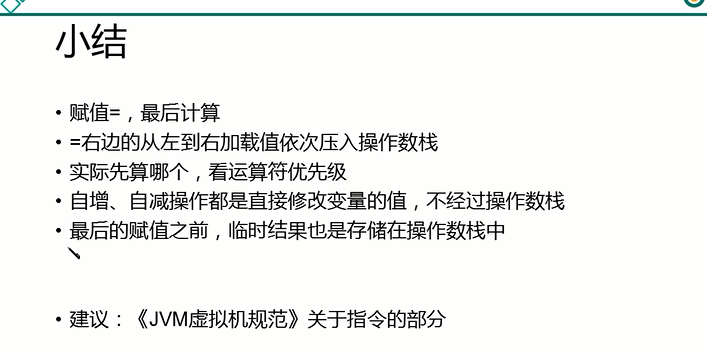


##### 2.关于==运算符

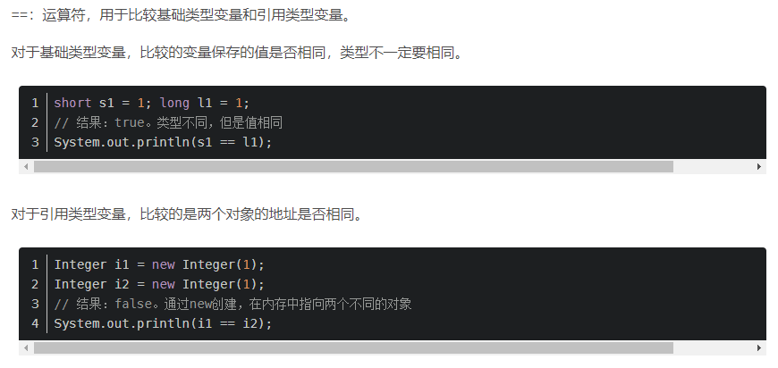

##### 3.重载和重写

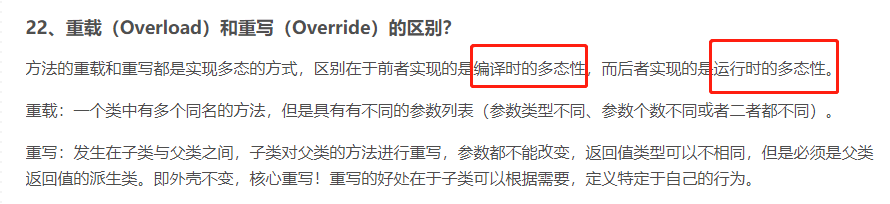

##### 4.初始化

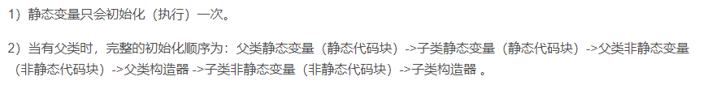

##### 5.Java8新特性 着重看下方法引用

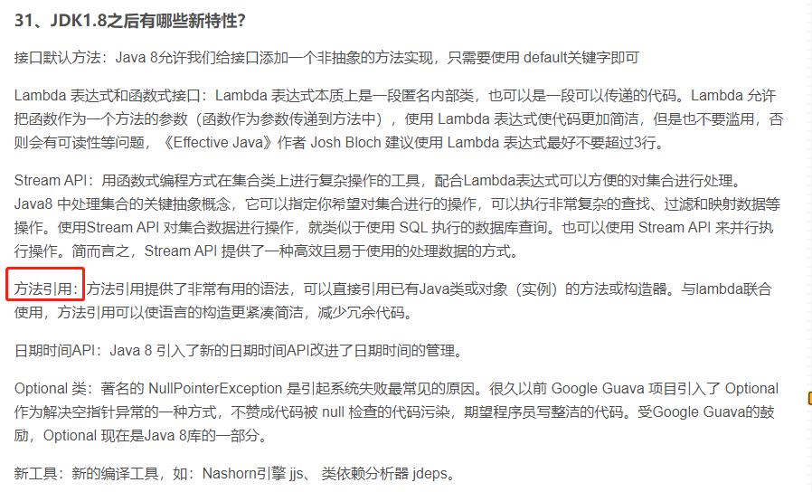


##### 6.hashcode

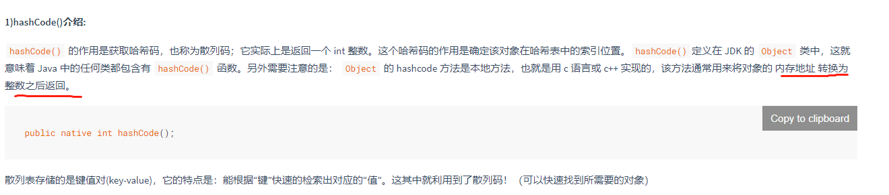

关于hashCode和equals方法重写的文章：https://www.cnblogs.com/skywang12345/p/3324958.html

##### 7.基本数据类型

char类型和数字比较 其实是同ascII码比较。ascll码的十进制数字范围

##### 8.Java是值传递。

如果参数是基本数据类型，此时实参赋给形参的是实参真实存储的数据值
如果参数是引用数据类型，此时实参赋给形参的是实参存储数据的地址值

https://www.bilibili.com/video/BV1Qb411g7cz?p=211

值传递和引用传递的区别是引用传递不会创建副本，值传递会创建副本


##### 9.java变量存储

**方法体中**的引用变量和基本类型的变量都在栈上，其他都在堆上(对象)

Java成员变量的引用在堆里；如果成员变量是值类型，那么值也在堆里。详情看下虚拟机栈的结构
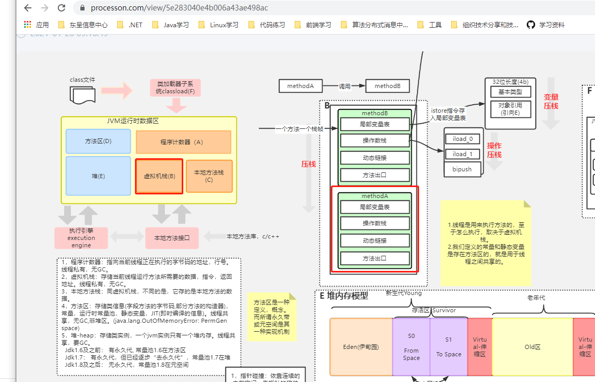

###### 关于Java方法中变量的存储位置

https://www.cnblogs.com/bky-nll/p/11117603.html

Java中的变量根据不同的标准可以分为两类，以其引用的数据类型的不同来划分可分为“原始数据类型变量和引用数据类型变量”，以其作用范围的不同来区分可分为“局部变量，实例变量和静态变量”。

根据“[Java中的变量与数据类型](https://blog.csdn.net/leunging/article/details/80598259)”中的介绍，“变量是在内存中分配的保留区域的名称。换句话说，它是一个内存位置的名称”，也就是说我们通过这个变量名字就可以找到一个指向这个变量所引用的数据的内存指针，根据变量的类型我们可以知道这个指针之后的几个字节里存储了这个变量所引用的数据。

所以，了解变量在方法区、栈内存、堆内存中的分配要了解两部分内容，一个是“变量在内存中的分配”，另一个是“变量所引用的数据在内存中的分配”。以下简称为“变量分配”与“数据分配”。

**原始数据类型变量：**
**原始数据类型变量的“变量分配”与“数据分配”是在一起的（都在方法区或栈内存或堆内存）**

**引用数据类型变量：**
**引用数据类型变量的“变量分配”与“数据分配”不一定是在一起的。**

示例代码

```java
class Fruit {
    static int x = 10;
    static BigWaterMelon bigWaterMelon_1 = new BigWaterMelon(x);

    int y = 20;
    BigWaterMelon bigWaterMelon_2 = new BigWaterMelon(y);
    
    public static void main(String[] args) {
        final Fruit fruit = new Fruit();
    
        int z = 30;
        BigWaterMelon bigWaterMelon_3 = new BigWaterMelon(z);
    
        new Thread() {
            @Override
            public void run() {
                int k = 100;
                setWeight(k);
            }
    
            void setWeight(int waterMelonWeight) {
                fruit.bigWaterMelon_2.weight = waterMelonWeight;
            }
        }.start();
    }

}

class BigWaterMelon {
    public BigWaterMelon(int weight) {
        this.weight = weight;
    }

    public int weight;

}
```


同一种颜色代表变量和对象的引用关系：

由于方法区和堆内存的数据都是线程间共享的，所以线程Main Thread，New Thread和Another Thread都可以访问方法区中的静态变量以及访问这个变量所引用的对象的实例变量。ps：方法区存储的都是只加载一次的。

**关于用final修饰的变量**

基本类型：基本类型的值不能发生改变
引用类型：引用类型的地址值不能发生改变。但是，该对象的堆内存的值是可以改变的。

##### 10.try-catch-finally执行顺序

a. finally 的基础用法，在 return 前会先执行 finally 语句块，所以是先输出 finally 里的 3，再输出 return 的 1，执行结果：31

```java
public class TryDemo {
    public static void main(String[] args) {
        System.out.println(test());
    }
    public static int test() {
        try {
            return 1;
        } catch (Exception e) {
            return 2;
        } finally {
            System.out.print("3");
        }
    }
}
```

b. 执行结果：3。try 返回前先执行 finally，结果 finally 里不按套路出牌，直接 return 了，自然也就走不到 try 里面的 return 了。

```java
public class TryDemo {
    public static void main(String[] args) {
        System.out.println(test1());
    }
    public static int test1() {
        try {
            return 2;
        } finally {
            return 3;
        }
    }
}
```

c.执行结果：2。在执行 finally 之前，JVM 会先将 i 的结果暂存起来，然后 finally 执行完毕后，会返回之前暂存的结果，而不是返回 i，所以即使这边 i 已经被修改为 3，最终返回的还是之前暂存起来的结果 2。这边其实根据字节码可以很容易看出来，在进入 finally 之前，JVM 会使用 iload、istore 两个指令，将结果暂存，在最终返回时在通过 iload、ireturn 指令返回暂存的结果

```java
public class TryDemo {
    public static void main(String[] args) {
        System.out.println(test1());
    }
    public static int test1() {
        int i = 0;
        try {
            i = 2;
            return i;
        } finally {
            i = 3;
        }
    }
}
```

##### 11.什么是序列化，什么是反序列化

- **序列化**： 将数据结构或对象转换成二进制字节流的过程
- **反序列化**：将在序列化过程中所生成的二进制字节流转换成数据结构或者对象的过程

对于不想进行序列化的变量，使用 `transient` 关键字修饰。

`transient` 关键字的作用是：阻止实例中那些用此关键字修饰的的变量序列化；当对象被反序列化时，被 `transient` 修饰的变量值不会被持久化和恢复。

关于 `transient` 还有几点注意：

- `transient` 只能修饰变量，不能修饰类和方法。
- `transient` 修饰的变量，在反序列化后变量值将会被置成类型的默认值。例如，如果是修饰 `int` 类型，那么反序列后结果就是 `0`。
- `static` 变量因为不属于任何对象(Object)，所以无论有没有 `transient` 关键字修饰，均不会被序列化。

##### 12.Java IO流

- 按照流的流向分，可以分为输入流和输出流；

- 按照操作单元划分，可以划分为字节流和字符流；

- 按照流的角色划分为节点流和处理流。

  既然有了字节流,为什么还要有字符流?

  问题本质想问：**不管是文件读写还是网络发送接收，信息的最小存储单元都是字节，那为什么 I/O 流操作要分为字节流操作和字符流操作呢？**

  回答：字符流是由 Java 虚拟机将字节转换得到的，问题就出在这个过程还算是非常耗时，并且，如果我们不知道编码类型就很容易出现乱码问题。所以， I/O 流就干脆提供了一个直接操作字符的接口，方便我们平时对字符进行流操作。如果音频文件、图片等媒体文件用字节流比较好，如果涉及到字符的话使用字符流比较好。

##### 13.static关键字

**static 关键字主要有以下四种使用场景：**

a.**修饰成员变量和成员方法:** 被 static 修饰的成员属于类，不属于单个这个类的某个对象，被类中所有对象共享，可以并且建议通过类名调用。被 static 声明的成员变量属于静态成员变量，静态变量 存放在 Java 内存区域的方法区。调用格式：`类名.静态变量名` `类名.静态方法名()`

b.**静态代码块:** 静态代码块定义在类中方法外, 静态代码块在非静态代码块之前执行(静态代码块—>非静态代码块—>构造方法)。 该类不管创建多少对象，静态代码块只执行一次.
static{}`静态代码块与`{}非静态代码块(构造代码块)

相同点： 都是在 JVM 加载类时且在构造方法执行之前执行，在类中都可以定义多个，定义多个时按定义的顺序执行，一般在代码块中对一些 static 变量进行赋值。

不同点： 静态代码块在非静态代码块之前执行(静态代码块 -> 非静态代码块 -> 构造方法)。静态代码块只在第一次 new 执行一次，之后不再执行，而非静态代码块在每 new 一次就执行一次。 非静态代码块可在普通方法中定义(不过作用不大)；而静态代码块不行。

> **🐛 修正（参见： [issue #677](https://github.com/Snailclimb/JavaGuide/issues/677)）** ：静态代码块可能在第一次 new 对象的时候执行，但不一定只在第一次 new 的时候执行。比如通过 `Class.forName("ClassDemo")`创建 Class 对象的时候也会执行，即 new 或者 `Class.forName("ClassDemo")` 都会执行静态代码块。

非静态代码块与构造函数的区别是： 非静态代码块是给所有对象进行统一初始化，而构造函数是给对应的对象初始化，因为构造函数是可以多个的，运行哪个构造函数就会建立什么样的对象，但无论建立哪个对象，都会先执行相同的构造代码块。也就是说，构造代码块中定义的是不同对象共性的初始化内容。

c.**静态内部类（static 修饰类的话只能修饰内部类）：** 静态内部类与非静态内部类之间存在一个最大的区别: 非静态内部类在编译完成之后会隐含地保存着一个引用，该引用是指向创建它的外围类，但是静态内部类却没有。没有这个引用就意味着：1. 它的创建是不需要依赖外围类的创建。2. 它不能使用任何外围类的非 static 成员变量和方法。

**Example（静态内部类实现单例模式）**

```java
public class Singleton {

    //声明为 private 避免调用默认构造方法创建对象
    private Singleton() {
    }

   // 声明为 private 表明静态内部该类只能在该 Singleton 类中被访问
    private static class SingletonHolder {
        private static final Singleton INSTANCE = new Singleton();
    }

    public static Singleton getUniqueInstance() {
        return SingletonHolder.INSTANCE;
    }
}
```

当 Singleton 类加载时，静态内部类 SingletonHolder 没有被加载进内存。只有当调用 `getUniqueInstance()`方法从而触发 `SingletonHolder.INSTANCE` 时 SingletonHolder 才会被加载，此时初始化 INSTANCE 实例，并且 JVM 能确保 INSTANCE 只被实例化一次。

这种方式不仅具有延迟初始化的好处，而且由 JVM 提供了对线程安全的支持。

d.**静态导包(用来导入类中的静态资源，1.5 之后的新特性):** 格式为：`import static` 这两个关键字连用可以指定导入某个类中的指定静态资源，并且不需要使用类名调用类中静态成员，可以直接使用类中静态成员变量和成员方法。

##### 14.this 关键字

this 关键字用于引用类的当前实例。 例如：

```java
class Manager {
    Employees[] employees;

    void manageEmployees() {
        int totalEmp = this.employees.length;
        System.out.println("Total employees: " + totalEmp);
        this.report();
    }

    void report() { }
}
```

在上面的示例中，this 关键字用于两个地方：

- this.employees.length：访问类 Manager 的当前实例的变量。
- this.report（）：调用类 Manager 的当前实例的方法。

此关键字是可选的，这意味着如果上面的示例在不使用此关键字的情况下表现相同。 但是，使用此关键字可能会使代码更易读或易懂。

##### 15.super 关键字

super 关键字用于从子类访问父类的变量和方法。 例如：

```java
public class Super {
    protected int number;

    protected showNumber() {
        System.out.println("number = " + number);
    }
}

public class Sub extends Super {
    void bar() {
        super.number = 10;
        super.showNumber();
    }
}
```

在上面的例子中，Sub 类访问父类成员变量 number 并调用其父类 Super 的 `showNumber（）` 方法。

**使用 this 和 super 要注意的问题：**

- 在构造器中使用 `super()` 调用父类中的其他构造方法时，该语句必须处于构造器的首行，否则编译器会报错。另外，this 调用本类中的其他构造方法时，也要放在首行。
- this、super 不能用在 static 方法中。

**简单解释一下：**

被 static 修饰的成员属于类，不属于单个这个类的某个对象，被类中所有对象共享。而 this 代表对本类对象的引用，**指向本类对象**；而 super 代表对父类对象的引用，指向父类对象；所以， **this 和 super 是属于对象范畴的东西，而静态方法是属于类范畴的东西**

##### 16.反射

**优点** ： 可以让咱们的代码更加灵活、为各种框架提供开箱即用的功能提供了便利

**缺点** ：让我们在运行时有了分析操作类的能力，这同样也增加了安全问题。比如可以无视泛型参数的安全检查（泛型参数的安全检查发生在编译时）。另外，反射的性能也要稍差点，不过，对于框架来说实际是影响不大的。

##### 17.动态代理

a.JDK动态代理：

在JDK 动态代理机制中 `InvocationHandler` 接口和 `Proxy` 类是核心
JDK 动态代理有一个最致命的问题是其只能**代理实现了接口的类**

b.CGLIB动态代理：

在 CGLIB 动态代理机制中 `MethodInterceptor` 接口和 `Enhancer` 类是核心

Spring 中的 AOP 模块中：如果目标对象实现了接口，则默认采用 JDK 动态代理，否则采用 CGLIB 动态代理

###### JDK 动态代理和 CGLIB 动态代理对比

1. **JDK 动态代理只能代理实现了接口的类或者直接代理接口，而 CGLIB 可以代理未实现任何接口的类。** 另外， CGLIB 动态代理是通过生成一个被代理类的子类来拦截被代理类的方法调用，因此不能代理声明为 final 类型的类和方法。
2. 就二者的效率来说，大部分情况都是 JDK 动态代理更优秀，随着 JDK 版本的升级，这个优势更加明显

###### 静态代理和动态代理的对比

1. **灵活性** ：动态代理更加灵活，不需要必须实现接口，可以直接代理实现类，并且可以不需要针对每个目标类都创建一个代理类。另外，静态代理中，接口一旦新增加方法，目标对象和代理对象都要进行修改，这是非常麻烦的！
2. **JVM 层面** ：静态代理在编译时就将接口、实现类、代理类这些都变成了一个个实际的 class 文件。而动态代理是在运行时动态生成类字节码，并加载到 JVM 中的。

##### 18.数组

java数组中的length是在哪个类里定义的？
数组是在Java中的特殊对象，他们有一个名为一个简单的属性`length`是`final`。没有数组的“类定义”（你无法在任何.class文件中找到它），它们是语言本身的一部分

##### 19.集合

TreeMap，

###### a.java集合类图

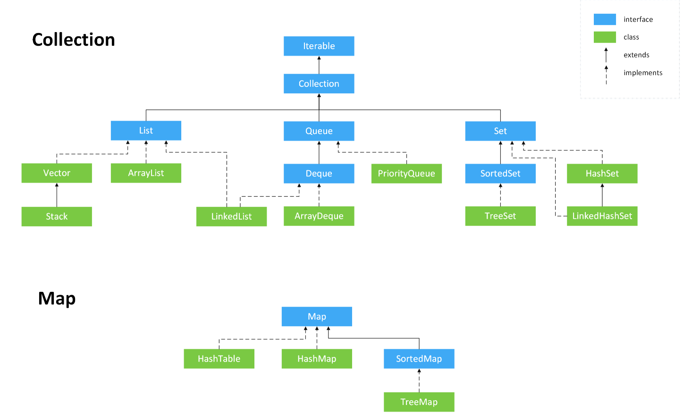

###### b.ArrayList和Vector的区别

- `ArrayList` 是 `List` 的主要实现类，底层使用 `Object[ ]`存储，适用于频繁的查找工作，线程不安全 ；
- `Vector` 是 `List` 的古老实现类，底层使用`Object[ ]` 存储，线程安全的。

###### c.HashMap扩容

JDK1.8 之后在解决哈希冲突时有了较大的变化，当链表长度大于阈值（默认为 8）
1.如果当前长度小于64则进行扩容

（将链表转换成红黑树前会判断，如果当前数组的长度小于 64，那么会选择先进行数组扩容，而不是转换为红黑树）时，将链表转化为红黑树，以减少搜索时间

###### d.HashMap在jdk8的底层实现


1.new HashMap()：底层没有创建一个长度为16的数组

2.jdk8底层的数组是Node[]

3.首次调用put方法时，底层创建长度为16的数组

4.底层数据结构：数组+链表+红黑树

* 形成链表时，旧的元素指向新的元素；jdk7是新的元素指向旧的元素

* 当数组的某一个索引位置上的元素**以链表形式存在的数据个数>8** 且**当前数组的长度>64**时，此时**此索引**位置上的所有数据改为红黑树存储

  HashMap底层一些重要常量：

  ```
  /*
   *      DEFAULT_INITIAL_CAPACITY : HashMap的默认容量，16
   *      DEFAULT_LOAD_FACTOR：HashMap的默认加载因子：0.75
   *      threshold：扩容的临界值，=容量*填充因子：16 * 0.75 => 12
   *      TREEIFY_THRESHOLD：Bucket中链表长度大于该默认值，转化为红黑树:8
   *      MIN_TREEIFY_CAPACITY：桶中的Node被树化时最小的hash表容量:64
   */
  ```

  关于**加载因子**
  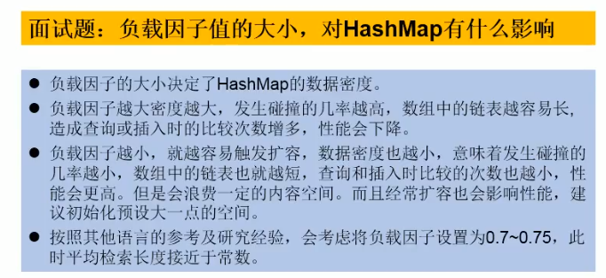

###### e.LinkedHashMap的底层实现原理（了解）

* LinkedHashMap`是`HashMap的子类

* 在HashMap存储结构的基础上，使用了一对双向链表来记录添加元素的顺序

* 与`LinkedHashSet`类似，`LinkedHashMap`可以维护`Map` 的迭代顺序：迭代顺序与`Key-Value` 对的插入顺序一致

* HashMap`中的内部类：`Node

  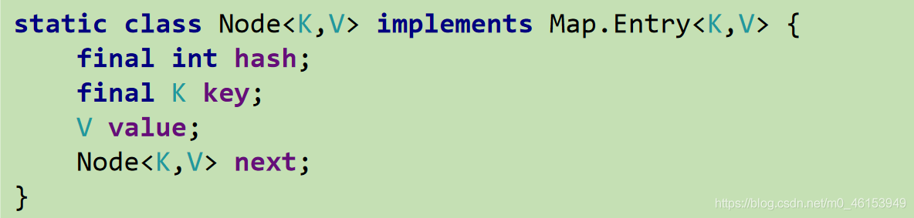

* LinkedHashMap`中的内部类：`Entry

  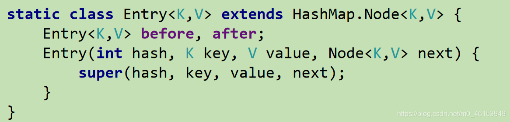

###### f.HashSet底层是什么？

底层是HashMap，key是具体的值，value是object类型常量

###### g.TreeMap (todo) 自然排序和定制排序

###### h.Properties（todo）

##### 20.对象的访问定位

**句柄：** 如果使用句柄的话，那么Java堆中将会划分出一块内存来作为句柄池，reference 中存储的就是对象的句柄地址，而句柄中包含了对象实例数据与类型数据各自的具体地址信息； 

**直接指针：** 如果使用直接指针访问，那么 Java 堆对象的布局中就必须考虑如何放置访问类型数据的相关信息，而reference 中存储的直接就是对象的地址。

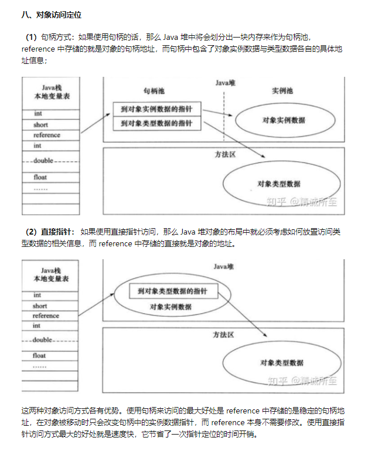

##### 21.线程的常用方法

什么叫**线程阻塞**：在某一时刻某一个线程在运行一段代码的时候，这时候另一个线程也需要运行，但是在运行过程中的那个线程执行完成之前，另一个线程是无法获取到CPU执行权的。

为什么会出现线程阻塞？

###### 1.睡眠状态：

当一个线程执行代码的时候调用了sleep方法后，线程处于睡眠状态，需要设置一个睡眠时间，此时有其他线程需要执行时就会造成线程阻塞，而且sleep方法被调用之后，线程**不会释放锁对象**，但是锁还在该线程手里,等睡眠一段时间后，该线程就会进入就绪状态

###### 2.等待状态：

当一个线程正在运行时，调用了wait方法，此时该线程需要交出CPU执行权，也就是将锁**释放**出去，交给另一个线程，该线程进入等待状态，但与睡眠状态不一样的是，进入等待状态的线程**不需要设置睡眠时间**，但是**需要执行notify方法或者notifyall方法来对其唤醒**，自己是不会主动醒来的，等被唤醒之后，该线程也会进入**就绪**状态，但是这时进入就绪状态的该线程手里是**没有执行权**的，也就是没有锁，而睡眠状态的线程一旦苏醒，进入就绪状态时是自己还拿着锁的。等待状态的线程苏醒后，就是典型的“物是人非，大权旁落“；

###### 3.礼让状态：

当一个线程正在运行时，调用了yield方法之后，该线程会将**执行权**礼让给**同等级的线程或者比它高一级的线程优先执行**，此时该线程有可能只执行了一部分而此时把执行权礼让给了其他线程，这个时候也会进入阻塞状态，但是该线程会随时可能又被分配到执行权，这就很”中国化的线程“了，比较讲究谦让；

Thread里的yield方法的作用

让当前处于`运行状态`的线程退回到`可运行状态`，让出抢占资源的机会

https://blog.csdn.net/weixin_43553694/article/details/104107493


这里的Thread.yield()是主线程退到最初位置，把资源让出来，等待其他线程执行完。>2的原因是java默认两个线程main和gc线程。

###### 4.自闭状态：todo:

当一个线程正在运行时，调用了一个join方法，此时该线程会进入阻塞状态，另一个线程会运行，直到运行结束后，原线程才会进入就绪状态。这个比较像是”走后门“，本来该先把你的事情解决完了再解决后边的人的事情，但是这时候有走后门的人，那就会停止给你解决，而优先把走后门的人事情解决了；

###### 5.suspend() 和 resume() ：

这两个方法是配套使用的，suspend() 是让线程进入阻塞状态，它的解药就是resume()，没有resume()它自己是不会恢复的，由于这种比较容易出现死锁现象，所以jdk1.5之后就已经被废除了，这对就是相爱相杀的一对。


```
 Thread类里的常用方法
 * 1. start():启动当前线程；调用当前线程的run()
 * 2. run(): 通常需要重写Thread类中的此方法，将创建的线程要执行的操作声明在此方法中
 * 3. currentThread():静态方法，返回执行当前代码的线程
 * 4. getName():获取当前线程的名字
 * 5. setName():设置当前线程的名字
 * 6. yield():释放当前cpu的执行权
 * 7. join():在线程a中调用线程b的join(),此时线程a就进入阻塞状态，直到线程b完全执行完以后，线程a才
 * 结束阻塞状态。
 * 8. stop():已过时。当执行此方法时，强制结束当前线程。
 * 9. sleep(long millitime):让当前线程“睡眠”指定的millitime毫秒。在指定的millitime毫秒时间内，当前
 * 线程是阻塞状态。
 * 10. isAlive():判断当前线程是否存活
 
  线程的优先级：
 * 1.
 * MAX_PRIORITY：10
 * MIN _PRIORITY：1
 * NORM_PRIORITY：5  -->默认优先级
 * 2.如何获取和设置当前线程的优先级：
 * getPriority():获取线程的优先级
 * setPriority(int p):设置线程的优先级
    *
 * 说明：高优先级的线程要抢占低优先级线程cpu的执行权。但是只是从概率上讲，高优先级的线程高概率的情况下
 * 被执行。并不意味着只有当高优先级的线程执行完以后，低优先级的线程才执行。
```


##### 22.线程安全问题

```
一、 同步代码块解决
 * 例子：创建三个窗口卖票，总票数为100张.使用实现Runnable接口的方式
   *
 * 1.问题：卖票过程中，出现了重票、错票 -->出现了线程的安全问题
 * 2.问题出现的原因：当某个线程操作车票的过程中，尚未操作完成时，其他线程参与进来，也操作车票。
 * 3.如何解决：当一个线程a在操作ticket的时候，其他线程不能参与进来。直到线程a操作完ticket时，其他
 * 线程才可以开始操作ticket。这种情况即使线程a出现了阻塞，也不能被改变。
    *
    *
 * 4.在Java中，我们通过同步机制，来解决线程的安全问题。
   *
 * 方式一：同步代码块
   *
 * synchronized(同步监视器){
 * //需要被同步的代码
    *
 * }
 * 说明：1.操作共享数据的代码，即为需要被同步的代码。  -->不能包含代码多了，也不能包含代码少了。
 * 2.共享数据：多个线程共同操作的变量。比如：ticket就是共享数据。
 * 3.同步监视器，俗称：锁。任何一个类的对象，都可以充当锁。
 * 要求：多个线程必须要共用同一把锁。
    *
 * 补充：在实现Runnable接口创建多线程的方式中，我们可以考虑使用this充当同步监视器。
 * 方式二：同步方法。
 * 如果操作共享数据的代码完整的声明在一个方法中，我们不妨将此方法声明同步的。
    *
    *
 * 5.同步的方式，解决了线程的安全问题。---好处
 * 操作同步代码时，只能有一个线程参与，其他线程等待。相当于是一个单线程的过程，效率低。 ---局限性

 * 使用同步代码块解决继承Thread类的方式的线程安全问题
   *
 * 例子：创建三个窗口卖票，总票数为100张.使用继承Thread类的方式
   *
 * 说明：在继承Thread类创建多线程的方式中，慎用this充当同步监视器，考虑使用当前类充当同步监视器。

1、使用继承Thread的方式

	重要: 使用Window.clss作为同步锁, 原因: 因为我们每一个this都不是同一个对象, 因为我们创建了三个窗口, 所以如果要使用Window.clss来充当唯一的锁;

public class Windows extends Thread {
	private static int ticket = 100; // 多个Thread对象要共享ticket票

	// private static Object obj = new Object(); // 需要加static, 因为同步监视器要是唯一的
	@Override
	public void run() {
	    while (true) {
	        // synchronized (obj) { // 正确
	        // synchronized (this) { // 错误的方式,使用继承来创建thread,因为this不是同一个对象,不能充当共享资源的同步锁
	        synchronized (Window.class) { // 类对象,只会加载一次,所以也是唯一的
	            if (ticket > 0) {
	                try {
	                    Thread.sleep(100);
	                } catch (InterruptedException e) {
	                    e.printStackTrace();
	                }
	                System.out.println(Thread.currentThread().getName() + ": 卖票, 票号为: " + ticket);
	                ticket--;
	            } else {
	                break;
	            }
	        }
	    }
	}

}
public class WindowsTest2 {
    public static void main(String[] args) {
        Windows t1 = new Windows();
        Windows t2 = new Windows();
        Windows t3 = new Windows();

        t1.setName("窗口1");
        t2.setName("窗口2");
        t3.setName("窗口3");
    
        t1.start();
        t2.start();
        t3.start();
    }

}

2、使用实现Runnable方式

重点: 因为只创建了一个Window对象, 所有线程都可以共享该对象, 所以使用this,充当同步锁
public class Windows1 implements Runnable {
	private int ticket = 100;

    @Override
    public void run() {
        while (true) {
        	// 任何对象都可以充当其 同步监视器, 因为始终创建了一个实现Rnnable接口的实例;
            synchronized (this) {
                if (ticket > 0) {
                    try {
                        Thread.sleep(50);
                    } catch (InterruptedException e) {
                        e.printStackTrace();
                    }
                    System.out.println(Thread.currentThread().getName() + "卖票,票号为: " + ticket);
                    ticket--;
                } else {
                    break;
                }
            }
        }
    }

 }
public class WindowsTest1 {
    public static void main(String[] args) {
        Windows1 w = new Windows1();

        Thread t1 = new Thread(w);
        Thread t2 = new Thread(w);
        Thread t3 = new Thread(w);
    
        t1.setName("窗口1");
        t2.setName("窗口2");
        t3.setName("窗口3");
    
        t1.start();
        t2.start();
        t3.start();
    }

}
二、同步方法来解决

重点: 

 * 使用同步方法解决实现Runnable接口的线程安全问题
   *
 * 关于同步方法的总结：
 * 1. 同步方法仍然涉及到同步监视器，只是不需要我们显式的声明。
 * 2. 非静态的同步方法，同步监视器是：this
 * 静态的同步方法，同步监视器是：当前类本身


重点:
在synchronized前面加上static, 如果是静态的同步方法, 所有的对象都共享; 相当于 Xxx.class的方式

1、通过继承Thread来实现线程同步:
	// private synchronized void show () { // 此时同步锁不是唯一的了.
    private static synchronized void show () { // 锁就是 当前类对象, Xxx.class
        if (ticket > 0) {
            try {
                Thread.sleep(100);
            } catch (InterruptedException e) {
                e.printStackTrace();
            }
            System.out.println(Thread.currentThread().getName() + ": 卖票, 票号为: " + ticket);
            ticket--;
        }
    }
    
重点:
只需要加上synchronized, 因为只创建一个window对象, 所以不需要加static, 相当于this

2、通过实现Runnable接口来创建线程:
    private synchronized void show() {  // 同步监视器(同步锁) 就是 this
        if (ticket > 0) {
            try {
                Thread.sleep(100);
            } catch (InterruptedException e) {
                e.printStackTrace();
            }
            System.out.println(Thread.currentThread().getName() + "卖票,票号为: " + ticket);
            ticket--;
        }
    }

三、 解决线程安全问题的方式三：Lock锁  --- JDK5.0新增
 *

 * 1. 面试题：synchronized 与 Lock的异同？
 * 相同：二者都可以解决线程安全问题
 * 不同：synchronized机制在执行完相应的同步代码以后，自动的释放同步监视器
 * Lock需要手动的启动同步（lock()），同时结束同步也需要手动的实现（unlock()）
    *
 * 2.优先使用顺序：
 * Lock -> 同步代码块（已经进入了方法体，分配了相应资源）-> 同步方法（在方法体之外）
   *
    *
 * 面试题：如何解决线程安全问题？有几种方式
```


##### 23.线程间通信问题

```
线程通信的例子：使用两个线程打印 1-100。线程1, 线程2 交替打印
 *

 * 涉及到的三个方法：
 * wait():一旦执行此方法，当前线程就进入阻塞状态，并释放同步监视器(锁)。
 * notify():一旦执行此方法，就会唤醒被wait的一个线程。如果有多个线程被wait，就唤醒优先级高的那个。
 * notifyAll():一旦执行此方法，就会唤醒所有被wait的线程。
   *
 * 说明：
 * 1.wait()，notify()，notifyAll()三个方法必须使用在同步代码块或同步方法中。
 * 2.wait()，notify()，notifyAll()三个方法的调用者必须是同步代码块或同步方法中的同步监视器。
 * 否则，会出现IllegalMonitorStateException异常
 * 3.wait()，notify()，notifyAll()三个方法是定义在java.lang.Object类中。
   *
 * 面试题：sleep() 和 wait()的异同？
 * 1.相同点：一旦执行方法，都可以使得当前的线程进入阻塞状态。
 * 2.不同点：1）两个方法声明的位置不同：Thread类中声明sleep() , Object类中声明wait()
 * 2）调用的要求不同：sleep()可以在任何需要的场景下调用。 wait()必须使用在同步代码块或同步方法中
 * 3）关于是否释放同步监视器：如果两个方法都使用在同步代码块或同步方法中，sleep()不会释放锁，wait()会释放锁。

class Thread1 implements Runnable {

    private int number = 1;
    
    @Override
    public void run() {
        while (true) {
            synchronized (this) {
                this.notify(); // 唤醒被wait()的线程
                if (number <= 100) {
                    try {
                        Thread.sleep(50);
                    } catch (InterruptedException e) {
                        e.printStackTrace();
                    }
                    System.out.println(Thread.currentThread().getName() + ": number" + number);
                    number++;
                    try {
                        // 调用wait()方法的线程,进入阻塞状态
                        this.wait();
                    } catch (InterruptedException e) {
                        e.printStackTrace();
                    }
                } else {
                    break;
                }
            }
        }
    }

}
```


##### 24.transient关键字和Serializable接口

##### 25.阻塞队列

当阻塞队列是空时，从队列中获取元素的操作将会被阻塞。
当阻塞队列是满时，往队列里添加元素的操作将会被阻塞。

##### 26.CountDownLatch，CyclicBarrier，Semaphore

##### 27.多线程下的虚假唤醒

https://www.icode9.com/content-4-792471.html

wait：此方法出自Object类，所有对象均可调用此方法，它的应用主要是跟出身自Thread类的sleep方法作比较。
sleep:：方法说白了就是迫使当前线程拿着锁睡眠指定时间，时间一到手里拿着锁自动醒来，还可以往下继续执行。
wait方法有两种使用方式，一个带参数指定睡眠时间（我们不讨论这种实现），一个不带参数指定无限睡眠，这两种方式均可迫使当前线程进入睡眠
　　状态，但是不同于sleep，wait是**释放锁**去睡的，只有当前锁对象调用了**notify或者notifyAll**方法才会醒来，但手里是**没有锁**的，
　　相对应就没有了**立即执行下去的权利**，而是**进入了就绪状态**，随时准备与其他线程进行争抢CPU的执行权。而且wait方法一般情况是配合sync使用的。

所以当同步方法内的方法用的if进行判断的话，可能会出现如下情况：

```
1、A抢到锁执行 ++                    0 
2、A执行notify发现没有人wait，继续拿着锁执行 ，A判断不通过，A阻塞    1
3、B抢到锁 ，B判断不通过，B阻塞   　　　1
4、C 抢到锁 执行--     　          　0
5、C 执行Notify 唤醒A， A执行++      1
6、A 执行notify唤醒B ，B执行++       2  （注意这个地方恰巧唤醒B，那么B 从哪阻塞的就从哪唤醒，B继续执行wait下面的++操作，导致出现2）
再多一些解释：那么为什么会出现-2，-3，因为我们的减法判断是 ==0的时候才阻塞，一旦为-1，就会为false，再次执行--操作；
看完上面的步骤分析，我们可以总结出两大问题：
1、第6步唤醒了B是极大的错误，因为B的醒来不是我们想要看到的，我们需要的C或者D醒来，这就是本文题目所说的虚假唤醒，
我们就要像个办法，过滤掉B；
2、想的深入的同学可能会发现，上面代码本应有20步，为什么到了17步停止了，这就是唤醒不当，所有线程均被置为阻塞状态
```

while是为了再一次循环判断**刚刚争抢到锁的线程是否满足继续执行下去的条件**，条件通过才可以继续执行下去，不通过的线程只能再次进入wait状态，由其他活着的、就绪状态的线程进行争抢锁。

```java
package jucdemo;

public class TraditionalProducerConsumerDemo {

    public static void main(String[] args) {
        Data data = new Data();
        //生产者线程A
        new Thread(() -> {
            for (int i = 0;i < 5;i++) {
                try {
                    data.increment();
                } catch (InterruptedException e) {
                    e.printStackTrace();
                }
            }
        },"A").start();

        //生产者线程B
        new Thread(() -> {
            for (int i = 0;i < 5;i++) {
                try {
                    data.increment();
                } catch (InterruptedException e) {
                    e.printStackTrace();
                }
            }
        },"B").start();

        //消费者线程C
        new Thread(() -> {
            for (int i = 0;i < 5;i++) {
                try {
                    data.decrement();
                } catch (InterruptedException e) {
                    e.printStackTrace();
                }
            }
        },"C").start();

        //消费者线程D
        new Thread(() -> {
            for (int i = 0;i < 5;i++) {
                try {
                    data.decrement();
                } catch (InterruptedException e) {
                    e.printStackTrace();
                }
            }
        },"D").start();
    }


    //数据类
    static class Data {
        //表示数据个数
        private int number = 0;

        public synchronized void increment() throws InterruptedException {
            //关键点，这里应该使用while循环
            while (number != 0) {
                this.wait();
            }
            number++;
            System.out.println(Thread.currentThread().getName() + "生产了数据:" + number);
            this.notifyAll();
        }

        public synchronized void decrement() throws InterruptedException {
            //关键点，这里应该使用while循环
            while (number == 0) {
                this.wait();
            }
            number--;
            System.out.println(Thread.currentThread().getName() + "消费了数据:" + number);
            this.notifyAll();
        }
    }
}
```


##### 28.synchronized和lock的区别

1.synchronized属于JVM层面，属于java的关键字
monitorenter（底层是通过monitor对象来完成，其实wait/notify等方法也依赖于monitor对象 只能在同步块或者方法中才能调用 wait/ notify等方法）
Lock是具体类（java.util.concurrent.locks.Lock）是api层面的锁

2.使用方法：
synchronized：不需要用户去手动释放锁，当synchronized代码执行后，系统会自动让线程释放对锁的占用。
ReentrantLock：则需要用户去手动释放锁，若没有主动释放锁，就有可能出现死锁的现象，需要lock() 和 unlock() 配置try catch语句来完成

3.等待是否中断
synchronized：不可中断，除非抛出异常或者正常运行完成。
ReentrantLock：可中断，可以设置超时方法
设置超时方法，trylock(long timeout, TimeUnit unit)
lockInterrupible() 放代码块中，调用interrupt() 方法可以中断

4.加锁是否公平
synchronized：非公平锁
ReentrantLock：默认非公平锁，构造函数可以传递boolean值，true为公平锁，false为非公平锁

5.锁绑定多个条件Condition
synchronized：没有，要么随机，要么全部唤醒
ReentrantLock：用来实现分组唤醒需要唤醒的线程，可以精确唤醒，而不是像synchronized那样，要么随机，要么全部唤醒(notify和notifyAll)

##### 29.synchronized和lock锁保证可见性

可见性体现在：通过synchronized或者Lock能保证同一时刻只有**一个线程**获取锁然后执行同步代码，并且在**释放锁之前会将对变量的修改刷新到主存中**。

##### 30.强软弱虚引用架构图

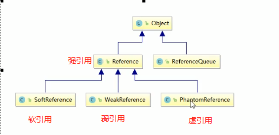

##### 31.强引用

强引用是我们最常见的普通对象引用，只要还有强引用指向一个对象，就能表明对象还“活着”，垃圾收集器不会碰这种对象。在Java中最常见的就是强引用，把一个对象赋给一个引用变量，这个引用变量就是一个强引用。当一个对象被强引用变量引用时，它处于可达状态，它是不可能被垃圾回收机制回收的，即使该对象以后永远都不会被用到，JVM也不会回收。因此强引用是造成Java内存泄漏的主要原因之一。

对于一个普通的对象，如果没有其他的引用关系，只要**超过了引用的作用域**或者**显式地将相应（强）引用赋值为 null**一般认为就是可以被垃圾收集的了(当然具体回收时机还是要看垃圾收集策略)

```java
public static void main(String[] args) throws Exception {
    String str1 = new String("11223344");
    String str2 = str1;
    str1 = null;
    System.gc();
    System.out.println(str2);
    System.out.println(str1);
}
```

str1置为空的时候 ，经过垃圾后回收发现str2不会为空，验证了
只要还有强引用指向一个对象，就能表明对象还“活着”，垃圾收集器不会碰这种对象。

##### 32.软引用

软引用是一种相对强引用弱化了一些的引用，需要用java.lang.ref.SoftReference类来实现，可以让对象豁免一些垃圾收集。

对于只有软引用的对象来说

* 当系统内存充足时它不会被回收，
* 当系统内存不足时它会被回收。

软引用通常用在对内存敏感的程序中，比如高速缓存就有用到软引用，**内存够用的时候就保留，不够用就回收!**

```java
public class SoftReferenceDemo {

    /**
     * 内存够用的时候
     * -XX:+PrintGCDetails
     */
    public static void softRefMemoryEnough() {
        // 创建一个强应用
        Object o1 = new Object();
        // 创建一个软引用
        SoftReference<Object> softReference = new SoftReference<>(o1);
        System.out.println(o1);
        System.out.println(softReference.get());
    
        o1 = null;
        // 手动GC
        System.gc();
    
        System.out.println(o1);
        System.out.println(softReference.get());
    }
    
    /**
     * JVM配置，故意产生大对象并配置小的内存，让它的内存不够用了导致OOM，看软引用的回收情况
     * -Xms5m -Xmx5m -XX:+PrintGCDetails
     */
    public static void softRefMemoryNoEnough() {
    
        System.out.println("========================");
        // 创建一个强应用
        Object o1 = new Object();
        // 创建一个软引用
        SoftReference<Object> softReference = new SoftReference<>(o1);
        System.out.println(o1);
        System.out.println(softReference.get());
    
        o1 = null;
    
        // 模拟OOM自动GC
        try {
            // 创建30M的大对象
            byte[] bytes = new byte[30 * 1024 * 1024];
        } catch (Exception e) {
            e.printStackTrace();
        } finally {
            System.out.println(o1);
            System.out.println(softReference.get());
        }
    }
    
    public static void main(String[] args) {
        softRefMemoryEnough();
        //softRefMemoryNoEnough();
    }
}
```


##### 33.弱引用

弱引用需要用java.lang.ref.WeakReference类来实现，它比软引用的生存期更短，

对于只有弱引用的对象来说，**只要垃圾回收机制**一运行不管JVM的内存空间是否足够，都会回收该对象占用的内存。这里的GC，是**弱引用中关联的对象**被gc回收，那么弱引用也一定被回收

```java
public class WeakReferenceDemo {
    public static void main(String[] args) {
        Object o1 = new Object();
        WeakReference<Object> weakReference = new WeakReference<>(o1);
        System.out.println(o1);
        System.out.println(weakReference.get());
        o1 = null;
        System.gc();
        System.out.println(o1);
        System.out.println(weakReference.get());
    }
}
```

**ThreadLocal 里有用到弱引用**

##### 34.软引用适用场景

场景：假如有一个应用需要读取大量的本地图片

* 如果每次读取图片都从硬盘读取则会严重影响性能
* 如果一次性全部加载到内存中，又可能造成内存溢出

此时使用软引用可以解决这个问题。

设计思路：使用HashMap来保存图片的路径和相应图片对象关联的软引用之间的映射关系，在内存不足时，JVM会自动回收这些缓存图片对象所占的空间，从而有效地避免了OOM的问题。

```java
Map<String, SoftReference<Bitmap>> imageCache = new HashMap<String, SoftReference<Bitmap>>();
```

**mybatis源码中大量用到了软引用**

##### 35.弱引用应用场景-WeakHashMap

```java
public static void main(String[] args) {
    myHashMap();
    System.out.println("==========");
    myWeakHashMap();
}

private static void myHashMap() {
    Map<Integer, String> map = new HashMap<>();
    Integer key = new Integer(1);
    String value = "HashMap";

    map.put(key, value);
    System.out.println(map);

    key = null;

    System.gc();

    System.out.println(map);
}

private static void myWeakHashMap() {
    Map<Integer, String> map = new WeakHashMap<>();
    Integer key = new Integer(1);
    String value = "WeakHashMap";

    map.put(key, value);
    System.out.println(map);

    key = null;

    System.gc();
    //进行垃圾回收后 WeakHashMap里的条目也被回收了
    System.out.println(map);
}
```

##### 36.虚引用简介

虚引用需要java.lang.ref.PhantomReference类来实现。

顾名思义，就是**形同虚设**，与其他几种引用都不同，虚引用并不会决定对象的生命周期。

如果一个对象仅持有虚引用，那么它就**和没有任何引用一样**，**在任何时候都可能被垃圾回收器回收**，它不能单独使用也不能通过它访问对象，**虚引用必须和引用队列(ReferenceQueue)联合使用**。

虚引用的主要作用是**跟踪对象被垃圾回收的状态**。**仅仅是提供了一种确保对象被finalize以后，做某些事情的机制**。

PhantomReference的**get方法总是返回null**，因此无法访问对应的引用对象。其意义在于说明一个对象已经进入finalization阶段，可以被gc回收，用来实现比finalization机制更灵活的回收操作。

换句话说，设置虚引用关联的唯一目的，就是在这个对象被收集器回收的时候收到一个系统通知或者后续添加进一步的处理。Java技术允许使用finalize()方法在垃圾收集器将对象从内存中清除出去之前做必要的清理工作。


##### 37.ReferenceQueue引用队列

用**带有引用队列**的弱(软，虚)引用**构造方法**初始化引用对象后，回收前需要被引用队列保存下

```java
/**
 * 引用队列
 * 执行gc前打印的
 * java.lang.Object@4cc0edeb
 * java.lang.Object@4cc0edeb
 * null
 * 发现引用队列里没内容
 * ====================================
 * 执行gc后的打印
 * null
 * null
 * java.lang.ref.WeakReference@e25b2fe
 * 发现引用队列里有内容了。
 *
 * 用带有引用队列的弱(软，虚)引用构造方法初始化引用对象，
 * 因为执行gc后，
 * 回收前引用队列里没有内容，回收后的弱引用会放到引用队列里。
 *
 * @author tc
 * @date 2021/11/22
 */
public class ReferenceQueueDemo {
    public static void main(String[] args) {
        Object o1 = new Object();

        // 创建引用队列
        ReferenceQueue<Object> referenceQueue = new ReferenceQueue<>();

        // 创建一个弱引用
        WeakReference<Object> weakReference = new WeakReference<>(o1, referenceQueue);

        System.out.println(o1);
        System.out.println(weakReference.get());
        // 取队列中的内容
        System.out.println(referenceQueue.poll());

        System.out.println("==================");

        o1 = null;
        System.gc();
        System.out.println("执行GC操作");

        try {
            TimeUnit.SECONDS.sleep(2);
        } catch (InterruptedException e) {
            e.printStackTrace();
        }

        System.out.println(o1);
        System.out.println(weakReference.get());
        // 取队列中的内容
        System.out.println(referenceQueue.poll());
    }
}
```


##### 38.虚引用和引用队列

Java提供了4种引用类型，在垃圾回收的时候，都有自己各自的特点。

ReferenceQueue是用来配合引用工作的，没有ReferenceQueue一样可以运行。

创建引用的时候可以指定关联的队列，当Gc释放对象内存的时候，会将引用加入到引用队列，如果**程序发现某个虚引用已经被加入到引用队列，那么就可以在所引用的对象的内存被回收之前采取必要的行动这相当于是一种通知机制**。

当关联的引用队列中有数据的时候，意味着引用指向的堆内存中的对象被回收。通过这种方式，JVM允许我们在对象被销毁后，做一些我们自己想做的事情。

##### 39.GCRoots和四大引用小总结

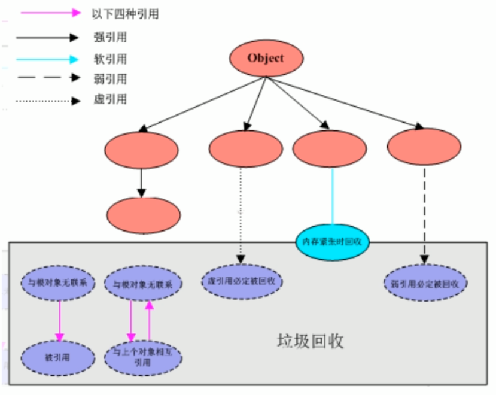

##### 40.JVM中常见的两种错误

* StackoverFlowError
  * java.lang.StackOverflowError

* OutofMemoryError
  * java.lang.OutOfMemoryError：java heap space
  * java.lang.OutOfMemoryError：GC overhead limit exceeeded
  * java.lang.OutOfMemoryError：Direct buffer memory
  * java.lang.OutOfMemoryError：unable to create new native thread
  * java.lang.OutOfMemoryError：Metaspace

以下是Java中的错误和异常的类图

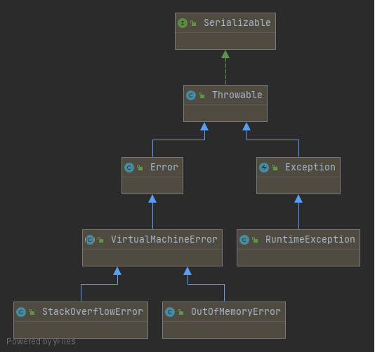


##### 41.StackOverflowError

错误的展现:递归调用一个方法而没有跳出。栈空间一般比较小，默认是512K到1024K之间。

```java
public class StackOverflowErrorDemo {
    public static void main(String[] args) {
        main(args);
    }
}
```

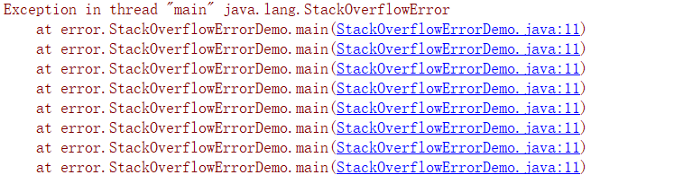


##### 42.OOM之Java heap space

堆内存不够用了，启动参数调小点，new一个大对象即可看到此错误

```java
public class OOMJavaHeapSpaceDemo {
    /**
     *
     * -Xms10m -Xmx10m
     *
     * @param args
     */
    public static void main(String[] args) {
        byte[] array = new byte[80 * 1024 * 1024];
    }
}
```


##### 43.OOM之GC overhead limit exceeded

超出GC开销限制

**GC回收时间过长**时会抛出OutOfMemroyError。过长的定义是，超过**98%**的时间用来做GC并且**回收了不到2%的堆内存**，**连续多次GC**都只回收了不到2%的极端情况下才会抛出。

假如不抛出GC overhead limit错误会发生什么情况呢？那就是GC清理的这么点内存很快会再次填满，迫使gc再次执行。这样就形成恶性循环，CPU使用率一直是100%，而Gc却没有任何成果。


```java
/**
 *
 * -Xms10m -Xmx10m -XX:MaxDirectMemorySize=5m -XX:+PrintGCDetails
 *
 * @param args
 */
public static void main(String[] args) {
    int i = 0;
    List<String> list = new ArrayList<>();
    try {
        while(true) {
            list.add(String.valueOf(++i).intern());
        }
    } catch (Exception e) {
        System.out.println("***************i:" + i);
        e.printStackTrace();
        throw e;
    }
}
```

运行结果：
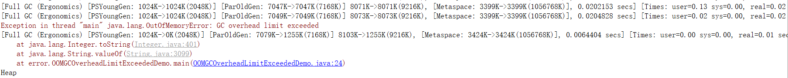


##### 44.OOM之Direct buffer memory

导致原因：

写NIO程序经常使用ByteBuffer来读取或者写入数据，这是一种基于通道(Channel)与缓冲区(Buffer)的IO方式，它可以使用Native函数库直接分配堆外内存，然后通过一个存储在Java堆里面的DirectByteBuffer对象作为这块内存的引用进行操作。这样能在一些场景中显著提高性能，因为避兔了在Java堆和Native堆中来回复制数据。

ByteBuffer.allocate(capability) 第一种方式是**分配JVM堆内存**，属于GC管辖范围，由于需要拷贝所以速度相对较慢。
ByteBuffer.allocateDirect(capability) 第二种方式是**分配OS本地内存**，不属于GC管辖范围，由于不需要内存拷贝所以速度相对较快。
但如果不断分配本地内存，堆内存很少使用，那么JV就不需要执行GC，DirectByteBuffer对象们就不会被回收，这时候堆内存充足，但本地内存可能已经使用光了，再次尝试分配本地内存就会出现OutOfMemoryError，那程序就直接崩溃了。

-XX:MaxDirectMemorySize=5m 是设置本地直接内存大小

```java
public class OOMEDirectBufferMemoryDemo {
    /**
     * -Xms5m -Xmx5m -XX:+PrintGCDetails -XX:MaxDirectMemorySize=5m
     *
     * @param args
     * @throws InterruptedException
     */
    public static void main(String[] args) throws InterruptedException {
        System.out.println(String.format("配置的maxDirectMemory: %.2f MB",//
                sun.misc.VM.maxDirectMemory() / 1024.0 / 1024));

        TimeUnit.SECONDS.sleep(3);

        ByteBuffer bb = ByteBuffer.allocateDirect(6 * 1024 * 1024);
    }
}
```

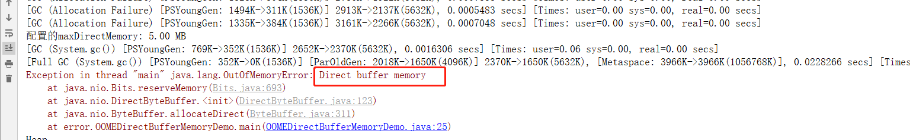


##### 45.OOM之unable to create new native thread

不能够创建更多的新的线程了，也就是说创建线程的上限达到了

高并发请求服务器时，经常会出现异常`java.lang.OutOfMemoryError:unable to create new native thread`，准确说该native thread异常**与对应的平台有关**

导致原因：

* 应用创建了太多线程，一个应用进程创建多个线程，超过系统承载极限
* 服务器并不允许你的应用程序创建这么多线程，linux系统默认运行单个进程可以创建的线程为1024个，如果应用创建超过这个数量，就会报 java.lang.OutOfMemoryError:unable to create new native thread

解决方法：

1. 想办法**降低你应用程序创建线程的数量**，分析应用是否真的需要创建这么多线程，如果不是，改代码将线程数降到最低
2. 对于有的应用，确实需要创建很多线程，远超过linux系统默认**1024**个线程限制，可以通过修改Linux服务器配置，扩大linux默认限制

示例：

```java
public class OOMEUnableCreateNewThreadDemo {
    public static void main(String[] args) {
        for (int i = 0; ; i++) {
            System.out.println("************** i = " + i);
            new Thread(() -> {
                try {
                    TimeUnit.SECONDS.sleep(Integer.MAX_VALUE);
                } catch (InterruptedException e) {
                    e.printStackTrace();
                }
            }, String.valueOf(i)).start();
        }
    }
}
```

上面程序在Linux OS（CentOS）运行，会出现下列的错误，线程数大概在900多个

```
Exception in thread "main" java.lang.OutOfMemoryError: unable to create new native thread
```

##### 46.OOM之unable to create new native thread上限调整

非root用户登录Linux系统（CentOS）测试

服务器级别调参调优

查看系统线程限制数目命令

```c#
ulimit -u
```

修改系统线程限制数目

```c
vim /etc/security/limits.d/90-nproc.conf 
```

打开后发现除了root，其他账户都限制在1024个

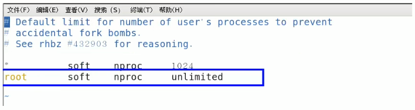

假如我们想要张三这个用卢运行，希望他生成的线程多一些，我们可以如下配置

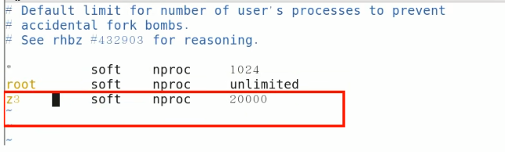

##### 47.OOM之Metaspace

使用java -XX:+PrintFlagsInitial命令查看本机的初始化参数，-XX:MetaspaceSize为21810376B（大约20.8M）

**Java 8及之后的版本**使用Metaspace来替代永久代。

Metaspace是方法区在Hotspot 中的实现，它与持久代最大的区别在于：**Metaspace并不在虚拟机内存中而是使用本地内存**,也即在Java8中, classe metadata(the virtual machines internal presentation of Java class)，被存储在叫做Metaspace native memory。

永久代（Java8后被原空向Metaspace取代了）存放了以下信息：

* 虚拟机加载的类信息
* 常量池
* 静态变量
* 即时编译后的代码

模拟Metaspace空间溢出，我们借助CGLib直接操作字节码运行时不断生成类往元空间灌，类占据的空间总是会超过Metaspace指定的空间大小的。

首先添加CGLib依赖

```xml
<dependency>    
    <groupId>cglib</groupId>    
    <artifactId>cglib</artifactId>    
    <version>3.2.10</version> 
</dependency>
```

再是代码：

```java
public class OOMEMetaspaceDemo {
    // 静态类
    static class OOMObject {
    }

    /**
     * -XX:MetaspaceSize=10m -XX:MaxMetaspaceSize=10m
     *
     * @param args
     */
    public static void main(final String[] args) {
        // 模拟计数多少次以后发生异常
        int i = 0;
        try {
            while (true) {
                i++;
                // 使用Spring的动态字节码技术
                Enhancer enhancer = new Enhancer();
                enhancer.setSuperclass(OOMObject.class);
                enhancer.setUseCache(false);
                enhancer.setCallback(new MethodInterceptor() {
                    @Override
                    public Object intercept(Object o, Method method, Object[] objects, MethodProxy methodProxy) throws Throwable {
                        return methodProxy.invokeSuper(o, args);
                    }
                });
                enhancer.create();
            }
        } catch (Throwable e) {
            System.out.println("发生异常的次数:" + i);
            e.printStackTrace();
        } finally {

        }

    }
}
```

发生oom错误

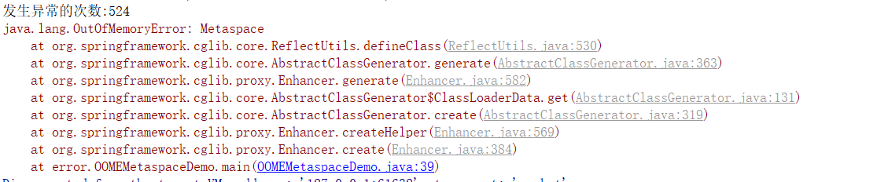

