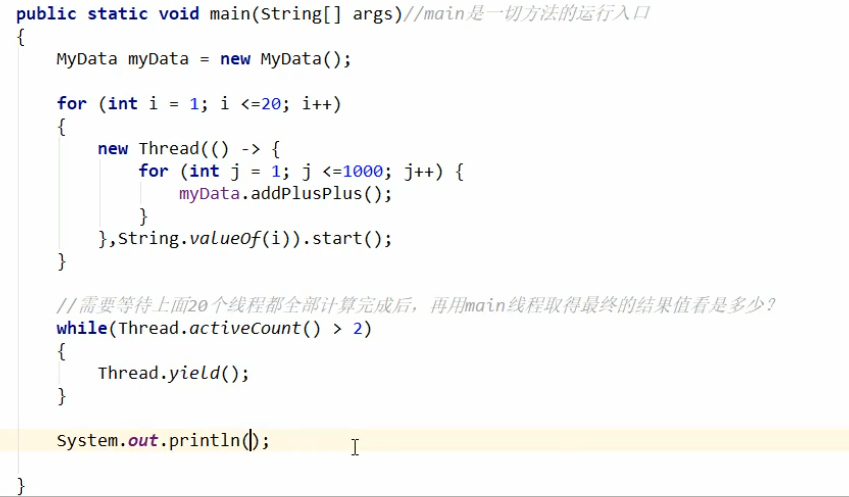
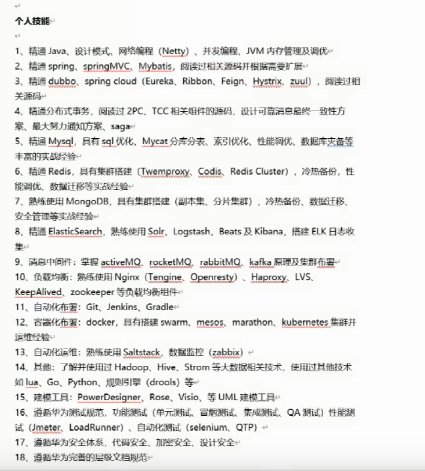
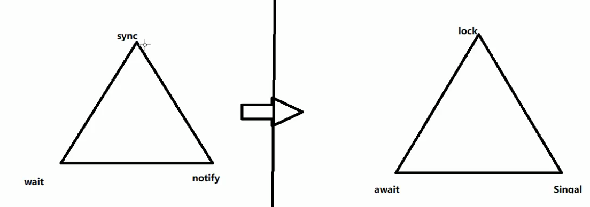

#### 1.Thread里的yield方法的作用

让当前处于`运行状态`的线程退回到`可运行状态`，让出抢占资源的机会

https://blog.csdn.net/weixin_43553694/article/details/104107493



这里的Thread.yield()是主线程退到最初位置，把资源让出来，等待其他线程执行完。>2的原因是java默认两个线程main和gc线程。

#### 2.Java中>>>运算符


java中有‘>>>’运算符，表示无符号右移运算。简单来说：j>>>i表示将数向右位移i位,右移后左边空出的位用0补上，具体细节如下：

1、操作数类型：byte、short、int、long

2、>>>在右移的时候在二进制表示的左端添0，运算结果取决于其二进制表示。相同的byte、short、int类型运算数得到的结果相同，long类型的运算数与前者可能不同。

3、对于j>>>i的结果是j>>>(i%(j的二进制表示的位数))的结果，如int j=-21,i=33 的结果是-21>>1的结果（当i的值大于等于j的二进制表示的位数时要注意）。

4、0的无符号右移值仍然为0

\>>>与>>的比较：

1、**注意有>>>运算但是没有<<<运算**。

2、对正数而言>>>与>>作用相同。

3、对于负数而言>>在右移的时候根据原数的正负决定在左端高位添加0或1（原数操作后正负不变）；

而***>>>在右移的时候在左端添0，则不论原来的数是正或负，右移后为非负数***


#### 3.树数据结构

二叉查找树 红黑树 完全二叉树  AVL树   平衡二叉树  2-3树


#### 4.Synchronized 的锁升级

#### 5.Java内存区域：

https://github.com/Snailclimb/JavaGuide/blob/3965c02cc0f294b0bd3580df4868d5e396959e2e/Java%E7%9B%B8%E5%85%B3/%E5%8F%AF%E8%83%BD%E6%98%AF%E6%8A%8AJava%E5%86%85%E5%AD%98%E5%8C%BA%E5%9F%9F%E8%AE%B2%E7%9A%84%E6%9C%80%E6%B8%85%E6%A5%9A%E7%9A%84%E4%B8%80%E7%AF%87%E6%96%87%E7%AB%A0.md


#### 6.Java创建对象的过程


#### 7.对象的访问方式：

对象的访问方式由**虚拟机实现**而定，目前主流的访问方式有**①使用句柄**和**②直接指针**两种

#### 8.优秀简历




#### 9.sychronized 锁原理 object里几种状态

#### 10.transient关键字

#### 11.Serializable接口

#### 12.sync到lock

线程操作资源类，高内聚低耦合，判断干活唤醒通知，严防多线程并发下的虚假唤醒（多线程的判断用while不用if,两个线程可能）

原因是

下面是由sync到lock的一个转变。传统的锁到JUC



#### 13.元空间

元空间是java8的JVM规范中方法区的实现，因而方法区存了啥，那么元空间就是存这些数据

#### 14.java -- JVM的符号引用和直接引用

在JVM中类加载过程中，在解析阶段，Java虚拟机会把类的二级制数据中的符号引用替换为直接引用。

1.符号引用（Symbolic References）：

　　符号引用以一组符号来描述所引用的目标，符号可以是任何形式的字面量，只要使用时能够无歧义的定位到目标即可。例如，在Class文件中它以CONSTANT_Class_info、CONSTANT_Fieldref_info、CONSTANT_Methodref_info等类型的常量出现。符号引用与虚拟机的内存布局无关，引用的目标并不一定加载到内存中。在[Java](http://lib.csdn.net/base/javaee)中，一个java类将会编译成一个class文件。在编译时，java类并不知道所引用的类的实际地址，因此只能使用符号引用来代替。比如org.simple.People类引用了org.simple.Language类，在编译时People类并不知道Language类的实际内存地址，因此只能使用符号org.simple.Language（假设是这个，当然实际中是由类似于CONSTANT_Class_info的常量来表示的）来表示Language类的地址。各种虚拟机实现的内存布局可能有所不同，但是它们能接受的符号引用都是一致的，因为符号引用的字面量形式明确定义在Java虚拟机规范的Class文件格式中。

2.直接引用：

 直接引用可以是

（1）直接指向目标的指针（比如，指向“类型”【Class对象】、类变量、类方法的直接引用可能是指向方法区的指针）

（2）相对偏移量（比如，指向实例变量、实例方法的直接引用都是偏移量）

（3）一个能间接定位到目标的句柄

直接引用是和虚拟机的布局相关的，同一个符号引用在不同的虚拟机实例上翻译出来的直接引用一般不会相同。如果有了直接引用，那引用的目标必定已经被加载入内存中了。

#### 15.什么时候会触发GC

https://zhuanlan.zhihu.com/p/74081100

#### 16.Java String类的intern()方法

该方法的作用是把字符串加载到常量池中（jdk1.6常量池位于方法区，jdk1.7以后常量池位于堆）

在jdk1.6中，该方法把字符串的**值复制**到常量区，然后返回常量区里这个字符串的值；
在jdk1.7里，该方法在常量区记录该字符串首次出现的实例**引用**，然后返回该地址，**常量区可以保存字面量也可以保存字符串对象在堆中的引用**。

```java
      String s3 = new String("123") + new String("123");     
      s3.intern();        
      String s4 = "123123";        
      System.out.println(s3 == s4);
```

在jdk6中，输出false，因为intern方法将字符串复制到常量区，然后返回一个该字符串在常量区中的引用。但是s3并没有接收这个引用，因此s3指向的还是堆，但是s4指向的是常量区，因此这两个地址不一样。

在jdk7 中，输出true，因为jdk7中intern方法是（在常量区找不到该字符串时）将该字符串对象在堆里的引用注册到常量区，以后使用相同字面量（双引号形式）声明的字符串对象都指向该地址，也就是该字符串在堆中的地址。所以，调用s3的intern方法后返回的引用就是s3本身的引用，而使用字面量声明的s4也是指向这个引用的，所以这两个地址相同。

在jdk8 中，输出true，常量在方法区（在metaSpace里）。

总结：

- 使用双引号声明的字符串总是放在常量区，必须显式使用双引号，例如String s1="abc",s2="123"+"abc";，两个字面量连接只会在常量区保存连接后的一个字面；如果赋值掺杂了String对象的引用，则不符合本条
- 使用new String("字符串")形式生命的String对象是分配在堆里的，例如String s3="hhh"+s1;，**但是"hhh"这个字面量会放到常量池**
- new String会生成两个对象，一个是分配在堆里的String对象，另一个是放在常量区的字面量
- jdk6总是将字面值放在常量区（将其字面值复制到常量区），常量区位于方法区
- jdk7常量区还能保存String对象在堆里的引用（将其在堆中的引用复制到常量区），常量区位于堆