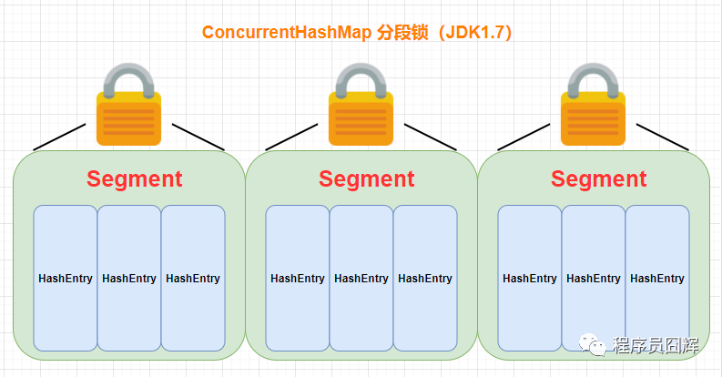
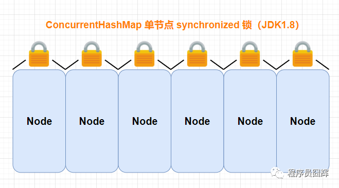
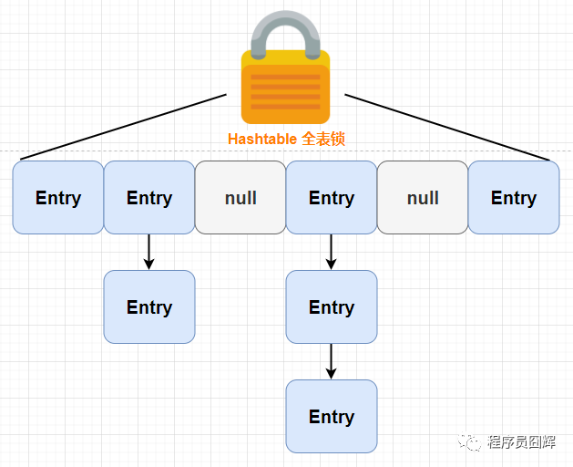
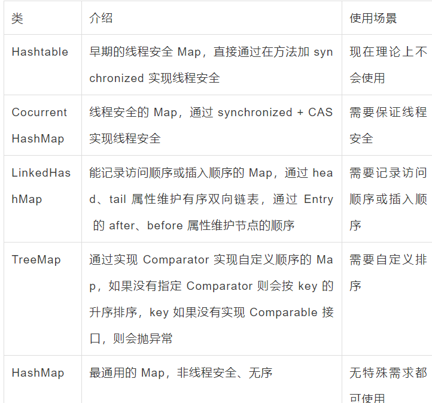

##### Hashtable 是怎么加锁的 ？

Hashtable 通过 synchronized 修饰方法来加锁，从而实现线程安全。

```java
public synchronized V get(Object key) {
    // ...
}
 
public synchronized V put(K key, V value) {
    // ...
}
```

##### LinkedHashMap 和 TreeMap 排序的区别？

LinkedHashMap 和 TreeMap 都是提供了排序支持的 Map，区别在于支持的**排序方式**不同：

LinkedHashMap：保存了**数据的插入顺序**，也可以**通过参数设置**，保存**数据的访问顺序**。

TreeMap：底层是**红黑树**实现。可以**指定比较器**（Comparator 比较器），通过**重写 compare** 方法来**自定义排序**；如果**没有**指定比较器，TreeMap **默认**是按 Key 的升序排序（**如果 key 没有实现 Comparable接口，则会抛异常**）。

##### HashMap 和 Hashtable 的区别？

HashMap **允许** key 和 value **为 null**，Hashtable **不允许**。

HashMap 的默认初始容量为 16，Hashtable 为 11。

HashMap 的扩容为**原来的 2 倍**，Hashtable 的扩容为原来的 **2 倍加 1**。

HashMap 是**非线程安全**的，Hashtable 是**线程安全**的，使用 synchronized 修饰方法实现线程安全。

HashMap 的 **hash 值重新计算过**，Hashtable **直接使用 hashCode**。

HashMap 去掉了 Hashtable 中的 **contains** 方法。

HashMap 继承自 **AbstractMap** 类，Hashtable 继承自 **Dictionary** 类。

HashMap 的**性能**比 Hashtable **高**，因为 **Hashtable** 使用 **synchronized** 实现线程安全，还有就是 HashMap 1.8 之后底层数据结构优化成 “**数组+链表+红黑树**”，在极端情况下也能提升性能。

##### ConcurrenHashMap在JDK1.7和JDK1.8之间的区别

ConcurrentHashMap 是 HashMap 的线程安全版本，和 HashMap 一样，在JDK 1.8 中进行了较大的优化。

JDK1.7：底层结构为：分段的数组+链表；实现线程安全的方式：分段锁（Segment，继承了ReentrantLock），如下图所示。



JDK1.8：底层结构为：数组+链表+红黑树；实现线程安全的方式：CAS + Synchronized



区别：

1、JDK1.8 中**降低锁的粒度**。**JDK1.7** 版本锁的**粒度**是基于 Segment 的，**包含多个节点**（HashEntry），而 **JDK1.8** 锁的**粒度**就是**单节点**（Node）。

2、JDK1.8 版本的**数据结构变得更加简单**，使得操作也更加清晰流畅，因为已经**使用 synchronized 来进行同步**，所以不需要分段锁的概念，也就**不需要 Segment 这种数据结构**了，当前还保留仅为了兼容。

3、JDK1.8 使用**红黑树**来**优化链表**，跟 HashMap 一样，优化了极端情况下，链表过长带来的性能问题。

4、JDK1.8 使用内置锁 **synchronized** 来**代替**重入锁 **ReentrantLock**，**synchronized** 是**官方一直在不断优化**的，现在**性能已经比较可观**，也是**官方推荐使用的加锁方式**。

##### ConcurrentHashMap 的并发扩容

ConcurrentHashMap 在扩容时会计算出一个**步长**（**stride**），**最小值是16**，然后给当前扩容线程分配“一个步长”的节点数，例如16个，**让该线程去对这16个节点进行扩容操作**（**将节点从老表移动到新表**）。

如果在扩容结束前又来一个线程，则也会给该线程分配一个步长的节点数让该线程去扩容。依次类推，以达到多线程并发扩容的效果。

例如：64要扩容到128，步长为16，则第一个线程会负责第113（索引112）~128（索引127）的节点，第二个线程会负责第97（索引96）~112（索引111）的节点，依次类推。

具体处理：

1）如果索引位置上为null，则直接使用 CAS 将索引位置赋值为 **ForwardingNode**（hash值为-1），表示已经处理过，这个也是触发并发扩容的关键点。

2）如果索引位置的节点 f 的 hash 值为 MOVED（-1），则代表节点 f 是 ForwardingNode 节点，只有 ForwardingNode 的 hash 值为 -1，意味着该节点已经处理过了，则跳过该节点继续往下处理。

3）.否则，对索引位置的节点 f 对象使用 synchronized 进行加锁，遍历链表或红黑树，如果找到 key 和入参相同的，则替换掉 value 值；如果没找到，则新增一个节点。如果是链表，同时判断是否需要转红黑树。处理完在索引位置的节点后，会将该索引位置赋值为 ForwardingNode，表示该位置已经处理过。

**ForwardingNode**：一个特殊的 Node 节点，hash 值为-1（源码中定义成 MOVED），其中存储 nextTable 的引用。 只有发生扩容的时候，ForwardingNode才会发挥作用，作为一个占位符放在 table 中表示当前节点已经被处理（或则为 null ）。

##### ConcurrenHashMap 和 Hashtable 的区别？

**1.底层数据结构：** 

ConcurrentHashMap：

* JDK1.7 采用 分段的数组+链表 实现；
* JDK1.8 采用 数组+链表+红黑树，跟 JDK1.8 的 HashMap 的底层数据结构一样。

Hashtable： 采用 数组+链表 的形式，跟 JDK1.8 之前的 HashMap 的底层数据结构类似。

**2.实现线程安全的方式（重要）：**

ConcurrentHashMap：

* JDK1.7：使用分段锁（Segment）保证线程安全，每个分段（Segment）包含若干个 HashEntry，当并发访问不同分段的数据时，不会产生锁竞争，从而提升并发性能。
* JDK1.8：使用 synchronized + CAS 的方式保证线程安全，每次只锁一个节点（Node），进一步降低锁粒度，降低锁冲突的概率，从而提升并发性能。

Hashtable：使用 **synchronized** 修饰方法来保证线程安全，**每个实例对象只有一把锁**，**并发性能较低**，**相当于串行访问**。

##### ConcurrentHashMap的size()方法的实现

JDK 1.7：先尝试在不加锁的情况下尝进行统计 size，最多统计3次，如果连续两次统计之间没有任何对 segment 的修改操作，则返回统计结果。否则，对每个segment 进行加锁，然后统计出结果，返回结果。

JDK 1.8：直接统计 baseCount 和 counterCells 的 value 值，返回的是一个近似值，如果有并发的插入或删除，实际的数量可能会有所不同。

该统计方式改编自 LongAdder 和 Striped64，这两个类在 JDK 1.8 中被引入，出自并发大神 Doug Lea 之手，是原子类（AtomicLong 等）的优化版本，主要优化了在并发竞争下，AtomicLong 由于 CAS 失败的带来的性能损耗。

值得注意的是，JDK1.8中，提供了另一个统计的方法 mappingCount，实现和 size 一样，只是返回的类型改成了 long，这也是官方推荐的方式。

```java
public int size() {
    long n = sumCount();
    return ((n < 0L) ? 0 :
            (n > (long)Integer.MAX_VALUE) ? Integer.MAX_VALUE :
            (int)n);
}
// 一个ConcurrentHashMap包含的映射数量可能超过int上限，
// 所以应该使用这个方法来代替size()
public long mappingCount() {
    long n = sumCount();
    return (n < 0L) ? 0L : n; // ignore transient negative values
}
final long sumCount() {
    CounterCell[] as = counterCells; CounterCell a;
    long sum = baseCount;
    if (as != null) {
        for (int i = 0; i < as.length; ++i) {
            if ((a = as[i]) != null)
                sum += a.value;
        }
    }
    return sum;
}
```

##### 比较下常见的几种 Map，在使用时怎么选择？




##### ArrayList 和 Vector 的区别

Vector 和 ArrayList 的实现几乎是一样的，区别在于：

1）最重要的的区别： **Vector** 在方法上使用了 **synchronized** 来**保证线程安全**，同时由于这个原因，在性能上 ArrayList 会有更好的表现。

2） Vector 扩容后容量默认变为原来 2 倍，而 ArrayList 为原来的 1.5 倍。

有类似关系的还有：StringBuilder 和 StringBuffer、HashMap 和 Hashtable


##### ArrayList 和 LinkedList 的区别？

1、ArrayList 底层基于动态**数组**实现，LinkedList 底层基于**双向链表**实现。

2、对于**随机访问**（按 index 访问，get/set方法）：ArrayList 通过 **index 直接定位到数组对应位置**的节点，而 **LinkedList需要从头结点或尾节点开始遍历**，直到寻找到目标节点，因此在**效率上 ArrayList 优于 LinkedList**。

3、对于**随机插入和删除**：ArrayList 需要移动目标节点后面的节点（使用System.arraycopy 方法移动节点），而 LinkedList 只需修改目标节点前后节点的 next 或 prev 属性即可，因此在效率上 **LinkedList 优于 ArrayList**。

4、对于**顺序插入和删除**：由于 **ArrayList 不需要移动节点**，因此在效率上**比 LinkedList 更好**。这也是为什么在实际使用中 ArrayList 更多，因为大部分情况下我们的使用都是顺序插入。

5、两者**都不是线程安全的**。

6、内存空间占用： **ArrayList 的空 间浪费主要体现在在 list 列表的结尾会预留一定的容量空间**，**而 LinkedList 的空间花费则体现在它的每一个元素都需要消耗比 ArrayList 更多的空间**（因为要**存放直接后继和直接前驱以及数据**）。

##### HashSet 是如何保证不重复的

HashSet 底层使用 **HashMap** 来实现，见下面的源码，**元素放在 HashMap 的 key 里**，v**alue 为固定的 Object 对象**。当 add 时调用 HashMap 的 put 方法，如果元素不存在，则返回 null 表示 add 成功，否则 add 失败。

由于 HashMap 的 Key 值本身就不允许重复，HashSet 正好利用 HashMap 中 key 不重复的特性来校验重复元素，简直太妙了。

##### TreeSet 和TreeMap

“TreeSet 和 TreeMap 的关系” 和上面说的 “HashSet 和 HashMap 的关系” 几乎一致。

TreeSet **底层默认**使用 **TreeMap** 来实现。而 TreeMap 通过实现 **Comparator**（或 K**ey 实现 Comparable**）来实现自定义顺序。

##### CopyOnWriteArrayList

CopyOnWriteArrayList 是 ArrayList 的**线程安全版本**，也是大名鼎鼎的 copy-on-write（COW，**写时复制**）的一种实现。

在**读操作时不加锁**，跟ArrayList类似；在**写**操作时，**复制出一个新的数组**，在新数组上进行操作，操作完了，**将底层数组指针指向新数组**。适合使用在**读多写少**的场景。

例如 add(E e) 方法的操作流程如下：使用 **ReentrantLock 加锁**，拿到原数组的length，使用 **Arrays.copyOf** 方法从原数组复制一个**新的数组**（length+1），将要添加的元素放到新数组的下标length位置，最后将**底层数组指针指向新数组**。

##### Comparable 和 Comparator 比较？

1、Comparable 是排序接口，**一个类实现了 Comparable接口**，意味着“**该类支持排序**”。Comparator 是**比较器**，我们可以实现该接口，**自定义比较算法**，创建一个 “**该类的比较器**” 来进行排序。

2、Comparable 相当于“内部比较器”，而 Comparator 相当于“外部比较器”。

3、Comparable 的耦合性更强，Comparator 的灵活性和扩展性更优。

4、Comparable 可以用作类的默认排序方法，而 Comparator 则用于默认排序不满足时，提供自定义排序。

耦合性和扩展性的问题，举个简单的例子：

当实现类实现了 Comparable 接口，但是已有的 compareTo 方法的比较算法不满足当前需求，此时如果想对两个类进行比较，有两种办法：

1）修改实现类的源代码，修改 compareTo 方法，但是这明显不是一个好方案，因为这个实现类的默认比较算法可能已经在其他地方使用了，此时如果修改可能会造成影响，所以一般不会这么做。

2）实现 Comparator 接口，自定义一个比较器，该方案会更优，自定义的比较器只用于当前逻辑，其他已有的逻辑不受影响。

##### List、Set、Map三者的区别?

List（对付顺序的好帮手）： 存储的对象是可重复的、有序的。

Set（注重独一无二的性质）：存储的对象是不可重复的、无序的。

Map（用 Key 来搜索的专业户）: 存储键值对（key-value），不能包含重复的键（key），每个键只能映射到一个值。

##### Map、List、Set 分别说下你了解到它们有的线程安全类和线程不安全的类？

Map

线程安全：CocurrentHashMap、Hashtable

线程不安全：HashMap、LinkedHashMap、TreeMap、WeakHashMap

List

线程安全：Vector（线程安全版的ArrayList）、Stack（继承Vector，增加pop、push方法）、CopyOnWriteArrayList

线程不安全：ArrayList、LinkedList

Set

线程安全：CopyOnWriteArraySet（底层使用CopyOnWriteArrayList，通过在插入前判断是否存在实现 Set 不重复的效果）

线程不安全：HashSet（基于 HashMap）、LinkedHashSet（基于 LinkedHashMap）、TreeSet（基于 TreeMap）、EnumSet

##### Collection 与 Collections的区别

Collection：**集合类的一个顶级接口**，提供了**对集合对象进行基本操作的通用接口方法**。Collection接口的意义是为各种具体的集合提供了最大化的统一操作方式，常见的 **List 与 Set 就是直接继承 Collection** 接口，而Map这类的顶级接口是Map。

Collections：集合类的一个工具类/帮助类，提供了一系列静态方法，用于对集合中元素进行排序、搜索以及线程安全等各种操作。
