##### HashMap 的底层数据结构

我们现在用的都是 **JDK 1.8**，底层是由“**数组+链表+红黑树**”组成，如下图，而在 JDK 1.8 之前是由“数组+链表”组成。

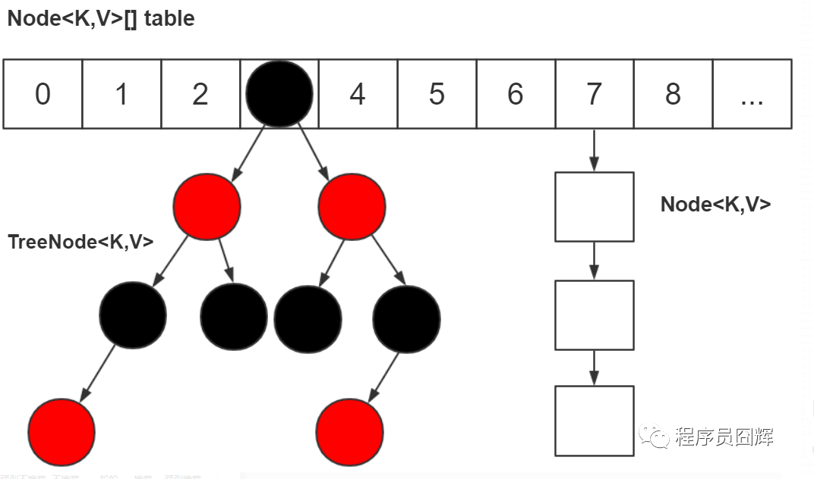


##### 为什么要改成“数组+链表+红黑树”？

主要是为了提升在 hash冲突严重时（链表过长）的查找性能，使用链表的查找性能是 O(n)，而使用红黑树是 O(logn)。

##### 什么时候用链表？什么时候用红黑树？

对于插入，**默认**情况下是**使用链表节点**。当同一个索引位置的节点数在新增后超过8个（**阈值8**）：**如果此时数组长度大于等于 64**，则会**触发链表节点转红黑树节点**（treeifyBin方法）；而如果**数组**长度**小于**64，则**不会触发链表转红黑树**，**而是会进行扩容，因为此时的数据量还比较小**。

对于移除，当同一个索引位置的节点在**移除后达到 6 个**，并且该索引位置的节点为红黑树节点，会触发**红黑树节点转链表节点**（untreeify方法）。

##### 为什么链表转红黑树的阈值是8？

我们平时在进行方案设计时，必须考虑的两个很重要的因素是：时间和空间。对于 HashMap 也是同样的道理，简单来说，阈值为8是在时间和空间上权衡的结果

红黑树节点大小约为链表节点的2倍，在节点太少时，红黑树的查找性能优势并不明显，付出2倍空间的代价作者觉得不值得

理想情况下，使用随机的哈希码，节点分布在 hash 桶中的频率遵循**泊松分布**，按照泊松分布的公式计算，HashMap的数组中的一个位置上的**链表的节点个数为8时的概率为 0.00000006**（跟大乐透一等奖差不多，中大乐透？不存在的），这个概率足够低了，并且到**8个节点**时，**红黑树的性能优势也会开始展现出来**，因此8是一个较合理的数字。

##### 那为什么转回链表节点是用的6而不是复用8？

如果我们设置节点多于8个转红黑树，少于8个就马上转链表，当节点个数在8徘徊时，就会频繁进行红黑树和链表的转换，造成性能的损耗

#####  HashMap 有哪些重要属性？分别用于做什么的？

除了用来存储我们的节点 table 数组外，HashMap 还有以下几个重要属性：

1）size：HashMap 已经存储的节点个数；

2）threshold：扩容阈值，当 HashMap 的个数达到该值，触发扩容。【这个值在扩容方法的时候会进行赋值判断，扩容阈值 = 容量【初始容量默认16】 * 负载因子】

3）loadFactor：负载因子，扩容阈值 = 容量【初始容量默认16】 * 负载因子

##### threshold 除了用于存放扩容阈值还有其他作用吗？

在我们新建 HashMap 对象时， threshold 还会被用来存初始化时的容量。HashMap 直到我们第一次插入节点时，才会对 table 进行初始化，避免不必要的空间浪费

##### HashMap 的默认初始容量是多少？HashMap 的容量有什么限制吗？

**默认初始容量是16**。HashMap 的容量**必须**是2的N次方，HashMap 会根据我们传入的容量计算一个**大于等于该容量的最小的2的N次方**，例如传 9，容量为16。

HashMap中具体计算容量的方法如下。传入一个我们定的容量值cap。

```java
static final int tableSizeFor(int cap) {
    int n = cap - 1;
    n |= n >>> 1;
    n |= n >>> 2;
    n |= n >>> 4;
    n |= n >>> 8;
    n |= n >>> 16;
    return (n < 0) ? 1 : (n >= MAXIMUM_CAPACITY) ? MAXIMUM_CAPACITY : n + 1;
}
```

我们先不看第一行“int n = cap - 1”，先看下面的5行计算。

|=（或等于）：这个符号比较少见，但是“+=”应该都见过。例如：a |= b ，可以转成：a = a | b

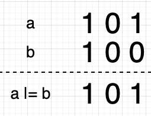

\>>>（无符号右移）：例如 a >>> b 指的是将 a 向右移动 b 指定的位数，右移后左边空出的位用零来填充，移出右边的位被丢弃

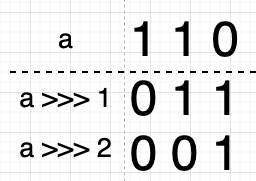

假设 n 的二进制值为 0010 0001，则该计算如下图：

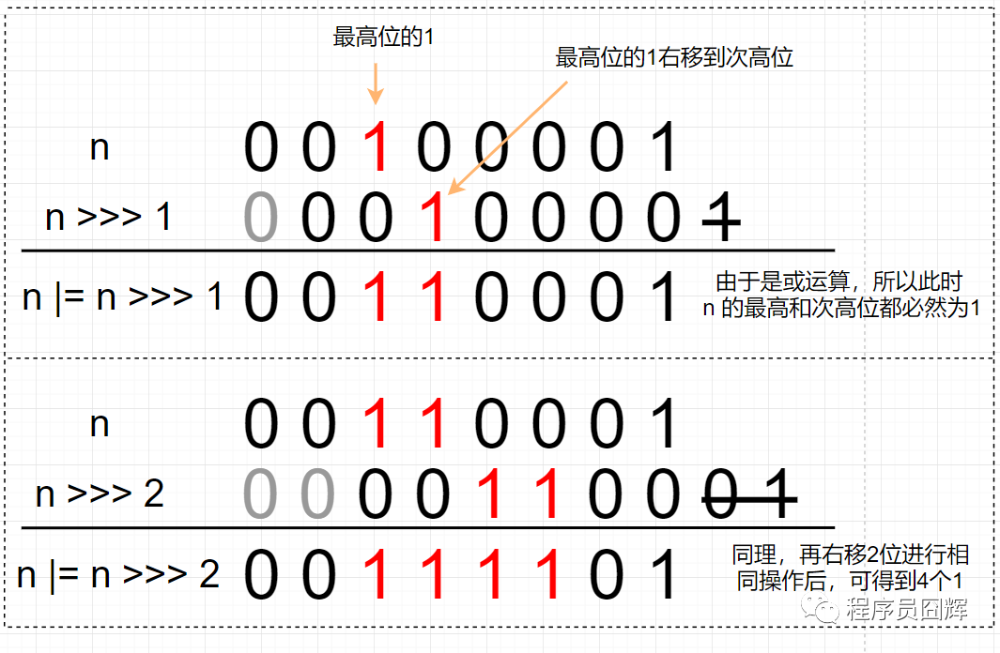

这5个公式会通过最高位的1，拿到2个1、4个1、8个1、16个1、32个1。当然，有多少个1，取决于我们的入参有多大，但我们肯定的是经过这5个计算，得到的值是一个低位全是1的值，最后返回的时候 +1，则会得到1个比n 大的 2 的N次方。

这时再看开头的 cap - 1 就很简单了，**这是为了处理 cap 本身就是 2 的N次方的情况**。

计算机底层是二进制的，移位和或运算是非常快的，所以这个方法的效率很高。

##### HashMap 的容量必须是 2 的 N 次方，这是为什么？

计算索引位置的公式为：**(n - 1) & hash**，当 **n 为 2 的 N 次方时**，**n - 1 为低位全是 1 的值**，此时任何值跟 n - 1 进行 & 运算的结果为该值的低 **N** 位，达到了和取模同样的效果，实现了均匀分布。实际上，这个设计就是基于公式：x mod 2^n = x & (2^n - 1)，因为 & 运算比 mod 具有更高的效率。

如下图，当 n 不为 2 的 N 次方时，hash 冲突的概率明显增大
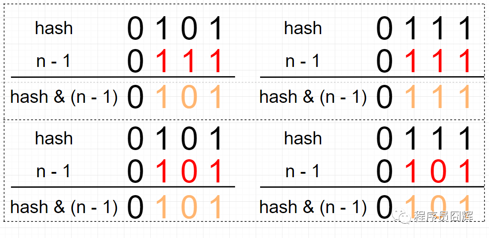

##### 负载因子默认初始值又是多少，为什么要设置这个值

负载因子默认值是0.75。这个也是在**时间和空间**上权衡的结果。如果值较高，例如1，此时会减少空间开销，但是 hash 冲突的概率会增大，增加查找成本；而如果值较低，例如 0.5 ，此时 hash 冲突会降低，但是有一半的空间会被浪费，所以折衷考虑 0.75 似乎是一个合理的值。

##### HashMap 的插入流程

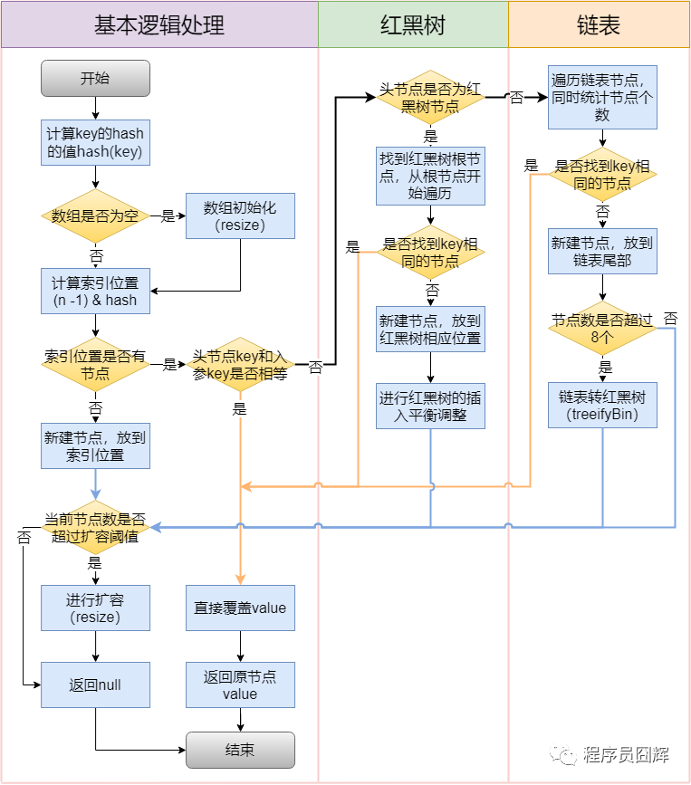

##### key 的 hash 值，是怎么设计的？

```java
static final int hash(Object key) {
    int h;
    return (key == null) ? 0 : (h = key.hashCode()) ^ (h >>> 16);
}
```

拿到 key 的 hashCode，并将 hashCode 的高16位和 hashCode 进行**异或**（XOR）运算，得到最终的 hash 值

这里拿高16位进行异或运算的原因，主要是为了在 table 的长度较小的时候，让高位也参与运算，并且不会有太大的开销。

例如下图，如果不加入高位运算，由于 n - 1 是 0000 0111，所以最终算出来的索引位置只取决于 hash 值的低3位，无论高位怎么变化，结果都是一样的。索引位置计算是 (n-1)&hashCode

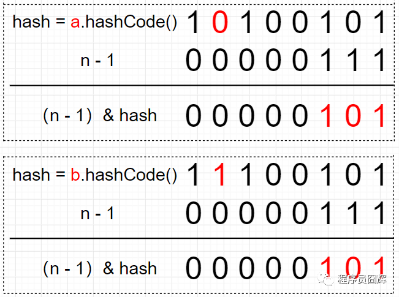

如果我们先将高位参与运算，则索引计算结果就不会仅取决于低位。

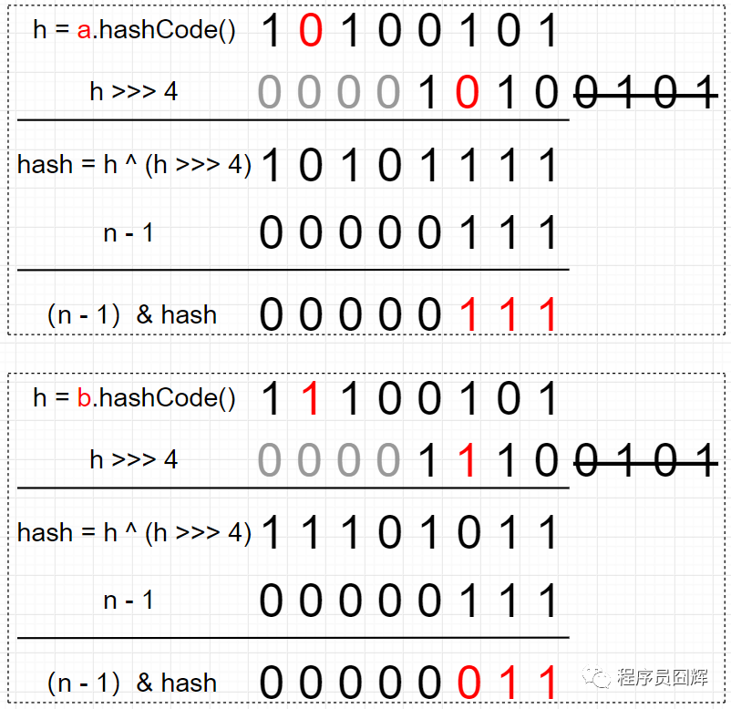

##### HashMap扩容（resize）流程

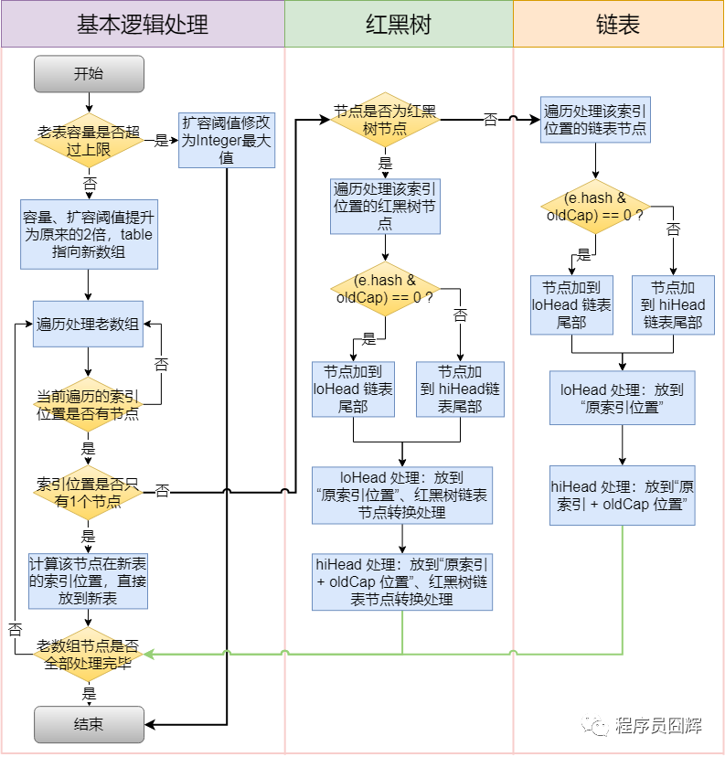

##### 扩容的过程中红黑树和链表都是通过 e.hash & oldCap == 0 来定位在新表的索引位置，这是为什么？

请看下面例子，扩容前 table 的容量为16，a 节点和 b 节点在扩容前处于同一索引位置。

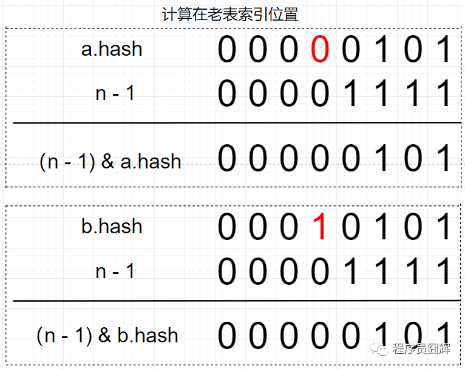

扩容后，table 长度为32，新表的 n - 1 只比老表的 n - 1 在高位多了一个1（图中标红）。

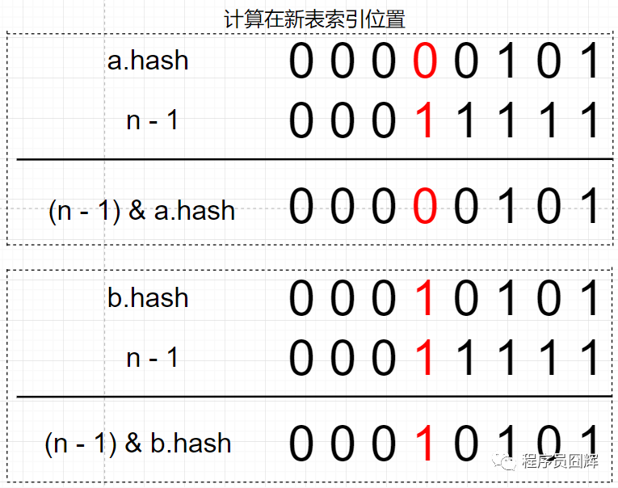

因为 2 个节点在老表是同一个索引位置，因此计算新表的索引位置时，只取决于新表在高位多出来的这一位（图中标红），而这一位的值刚好等于 oldCap。

因为只取决于这一位，所以只会存在两种情况：

1）(e.hash & oldCap) == 0 ，则新表索引位置为“原索引位置” ；

2）(e.hash & oldCap) != 0，则新表索引位置为“原索引 + oldCap 位置”


