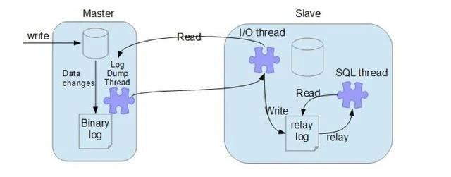

##### HashMap 的底层数据结构

我们现在用的都是 **JDK 1.8**，底层是由“**数组+链表+红黑树**”组成，如下图，而在 JDK 1.8 之前是由“数组+链表”组成。

##### 为什么要改成“数组+链表+红黑树”？

主要是为了提升在 hash冲突严重时（链表过长）的查找性能，使用链表的查找性能是 O(n)，而使用红黑树是 O(logn)。

##### 什么时候用链表？什么时候用红黑树？

对于插入，**默认**情况下是**使用链表节点**。当同一个索引位置的节点数在新增后超过8个（**阈值8**）：**如果此时数组长度大于等于 64**，则会**触发链表节点转红黑树节点**（treeifyBin方法）；而如果**数组长度小于64**，则**不会触发链表转红黑树**，**而是会进行扩容，因为此时的数据量还比较小**。

对于移除，当同一个索引位置的节点在**移除后达到 6 个**，并且该索引位置的节点为红黑树节点，会触发**红黑树节点转链表节点**（untreeify方法）。

##### 为什么链表转红黑树的阈值是8？

我们平时在进行方案设计时，必须考虑的两个很重要的因素是：时间和空间。对于 HashMap 也是同样的道理，简单来说，阈值为8是在时间和空间上权衡的结果

红黑树节点大小约为链表节点的2倍，在节点太少时，红黑树的查找性能优势并不明显，付出2倍空间的代价作者觉得不值得

理想情况下，使用随机的哈希码，节点分布在 hash 桶中的频率遵循**泊松分布**，按照泊松分布的公式计算，HashMap的数组中的一个位置上的**链表的节点个数为8时的概率为 0.00000006**（跟大乐透一等奖差不多，中大乐透？不存在的），这个概率足够低了，并且到**8个节点**时，**红黑树的性能优势也会开始展现出来**，因此8是一个较合理的数字。

##### 那为什么转回链表节点是用的6而不是复用8？

如果我们设置节点多于8个转红黑树，少于8个就马上转链表，当节点个数在8徘徊时，就会频繁进行红黑树和链表的转换，造成性能的损耗

#####  HashMap 有哪些重要属性？分别用于做什么的？

除了用来存储我们的节点 table 数组外，HashMap 还有以下几个重要属性：

1）size：HashMap 已经存储的节点个数；

2）threshold：扩容阈值，当 HashMap 的个数达到该值，触发扩容。

3）loadFactor：负载因子，扩容阈值 = 容量【初始容量默认16】 * 负载因子

##### threshold 除了用于存放扩容阈值还有其他作用吗？

在我们新建 HashMap 对象时， threshold 还会被用来存初始化时的容量。HashMap 直到我们第一次插入节点时，才会对 table 进行初始化，避免不必要的空间浪费

##### HashMap 的默认初始容量是多少？HashMap 的容量有什么限制吗？

**默认初始容量是16**。HashMap 的容量**必须**是2的N次方，HashMap 会根据我们传入的容量计算一个**大于等于该容量的最小的2的N次方**，例如传 9，容量为16。

